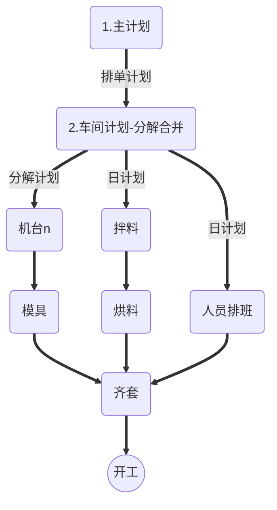
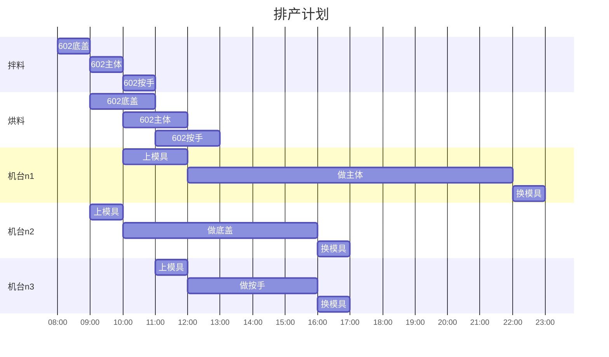

<pre>图文加载中...请稍后....</pre>

# 生产制造

```mermaid
graph TB;

主计划(1.主计划)
拌料(拌料)
车间计划(2.车间计划-分解合并)
烘料(烘料)
机台n(机台n)
人员排班(人员排班)
齐套(齐套)
模具(模具)
开工((开工))

主计划==排单计划==>车间计划==分解计划==>机台n==>模具==>齐套
车间计划==日计划==>拌料==>烘料==>齐套
车间计划==日计划==>人员排班==>齐套==>开工
 
```

## 常见进度

```mermaid
gantt
    title 排产计划
    dateFormat  DD HH:mm
    axisFormat  %H:%M
    excludes weekends
    
section 拌料
    602底盖           :a1, 01 08:00, 1h
    602主体           :a2,after a1, 1h
    602按手           :a3,after a2,   1h

section 烘料
    602底盖           :b1,after a1, 2h
    602主体           :b2,after a2, 2h
    602按手           :b3,after a3,   2h
    
section 机台n1
    上模具      :n1 ,after a2 , 2h
    做主体      :n1-1,after n1, 10h
    换模具      :n1-2 , after n1-1 , 1h
section 机台n2
    上模具      :n2 ,after a1 , 1h
    做底盖      :n2-1,after n2, 6h
    换模具      :n2-2 , after n2-1 , 1h

section 机台n3
    上模具      :n3 , after a3 , 1h
    做按手      :n3-1,after n3, 4h
    换模具      :n3-2 , after n3-1 , 1h

```

 