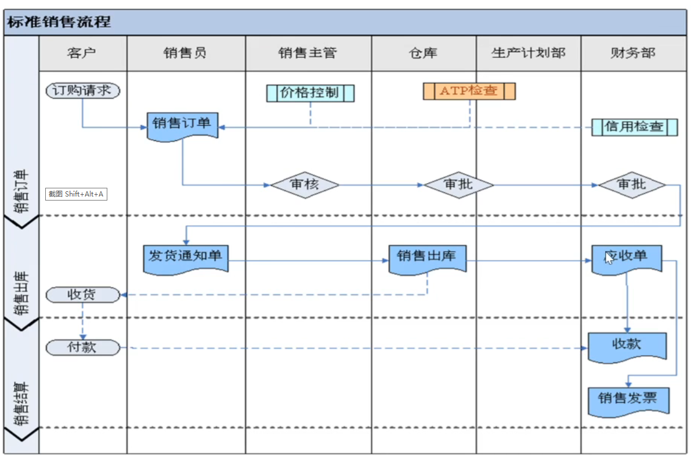
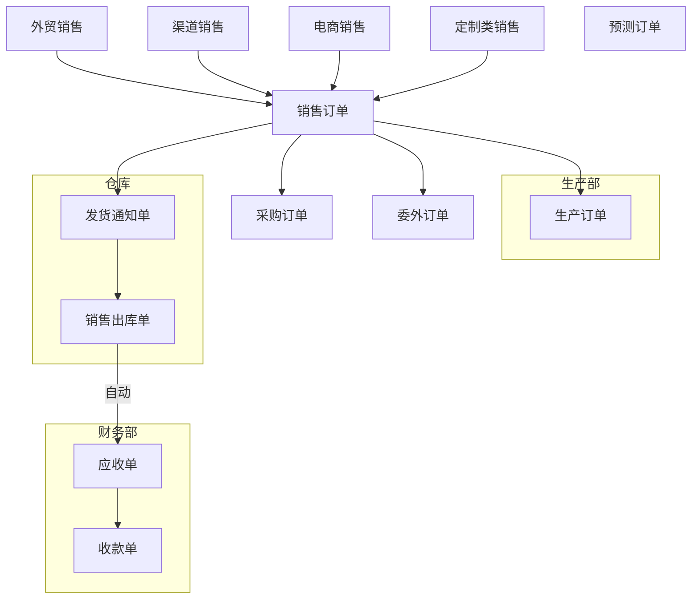
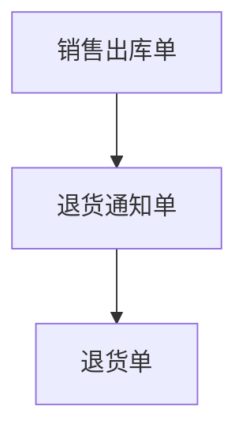
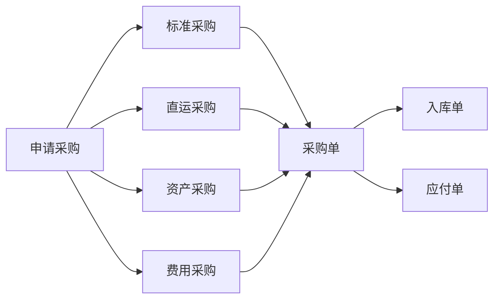
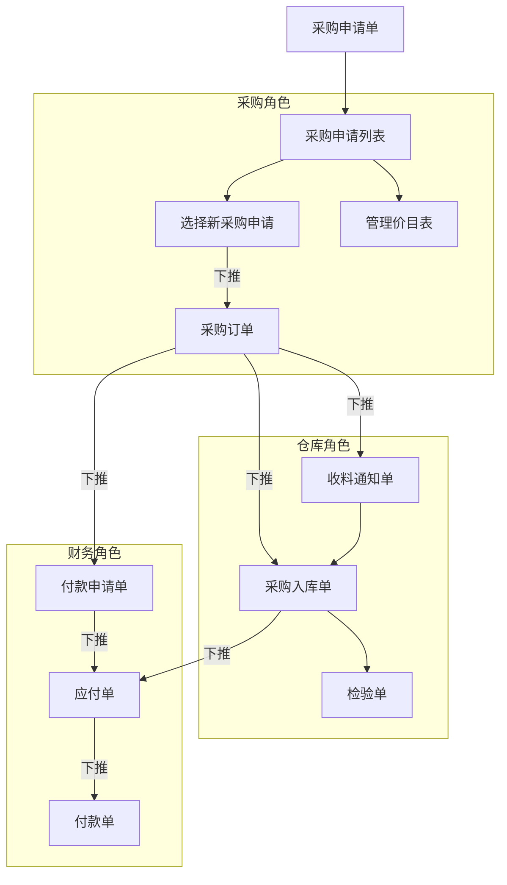
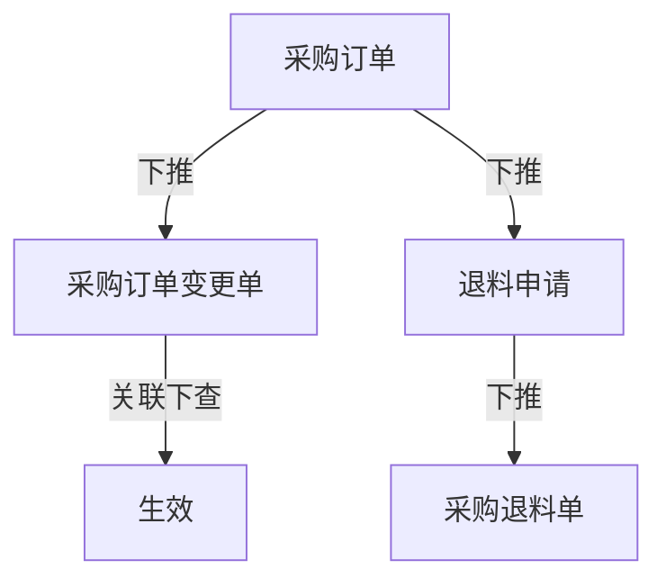

<pre>图文加载中...请稍后....</pre>

# 业务流

## 标准销售流程

# 

## 销售--主流程

```mermaid
graph TB;
外贸销售[外贸销售]
电商销售[电商销售]
渠道非标[定制类销售]
现货销售[渠道销售]
预测订单[预测订单]

外贸销售-->销售订单
现货销售-->销售订单
电商销售-->销售订单
渠道非标-->销售订单

销售订单-->采购订单
销售订单-->生产订单
销售订单-->委外订单
销售订单-->发货通知单
subgraph 财务部
收款单
应收单-->收款单
end
subgraph 生产部
生产订单
end
subgraph 仓库
发货通知单-->销售出库单 
销售出库单--自动-->应收单
end


 
```

#### 变更订单

业务操作--订单变更--生效

### 周边流程

```mermaid
graph TB;
销售出库单-->退货通知单 --> 退货单
```

## 采购--业务流程

采购属于进产销存中的前端

```mermaid
graph LR;

申请采购-->标准采购
申请采购-->直运采购
申请采购-->资产采购
申请采购-->费用采购

标准采购-->采购单
直运采购-->采购单
资产采购-->采购单
费用采购-->采购单

采购单-->入库单
采购单-->应付单
```

### 主流程

```mermaid
graph TB;
 

采购申请单--> 采购申请列表

subgraph 采购角色
采购申请列表 -->选择新采购申请--下推-->采购订单
采购申请列表 -->管理价目表


end
subgraph 仓库角色
采购订单--下推-->收料通知单
采购订单--下推-->采购入库单

收料通知单-->采购入库单
采购入库单-->检验单
end
subgraph 财务角色
采购入库单--下推-->应付单
采购订单--下推-->付款申请单
付款申请单--下推-->应付单--下推-->付款单
end
 
```

### 周边流程

```mermaid
graph TB;
采购订单--下推-->采购订单变更单--关联下查-->生效
采购订单--下推-->退料申请--下推-->采购退料单
```

