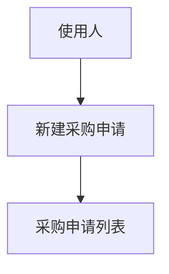
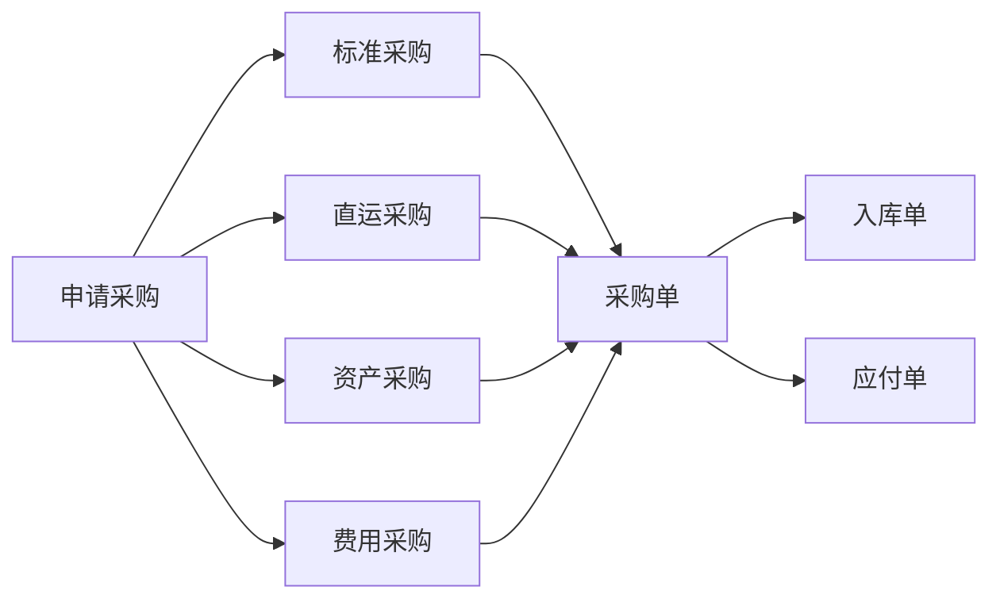
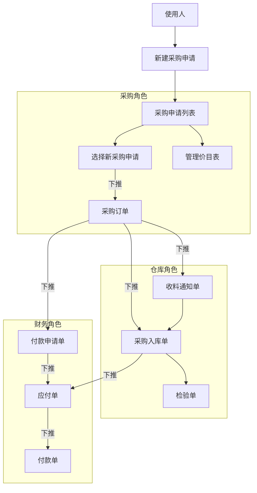
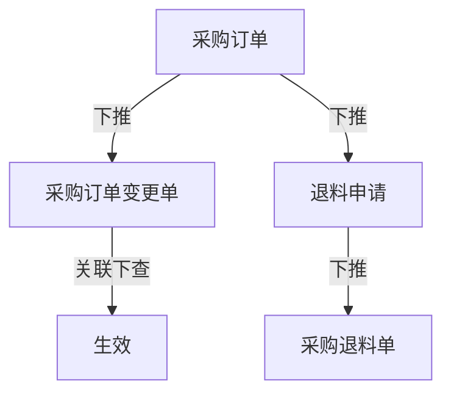

# 业务流


# 供应链


## 销售--业务流程




### 常用菜单

销售管理--基础资料--客户列表

销售管理--价格管理--销售价目列表

基础管理--基础资料--公共资料--业务员列表

基础管理--基础资料--主数据--物料列表

基础管理--基础资料--主数据--物料列表

基础管理--基础资料---公共资料--物料单位换算列表


## 采购--业务流程

采购属于进产销存中的前端





### 主流程



### 周边流程



## 常用菜单

供应链--采购管理

采购管理--货源与价格管理

采购管理--采购管理系统参数--价格管理

财务会计--应付款管理--应付单列表

财务会计--出纳管理--日常处理--付款申请单


立账类型 ：【 暂估应付，财务应付】（？立账类型 不等于 暂估应付）


# 员工管理

基础管理--基础资料--主数据--员工列表

基础管理--基础资料--主数据--物料

基础管理--基础资料--单价类型-单价类型列表


# 数据对应

```
data-field="FEXPIRYDATE"
```


<script type="text/javascript" src="https://cdnjs.cloudflare.com/ajax/libs/mermaid/9.4.3/mermaid.min.js"></script>
<script>
console.log('显示图表') 
mermaid.init({ noteMargin: 10 }, '.language-mermaid');
</script>
 

 
