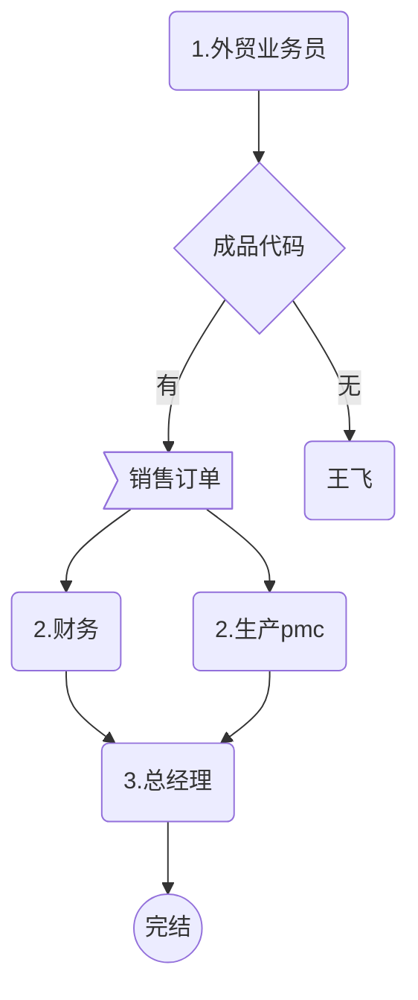
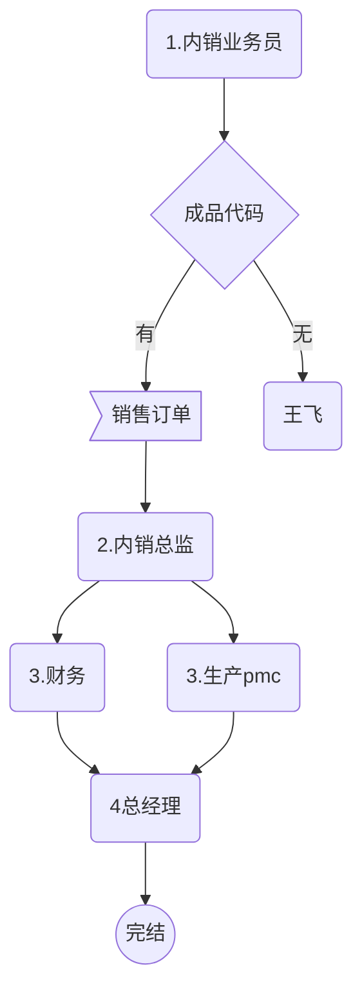

# 订单-评审工作流程


## 外贸工作流程图




### 销售订单--标准销售订单（外贸）

| 步骤 | 所属职位   | 所属人 | 备注                               |
| ---- | ---------- | ------ | ---------------------------------- |
| 1    | 外贸业务员 |        | 根据单据类型走不同的工作流程来审批 |
| 2    | 财务       | 彭     |                                    |
| 2    | PMC        | 车     |                                    |
| 3    | 总经理     | 翁     |                                    |
| 4    | 结束       |        |                                    |
|      |            |        |                                    |
|      |            |        |                                    |

## 内贸工作流程



### 销售订单--现销订单(内销)

| 步骤 | 所属职位   | 所属人 | 备注                               |
| ---- | ---------- | ------ | ---------------------------------- |
| 1    | 内销业务员 |        | 根据单据类型走不同的工作流程来审批 |
| 2    | 营销总监   | 潘     |                                    |
| 3.1  | PMC        | 车     |                                    |
| 3.2  | 财务部     | 彭     |                                    |
| 4    | 总经理     | 翁     |                                    |
| 5    | 结束       |        |                                    |
|      |            |        |                                    |
|      |            |        |                                    |


 ## 发货--工作流程图


| 步骤 | 所属职位   | 所属人 | 备注                               |
| ---- | ---------- | ------ | ---------------------------------- |
| 1    | 外贸业务员 |        | 根据单据类型走不同的工作流程来审批 |
| 2    | 财务       | 彭     |                                    |
| 2    | PMC        | 车     |                                    |
| 3    | 总经理     | 翁     |                                    |
| 4    | 结束       |        |                                    |
|      |            |        |                                    |
|      |            |        |                                    |

```

```


### 价格变更触发

```

```


------------------

<script type="text/javascript" src="https://cdnjs.cloudflare.com/ajax/libs/mermaid/9.4.3/mermaid.min.js"></script>
<script>
console.log('显示图表') 
mermaid.init({ noteMargin: 10 }, '.language-mermaid');
</script>
 

 
