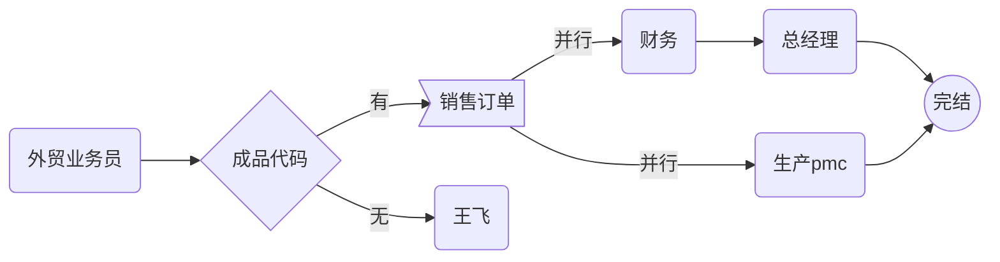
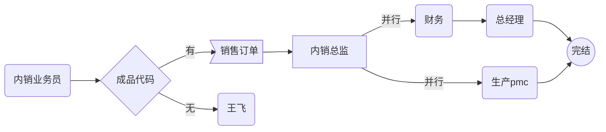

# 订单-评审流程

## 外贸流程图

```mermaid
graph LR;

sell(外贸业务员)
pmc(生产pmc)
acc(财务)
ceo(总经理)
e((完结))
code{成品代码}
bill>销售订单]
bom(王飞)
sell -->code --有-->bill
code --无-->bom
bill  --并行--> pmc ;
bill  --并行-->  acc  --> ceo;
ceo -->e;
pmc -->e;

 
```

## 内贸流程

```mermaid
graph LR;

sell(内销业务员)
pmc(生产pmc)
acc(财务)
ceo(总经理)
e((完结))
code{成品代码}
bill>销售订单]
bom(王飞)
sell -->code --有-->bill
code --无-->bom
bill -->内销总监
内销总监--并行--> pmc ;
内销总监 --并行-->  acc  --> ceo;
ceo -->e;
pmc -->e;

 
```

 

------------------

 

 
