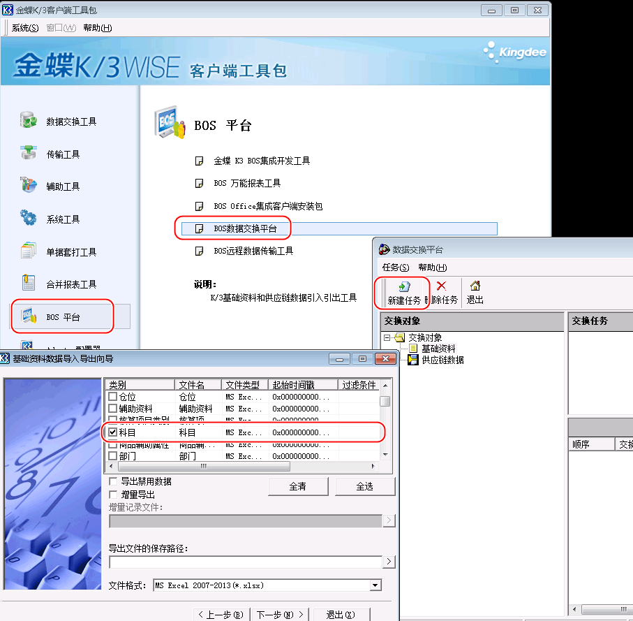
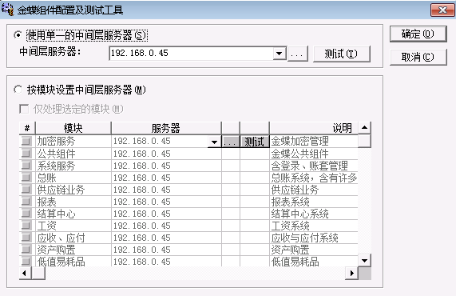

# 新账套创建

(参考1)[https://jingyan.baidu.com/article/27fa7326c9fbab07f8271fff.html]

(参考2)[https://vip.kingdee.com/article/82059387493354752?productLineId=7&lang=zh-CN]

## 流程

* 账套管理 ：新建一个

* 用户管理 ：导入用户

* 客户端：创建基础数据

* 批量导入：科目等

* 填入起初科目余额

* 结束初始化

* 录凭证，过账，结转受损

* 创建报表

  

## 初始数据导入

## 组件配置测试

 

