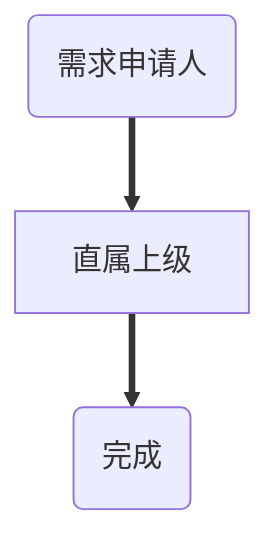
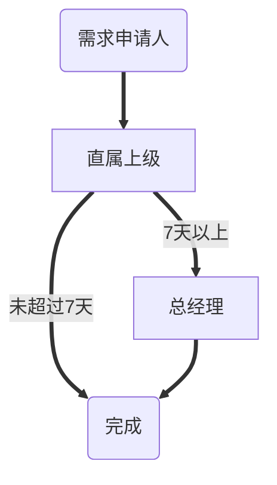
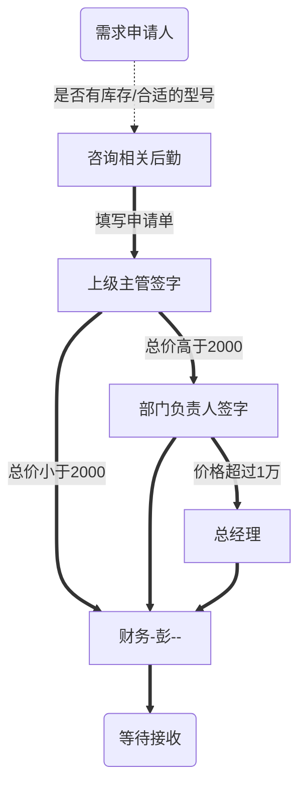
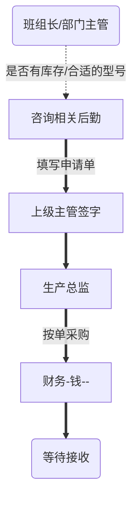

<pre>图文加载中...请稍后....</pre>

## 行政管理

### 补卡

次月工资结算日之前完成

| 步骤 | 所属职位 | 所属人 | 备注 |
| ---- | -------- | ------ | ---- |
| 1    | 申请人   |        |      |
| 2    | 上级领导 |        |      |

### 请假

| 步骤 | 所属职位 | 所属人 | 备注        |
| ---- | -------- | ------ | ----------- -- |
| 1    | 申请人   |        |                 |
| 2    | 上级领导 |        |                     |
| 3    | 总经理   |        | 如果请假超过7天 需要此步 |

## 办公采购

## 生产辅材采购

生产辅材、机物料

