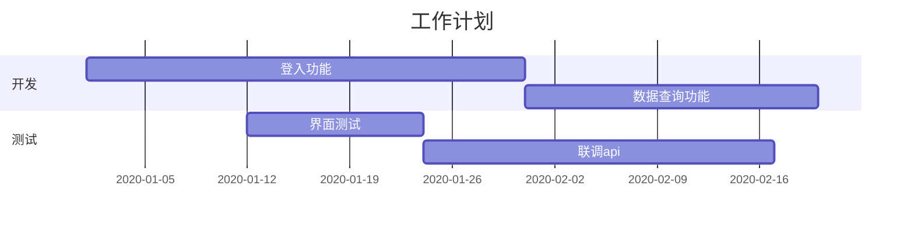
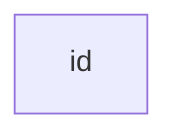
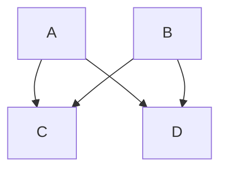
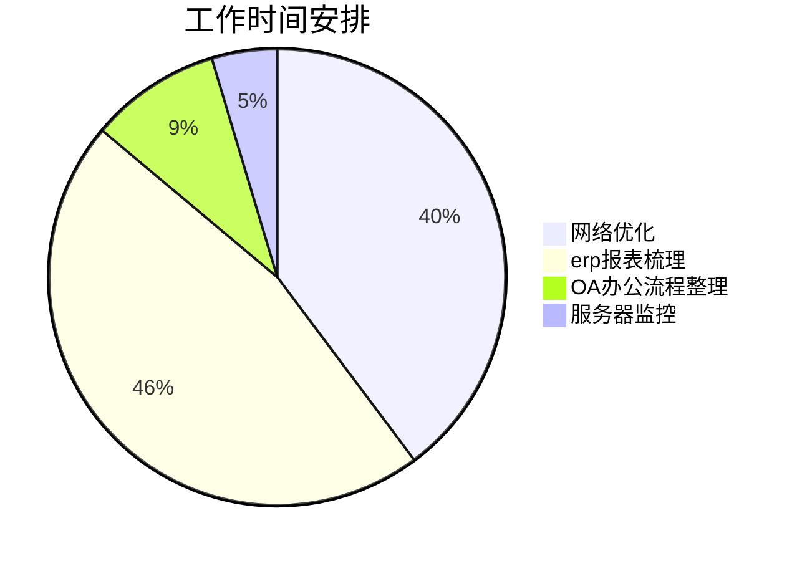

# 一图胜千言

### 进度图(甘特)

lldp通过 广播发送特定数据包来发现周围设备，所以两端设备都可以发送自己的信息给对方，也可以只接收信息。

```mermaid
gantt
    title 工作计划
    dateFormat  YYYY-MM-DD
section 开发
    登入功能           :a1, 2020-01-01, 30d
    数据查询功能     :after a1  , 20d
section 测试
    界面测试      :2020-01-12  , 12d
    联调api      : 24d
```

### 流程图

```mermaid
graph LR;
id
```

```mermaid
graph TB;
A & B --> C & D
```

#### 流程图（mermaid）

```mermaid
flowchart LR
    id1(Start)-->id2(Stop)
    style id1 fill:#f9f, stroke:#333, stroke-width:4px
    style id2 fill:#bbf, stroke:#f66, stroke-width:2px, color:#fff, stroke-dasharray: 5 5


```

```mermaid

flowchart LR
H>标签框] --> I{{六角框}} -->J[/平行四边形框/] --> K[\平行四边形框\] --> L[/梯形框\] --> M[\倒梯形框/]


```

```mermaid
flowchart LR
%% this is a comment A -- text --> B{node}
   A -- text --> B -- text2 --> C

```

### 饼图

```mermaid
pie
    title 工作时间安排
    "网络优化" : 42.96
    "erp报表梳理" : 50.05
    "OA办公流程整理" : 10.01
    "服务器监控" :  5
```