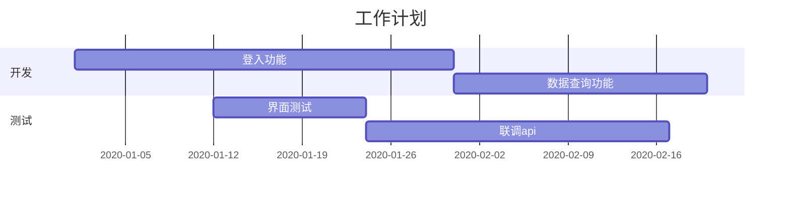
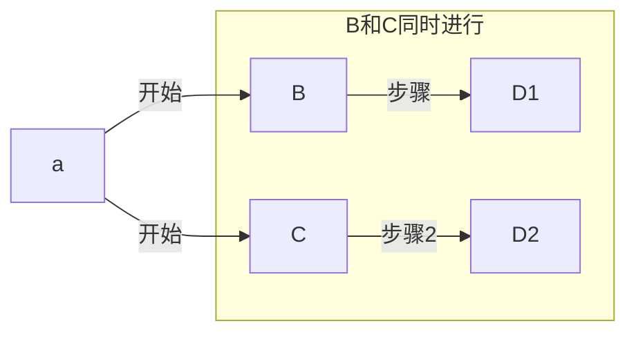
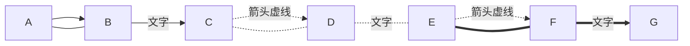
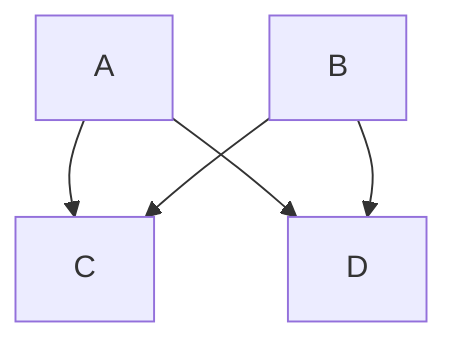
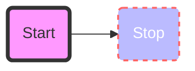
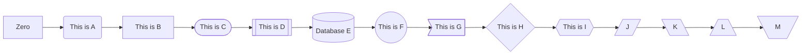
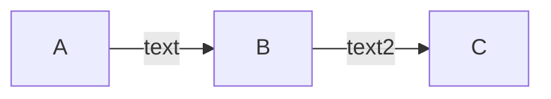
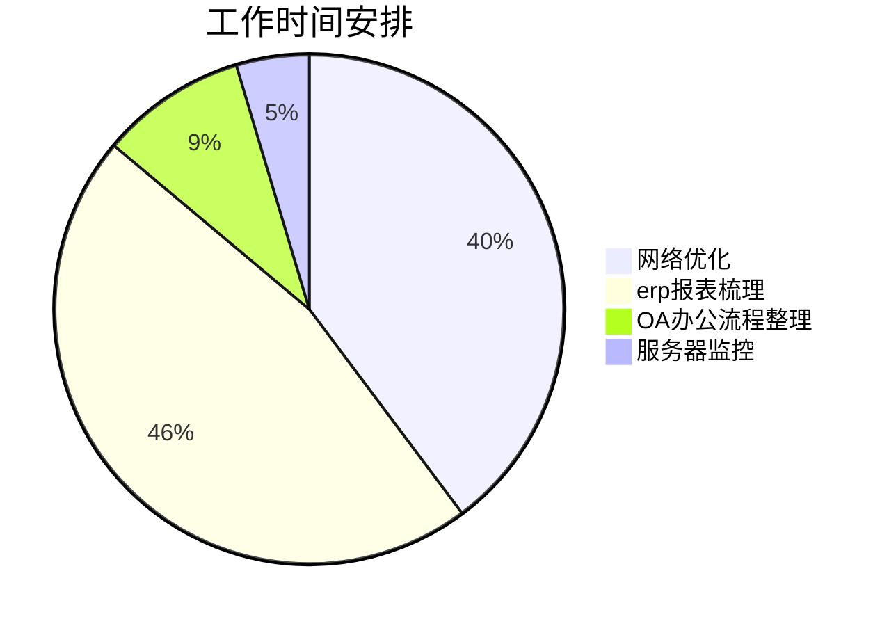

# 一图胜千言

### 进度图(甘特)

 

### 并行流

### 流程图

#### 流程图（mermaid）

### 饼图

------------------

​        

# 视频

<!-- webm格式 -->

<video id="video" controls=""  >
      <source id="webm" src="https://files.i1314.top/manim-ce.mp4" type="video/webm">
<ideos>