# 安全生产

## 安卓手机apk安装

 ### 扫码安装
打开微信 

### 通过微信扫码

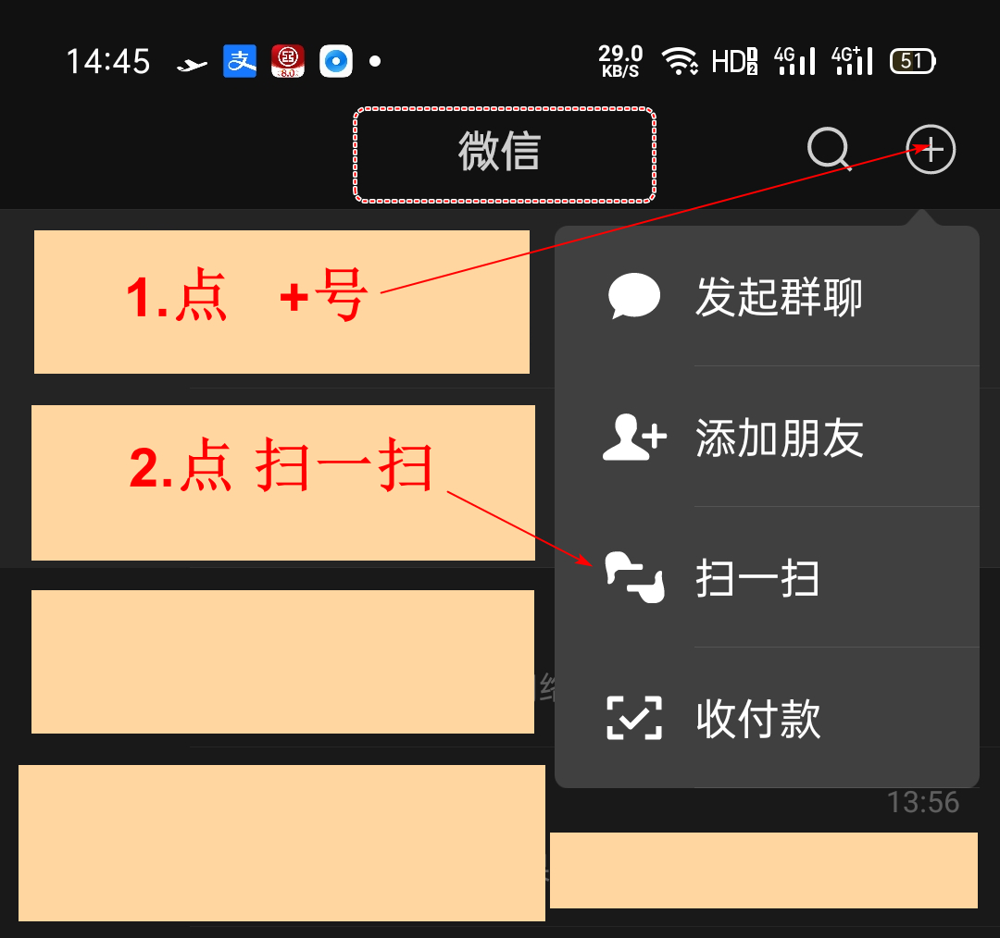

### 官网安装

#### 扫描二维码

#### 打开下载页面

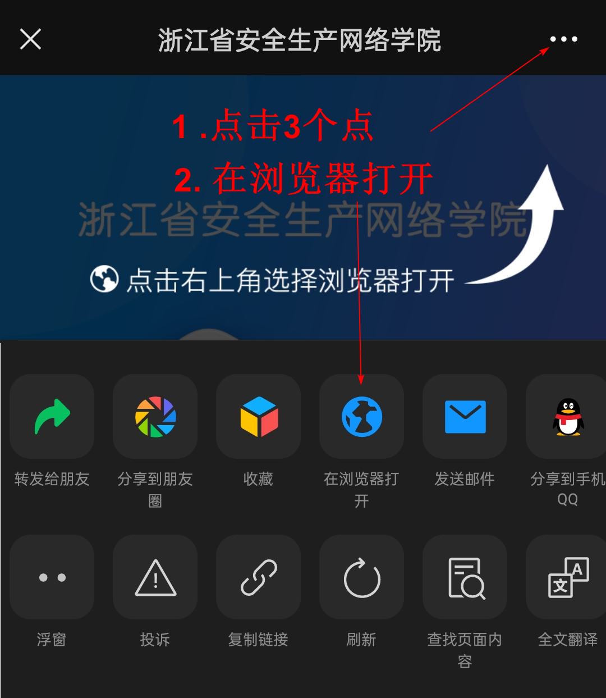

#### 挑选合适的浏览器

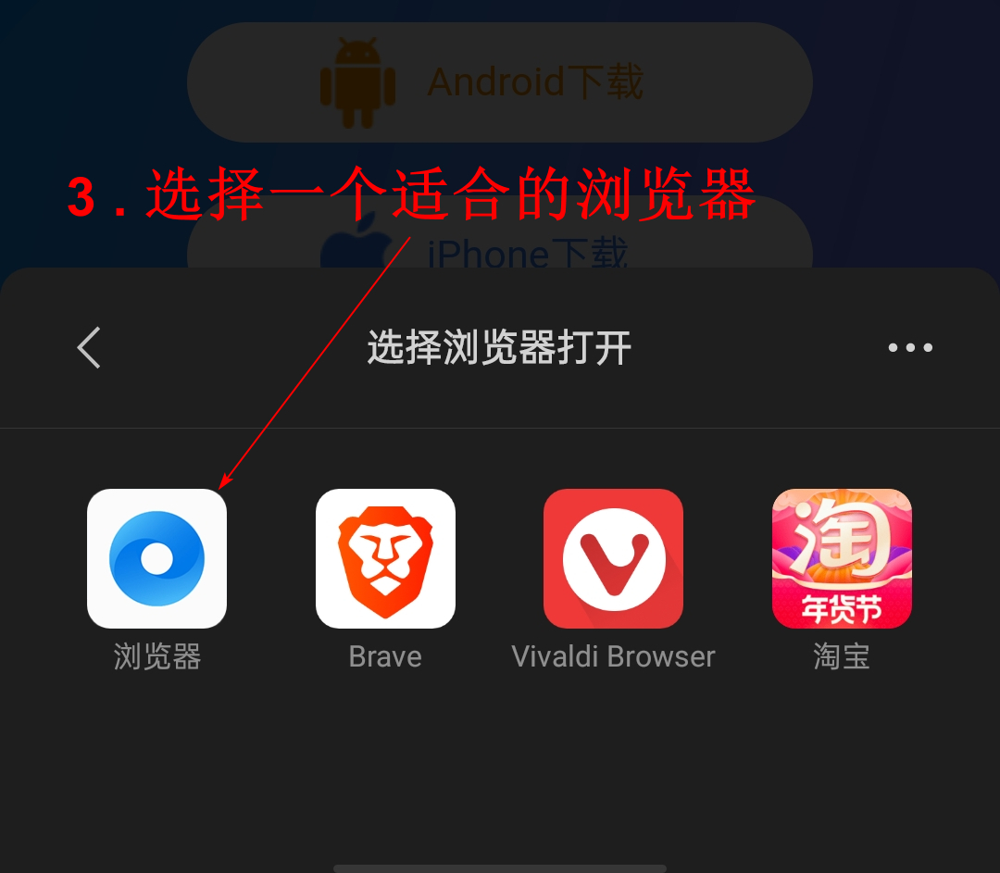

### 在浏览器中下载

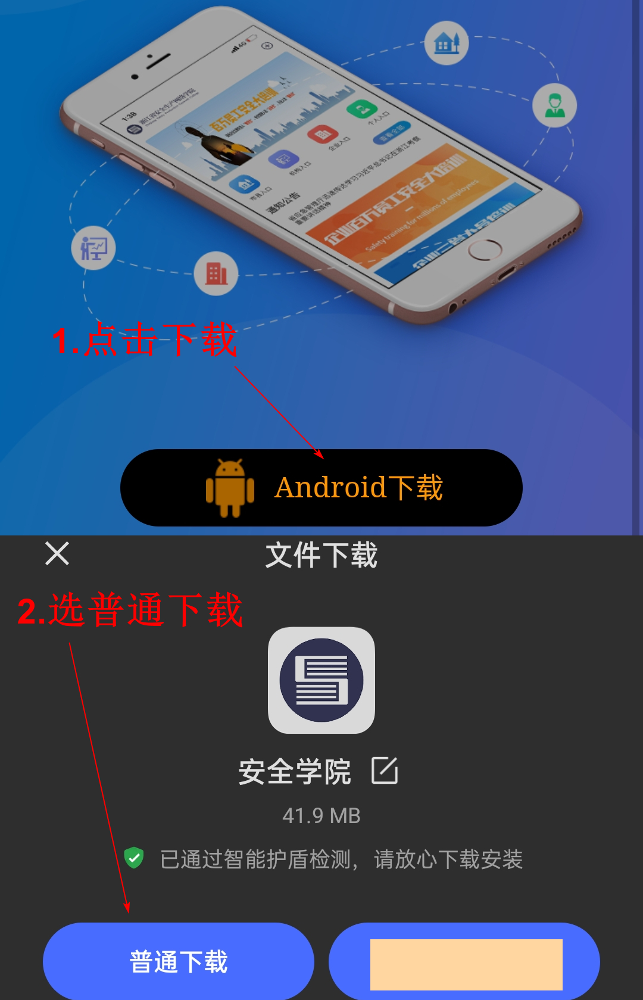

### 下载并安装

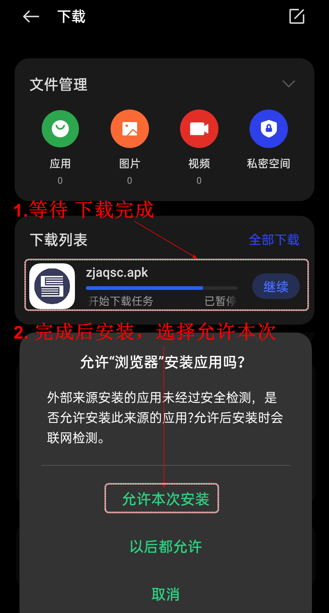

## 开始安装

#### 打开 应用 

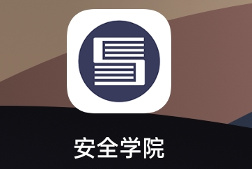

## 注册和登入

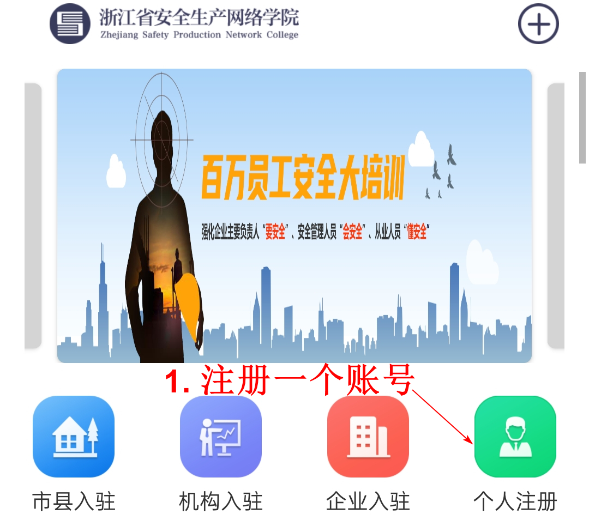

### 注册自己的账号

所有内容根据实际情况填写一共9步。

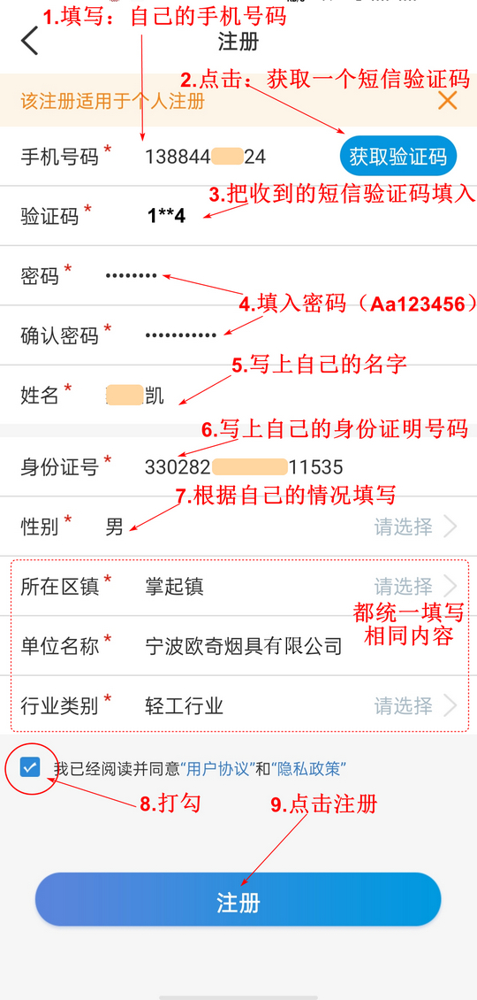

### 登入账号

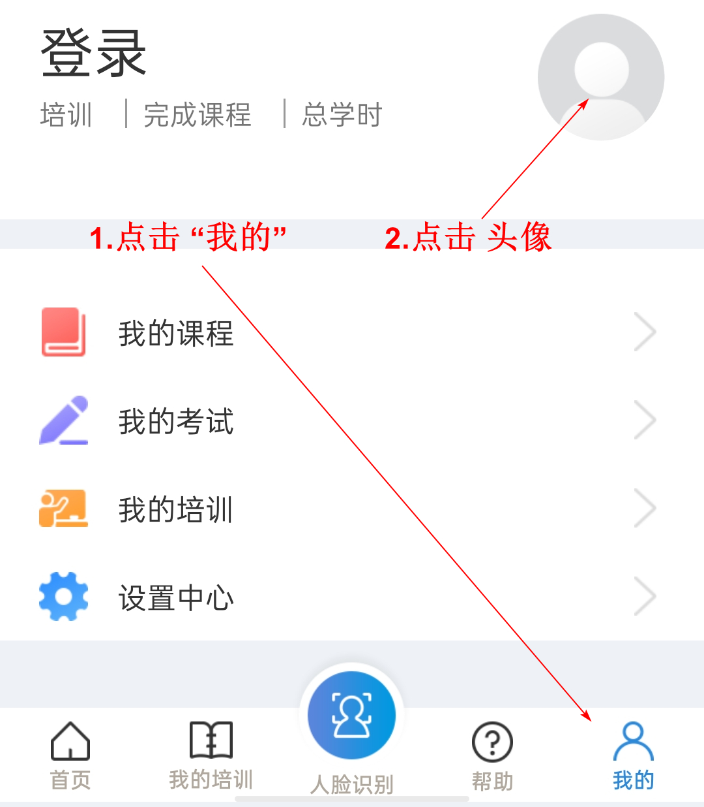

### 手机登入

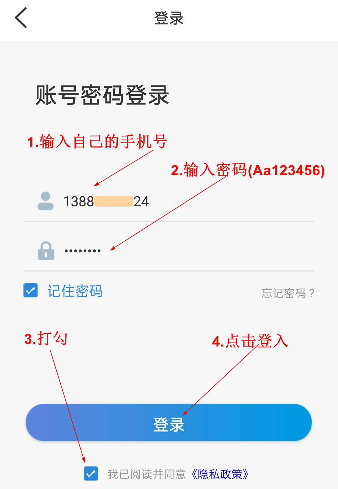

### 人脸识别

首次使用需要人脸验证

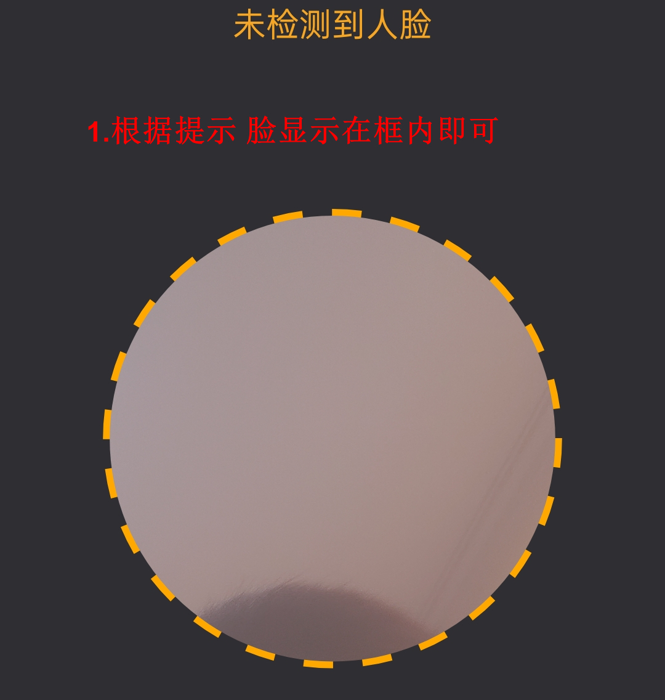

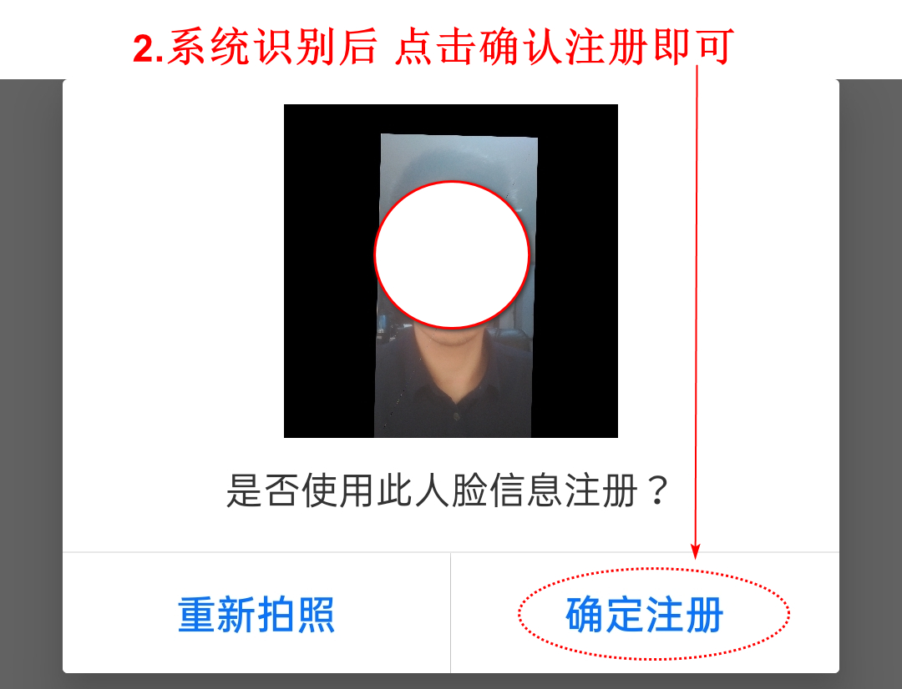

