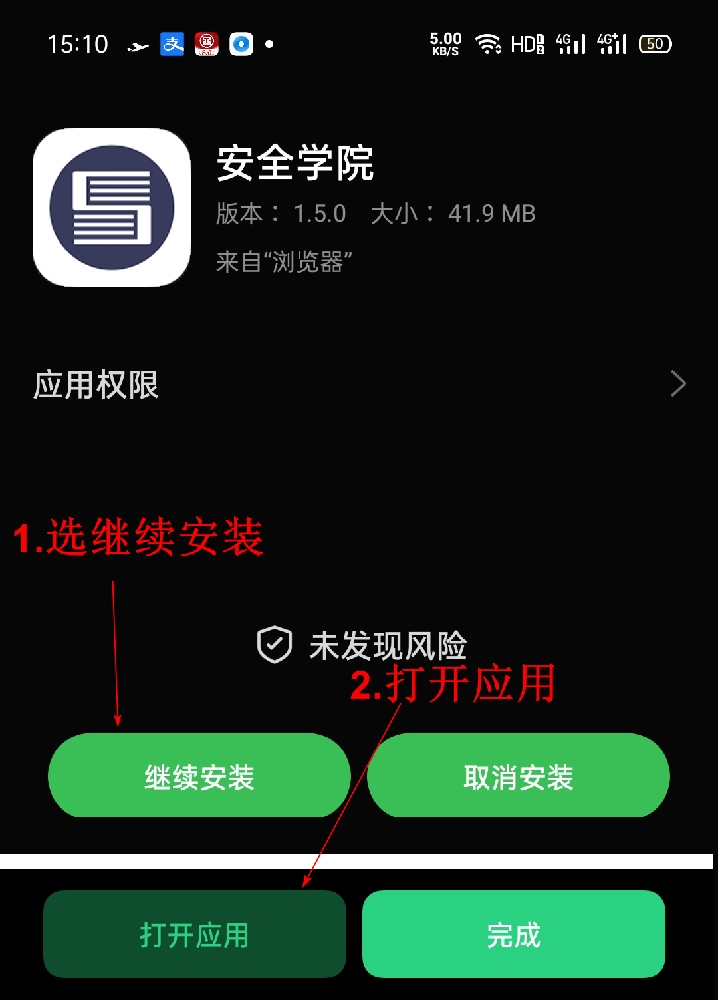

# 安全生产

## 安卓手机apk安装

 ### 扫码安装
打开微信 

### 通过微信扫码

### 官网安装

#### 扫描二维码

#### 打开下载页面

#### 挑选合适的浏览器

### 在浏览器中下载

### 下载并安装

## 开始安装

#### 打开 应用 

## 注册和登入

### 注册自己的账号

所有内容根据实际情况填写一共9步。

### 登入账号

### 手机登入

### 人脸识别

首次使用需要人脸验证

