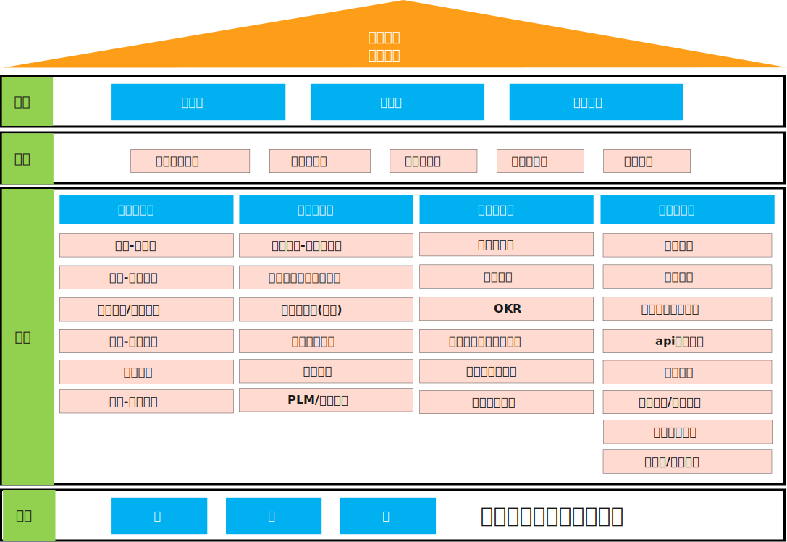
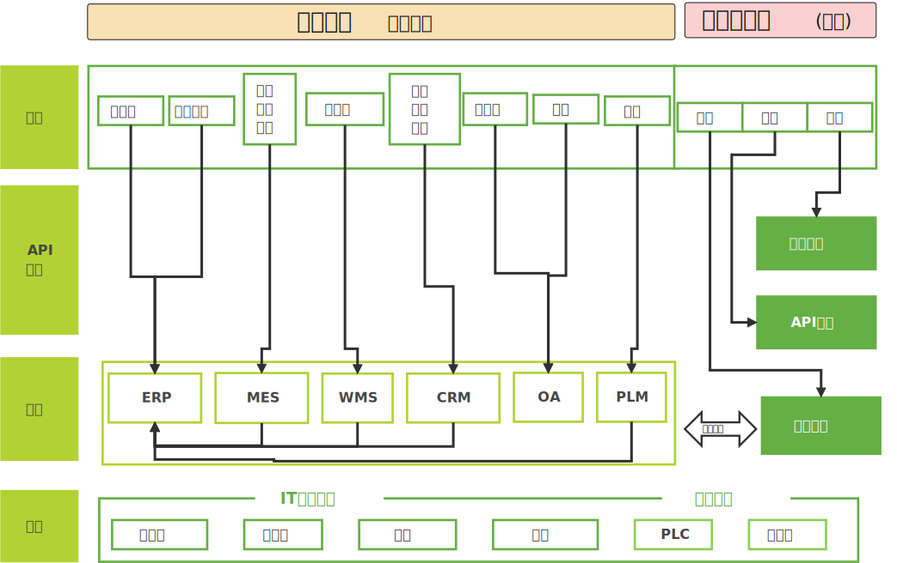

# 数字化（树枝）工厂

[数字化](https://www.d1edu.com/p/t_pc/course_pc_detail/video/v_654afb07e4b04c109d9b6b55)

## 战略分解-数字化

| 分类       | 代表工具 | 备注 |
| ---------- | -------- | ---- |
| 办公数字化 | office   |      |
| 业务数字化 | erp      |      |
| 生产数字化 | mes      |      |
| 仓储数字化 | wms      |      |
| 管理数字化 | oa       |      |
| 数据数字化 | bi       |      |
| it数字化   | cloud    |      |
| 研发数字化 | plm      |      |

## 业务结构简化

企业数字规划(来之CIO)

开放互通  ，信任+同心  

