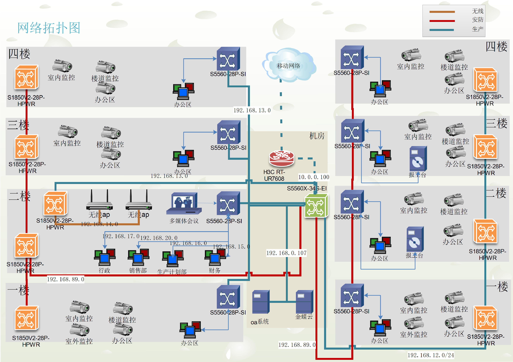

 

## 弱电网络

### 拓扑图

### 需求

* 布线部分
  * 每一层按通用按距离留面板再结合实际添加，保证后续布局调整可用
  * 网线超5类即可
  * 水晶头绿联超5类3u镀金头
  * 楼于楼间光纤建议用8型以上并用SC配线架
  * 机房到面板每条线表上便签

* 设备部分

  * 交换机超过8口使用管理型交换机

  * 10人以上办公室配置一个管理交换机  

  * ap覆盖需要使用支持漫游kvr设备

  * 摄像头使用海康，室内全用带旋转平台摄像头

  * GPD POCKET 3带串口的移动管理笔记本

    

* 其他

  * 服务器搬迁费用
  * 摄像头搬迁费用

## ip地址规划

| IP范围  | 用户      | 备注                                  |
| ------- | --------- | ------------------------------------- |
| 1-25    | 固定设备  | 基础设备使用 单数1为主，双数2为辅     |
| 25-100  | 无线dhcp  | 通过设置可以放大1-25的区域            |
| 100-200 | 有线设备  | 有线不够可以借用小于100的dhcp从25开始 |
| 200-254 | 保留/测试 | 虚拟化区域                            |

## vlan规划

以10为单位分割区域

| vlan id | 用户                   | 备注                        |
| ------- | ---------------------- | --------------------------- |
| 2-10    | 管理网使用/服务器/设备 |                             |
| 11-20   | 办公                   | 每一个业务办公室一个vlan id |
| 21-30   | 非办公区域             |                             |
| 31-40   | 生产车间               |                             |
| 81-90   | 监控/安防              |                             |
| 200-220 | 虚拟化区域             | ovs                         |

网口1接上行，网口2接下行

### 调整建议（网段）

vlan 1 作为默认，建议不使用

| 用途      | 调整前       | 调整后       | 备注                                                         |
| ---------------- | ------------ | ------------ | ------------------------------------------------------------ |
| 1楼大办公室      | 192.168.16.0 | 192.168.16.0 | 统一划入办公区端                                             |
| 行政             | 192.168.16.0 | 192.168.16.0 | 统一划入办公区端                                             |
| 部分监控（门卫） | 192.168.88.0 | 不变         |  |
| 财务             | 192.168.15.0 | 192.168.15.0 | 统一划入办公区端                                             |
| 内外销售         | 192.168.14.0 | 192.168.14.0 | 统一划入办公区端                                             |
| 技术/设计        | 192.168.19.0 | 192.168.19.0 | 统一划入办公区端                                             |
| 仓库             | 192.168.34.0 | 192.168.34.0 | 办公区                                                       |
| 注塑车间         | 192.168.34.0 | 192.168.31.0 | 工厂车间                                                     |
| 焊接             | 192.168.34.0 | 192.168.32.0 | 工厂车间                                                     |
| 点火枪           | 192.168.34.0 | 192.168.33.0 | 工厂车间                                                     |
| 独立电商         | 192.168.24.0 | 192.168.24.0 | 划入驻外办公区                                               |
| AP无线 | 192.168.22.0 |              | 无线ap |

备注：需要采购管理型交换机，监控部分独立划区域

### IP地址使用规划

| 开始ip         | 结束ip         | 用途     | 备注                                                         |
| -------------- | -------------- | -------- | ------------------------------------------------------------ |
| 192.168.0.0    | 192.168.10.0   | 保留     | 0段已用于服务器区域                                          |
| 192.168.11.0   | 192.168.20.255 | 办公使用 | 11段用于网络设备，12-19用于测试，20-29办公大楼，30-39工厂车间 其他空余 |
| 192.168.21.0   | 192.168.30.255 | 无线网络 | 45段办公无线  ，49段访客无线 (使用dhcp)                      |
| 192.168.41.255 | 192.168.50.255 | 办公使用 | 未来扩建使用/新网络接入点                                    |
| 192.168.81.0   | 192.168.90.0   | 用于安防 | 81用于安抚网络主控  85-89用于安防设备（独立分割）            |
| 192.168.100.0  | 192.168.200.0  | 不适用   | 留给未来规划                                                 |
| 192.168.200.0  | 192.168.250.0  | 保留     | 暂时不使用                                                   |

## 设备选型

| 路由防火墙 |                                             |      |      |                      |
| ---------- | ------------------------------------------- | ---- | ---- | -------------------- |
| 华三       | SecPath F1000-AI-25（双电源）含原厂部署服务 | 台   | 1    | 原厂三年质保         |
| 华三       | LIS-F1000-AI-25-IPS3-3Y                     | 套   | 1    | 入侵检测，可选功能   |
| 华三       | LIS-F1000-AI-25-AV-3Y                       | 套   | 1    | 网络防病毒，可选功能 |

| 行为管理 |                                          |      |      |              |      |
| -------- | ---------------------------------------- | ---- | ---- | ------------ | ---- |
| 华三     | SecPath ACG1000-AI-30（含1年特征库授权） | 台   | 1    | 原厂三年质保 |      |
| 华三     | LIS-ACG1000-AI-30-APP&URL-1Y             | 套   | 2    |              |      |

| 核心 |                           |      |      |              |                                              |
| ---- | ------------------------- | ---- | ---- | ------------ | -------------------------------------------- |
| 华三 | S5560X-34S-EI             | 台   | 1    | 原厂五年质保 | 建议更换为独立电源设备，通常电源故障概率高。 |

| 汇聚 |                           |      |      |              |                                              |
| ---- | ------------------------- | ---- | ---- | ------------ | -------------------------------------------- |
| 华三 | LS-5570S-28S-EI（双电源） | 台   | 4    | 原厂五年质保 | 1号楼、2号楼、监控                           |
| 接入 |                           |      |      |              |                                              |
| 华三 | S5130S-28P-EI             | 台   | 10   | 原厂五年质保 | 每楼层+办公室隔间                            |

| 监控交换机           |                       |      |          |                     |
| -------------------- | --------------------- | ---- | -------- | ------------------- |
| 华三                 | S5130S-28P-HPWR-EI-AC | 台   | 9        | 每楼层、室外        |

| 监控设备             |      |      |      |
| -------------------- | ---- | ---- | ---- |
| DS-2CD2T46F筒型      | 只   | 0    |      |
| DS-2DE3C140M-DE球机  | 只   | 0    |      |
| DS-2SC3Q140MY-TE球机 | 只   | 40   |      |
| DS-7916N-R4录像机    | 台   | 1    |      |
| DS-8864N-R8录像机    | 台   | 2    |      |
| 32寸监控电视         | 台   | 4    |      |

## 核心端口现状

| 端口   | 对端     | 网段   | 备注        |
| ------- | --------- | ------ | ---------------- |
| p10           | 10号，9号     | .34    | 核心             |
| p11           | 二层交换机    | .34    |   |
| p12           | 7号           | .34    | 串联到5，3，1楼     |
| p13           | 前门卫        | .6     |      |
| p15           | 后门          | .6     |    |
| p9            | 内销2楼       | .20    |       |
| p8 | 人事部 | .17 | |
| p5 | 财务2楼 | .15 |                |

## 

