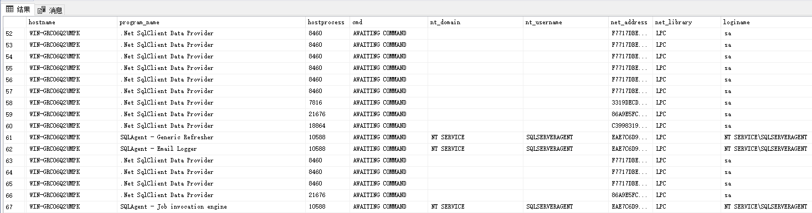
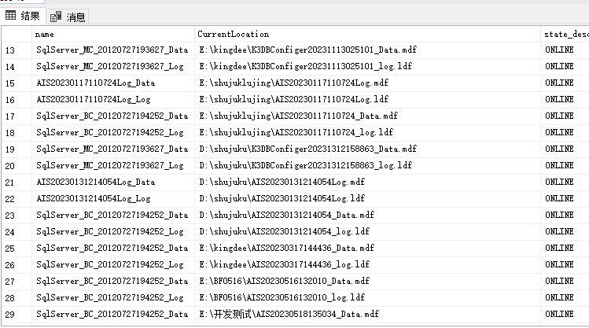
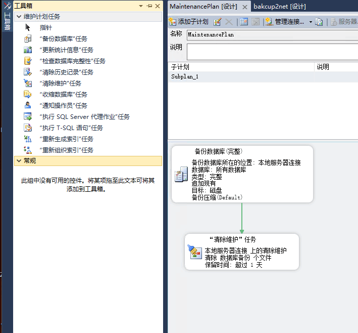

# 微软数据库

### 维护维护账号(db_datareader)

[参考](https://developer.aliyun.com/article/868429)

SQL Server 2016 (RTM) - 13.0.1601.5 (X64)    版本

oa 数据库配置文件 proxool.properties

#### 查询版本


```sql
-- Select @@version

-- SELECT SERVERPROPERTY('productversion'), SERVERPROPERTY ('productlevel'),SERVERPROPERTY ('edition')

SELECT 
SERVERPROPERTY('servername')  AS  实例名,  
SERVERPROPERTY('ProductVersion')  AS  实例版本,  
SERVERPROPERTY('Edition')  AS  产品版本,  
SERVERPROPERTY('ProductLevel')  AS  版本级别,  
@@VERSION  AS  版本信息   
```


| 实例版本    | 产品版本                    |
| ----------- | --------------------------- |
| 12.0.2000.8 | Enterprise Edition (64-bit) |
|             |                             |

## 锁

```sql
select request_session_id spid,OBJECT_NAME(resource_associated_entity_id) tableName 
from sys.dm_tran_locks where resource_type='OBJECT'	
```

## 当前事务

```sql
 select * from sys.dm_tran_session_transactions;
```


## LinkedServer（服务器对象->链接服务器）

链接服务器名 . 数据库名 . 用户名（如dbo）. 表名（或其他对象名）

```sql
select  * from WSND.ASMC.dbo.hzpytmp
```

#### 创建一个链接

```sql
exec sp_addlinkedserver '链接服务器名', '', 'SQLOLEDB', '对方实例地址'
exec sp_addlinkedsrvlogin '链接服务器名', 'false',null,'登录用户名', '密码'
```

select * from sys.servers;


#### 查询当前连接

```sql
select loginame,count(0) ct from sys.sysprocesses
group by loginame
order by ct desc
```



## 数据库查询

```sql
SELECT name, physical_name AS CurrentLocation, state_desc  
FROM sys.master_files 
```



## 备份数据库

覆盖方式备份

```sql
backup database   database_name to disk='E:\backup\database_name.bak' with init
```


```mssql
backup database   database_name to disk='E:\backup\database_name.bak' with init
```

#### 差异备份

```mssql
Backup Database *database_name* 
To disk='E:\backup\database_name.bak'
with Differential
```


#### 备份脚本

也可以设置成脚本备份

```sql
sqlcmd -i "f:\dbbak\bak.sql"
```


### 恢复数据库

脚本可指定文件

```mssql
RESTORE DATABASE AbpFirst FROM DISK='D:\AbpFirst.bak' WITH MOVE 'AbpFirst' TO 'D:\MyData\AbpFirst_Data.mdf', Move 'AbpFirst_log' TO 'D:\MyData\AbpFirst_log.ldf'
```

#### 只恢复文件

```mssql
RESTORE FILELISTONLY FROM DISK='d:\AbpFirst.bak'	
```




### 命令行访问

支持linux和docker部署

远程连接到数据库

```
sqlcmd -S 192.168.0.121,1433 -U SA 
```


#### 简单查询

```sql
USE TestDB;
SELECT * FROM Inventory WHERE quantity > 152;

go

```

必须使用go才执行

 


## win端管理工具

ssms（sql servier management studio）

直接连接图形化

 


### 修改某用户的密码

```sql
alter login dbjack with password='wsf119900'
```


