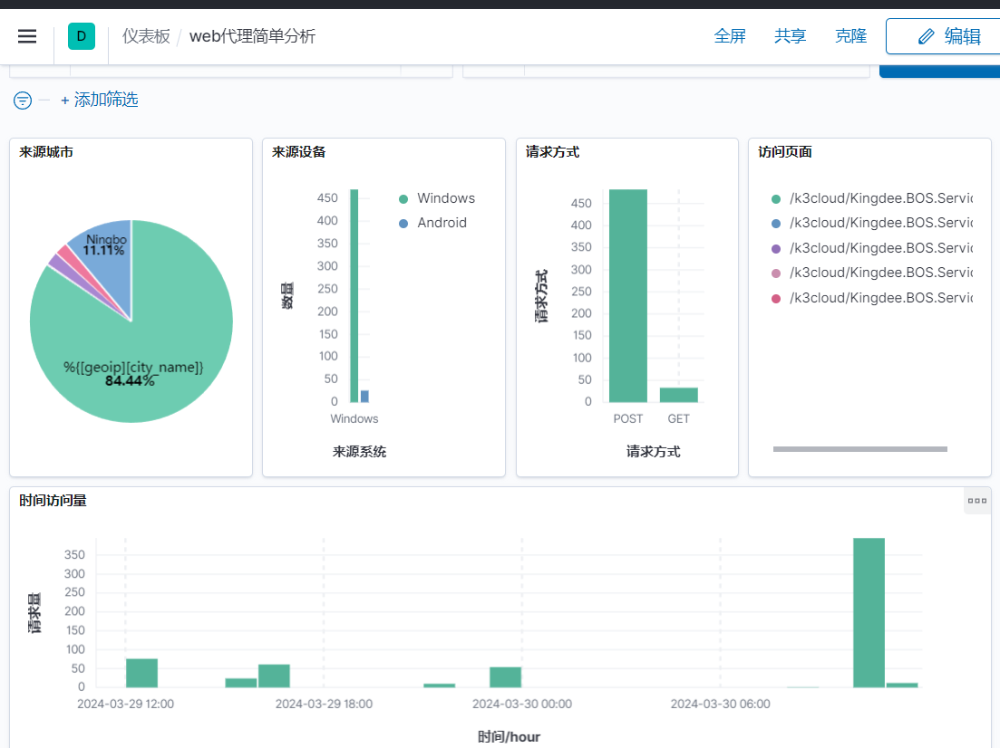
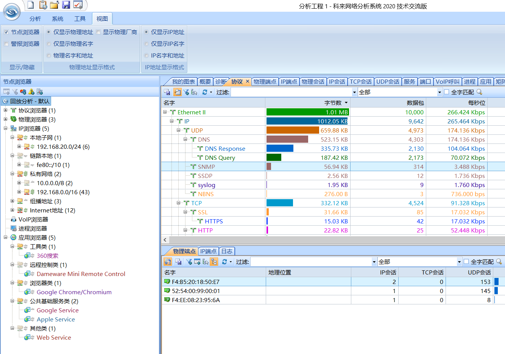

 


## 日志监控ELK Stack





http://192.168.0.123:5601/

* 按类型入库可搜索 [program] == 'xxxxxxx' 

* logstash 使用的默认514端口收集日志

```
 vi docker-compose-elk.yml 
```

 

```yml
# elasticsearch数据存储  kibana数据可视化  logstash数据收集
version: '3'

services:
  elasticsearch:
    image: docker.elastic.co/elasticsearch/elasticsearch:7.10.0
    ports:
      - "9200:9200"
    environment:
      - discovery.type=single-node

  logstash:
    image: docker.elastic.co/logstash/logstash:7.10.0
    ports:
      - "9601:9601"
      - "5044:5044"
      - "514:514/udp"
      - "9999:9999/udp"
      - "9991:9991/udp"
      - "9996:9996/udp"
      - "6343:6343/udp"
      - "2055:2055/udp"
      

  kibana:
    image: docker.elastic.co/kibana/kibana:7.10.0
    ports:
      - "5601:5601"
```

```
docker compose  -f ./docker-compose-elk.yml   up -d
```

### 改时区（发送端）

```
rm -f /etc/localtime 
ln -s /usr/share/zoneinfo/Asia/Shanghai /etc/localtime
date -R
```


```
vi /usr/share/elasticsearch/config/elasticsearch.yml  #elasticsearch配置文件
```

```
vi /usr/share/kibana/config/kibana.yml  #kibana配置文件  #i18n.locale: "zh-CN"
```

## 在接受日志配置

```
vi /usr/share/logstash/pipeline/logstash.conf  # logstash配置文件
```

### 默认配置

```ruby
input {
    beats {
    port => 5044
  }
}
output {
    stdout { codec => rubydebug}
}
```


### 测试配置

```
vi  /tmp/test-pipeline.conf 
```

```ruby
input {
    syslog{
        tags => "test"
        port => 514
    }
}
output {
    stdout { codec => rubydebug}
}
```

```
logstash -f /tmp/syslog-pipeline.conf  --path.data=/tmp/logstash
```


### 简易配置

```ruby
input {
    syslog{
        port => 514
    }
}
output {
    elasticsearch {
        hosts => ["elasticsearch:9200"]
        index => "system-syslog-%{+YYYY-MM-dd}"
    }
}
```

在elasticsearch的管理->索引管理就会收到来之logstash日志

### 基于判断配置

```ruby
output {
    if [host] == "192.168.0.2"{
        elasticsearch {
            hosts => ["elasticsearch:9200"]
            index => "huawei_tplv3_%{+YYYY_MM_dd}"
        }
    }
    if [host] == "192.168.0.121" and [logsource] == "vm" {
        elasticsearch {
            hosts => ["elasticsearch:9200"]
            index => "linux_tplv3_%{+YYYY_MM_dd}"
        }
    }
    if [host] == "192.168.0.121" and [program] in ["web_access_log","web_error_log"] {
        elasticsearch {
            hosts => ["elasticsearch:9200"]
            index => "web_tplv3_%{+YYYY_MM_dd}"
        }
    }
}
 
```

### 过滤转换  

（可在kibana开发工具中调试转换规则）

#### nginx 过滤规则

```ruby
filter {
  if [host] == "192.168.0.121" and [program] in ["web_access_log","web_error_log"]   {
      grok{
          match => {"message" => "%{IPV4:remote_addr} - (%{USERNAME:user}|-) \[%{HTTPDATE:log_timestamp}\] \"(%{WORD:request_method}|-) (%{URIPATH:uri}|-) HTTP/%{NUMBER:httpversion}\" %{NUMBER:http_status} (?:%{BASE10NUM:body_bytes_sent}|-) \"(?:%{GREEDYDATA:http_referrer}|-)\" \"(%{GREEDYDATA:user_agent}|-)\""}
      }
      geoip {
          source => "remote_addr"
          target => "geoip"
          add_field => [ "country_name", "%{[geoip][country_name]}" ]
          add_field => [ "city_name", "%{[geoip][city_name]}" ]
          add_field => [ "country_name", "%{[geoip][country_code3][0]}" ]
	    database => "/usr/share/logstash/vendor/bundle/jruby/2.5.0/gems/logstash-filter-geoip-6.0.3-java/vendor/GeoLite2-City.mmdb"
      }
    date {
      match => ["log_timestamp", "dd/MMM/yyyy:HH:mm:ss Z"]  
      target => "@timestamp"   
    }
    useragent {
         target => "agent"    
         source => "user_agent"    
    }
      
      mutate{
        remove_field => ["logsource"]
        remove_field => ["tags"]
        remove_field => ["severity"]
        remove_field => ["facility_label"]
        remove_field => ["facility"]
        remove_field => ["@version"]
        remove_field => ["timestamp"]
        convert => ["[geoip][city_name]", "string"]
        convert => ["[geoip][country_name]", "string"]
      }
  }
}
```

```ruby
    date {
         match => [ "timestamp", "MMM d HH:mm", "MMM DD HH:mm", "ISO8601"]
         target => "timestamp"　
    }
```


#### ip解析库

```
/usr/share/logstash/vendor/bundle/jruby/2.5.0/gems/logstash-filter-geoip-6.0.3-java/vendor/GeoLite2-City.mmdb
/usr/share/logstash/vendor/bundle/jruby/2.5.0/gems/logstash-filter-geoip-6.0.3-java/vendor/GeoLite2-ASN.mmdb
```


### 抓包验证数据

##### 监听查看

```
sudo netstat -anlup|grep 514
```

##### 发送日志

```
logger -n  192.168.0.123 asdfasdasfasdfsad
```

##### 抓包验证

```
tcpdump -v -nn -i enp1s0   port 514 and udp
```

```
Jan 23 2008 13:27:53 3700 %%01SHELL/6/DISPLAY_CMDRECORD(l)[21]:Record command information. (Task=VT0 , Ip=192.168.20.199, User=admin, Command="d| include info-center")
```

#### 解析后的数据

```
1 2024-03-27T08:09:42.417757+08:00 vm jack - - [timeQuality tzKnown="1" isSynced="1" syncAccuracy="223000"] asdfasdasfasdfsad
```


```ruby
{
          "priority" => 0,
          "@version" => "1",
              "host" => "192.168.0.121",
              "tags" => [
        [0] "123",
        [1] "_grokparsefailure_sysloginput"
    ],
    "facility_label" => "kernel",
          "facility" => 0,
    "severity_label" => "Emergency",
        "@timestamp" => 2024-03-27T02:05:50.078Z,
          "severity" => 0,
           "message" => "<13>1 2024-03-27T10:05:50.040097+08:00 vm jack - - [timeQuality tzKnown=\"1\" isSynced=\"1\" syncAccuracy=\"634500\"] asdfasdasfasdfsad"
}
```

## 日志外发


### Nginx日志接入

```ruby

log_format combined '$remote_addr - $remote_user [$time_local] $http_host $request_method "$uri" "$query_string" '
                  '$status $body_bytes_sent "$http_referer" $upstream_status $upstream_addr $request_time $upstream_response_time '
                  '"$http_user_agent" "$http_x_forwarded_for"' ;
```


```
access_log syslog:server=192.168.0.123:514,facility=local7,tag=web_access_log,severity=info;

error_log syslog:server=192.168.0.123:514,facility=local7,tag=web_error_log,severity=info;

```


识别设备标签 facility_label 通过这个判断  或  识别标签program

```ruby
{
        "@timestamp" => 2024-03-27T03:12:58.000Z,
         "timestamp" => "Mar 27 03:12:58",
              "type" => "system-syslog",
          "priority" => 190,
    "facility_label" => "local7",
         "logsource" => "c33462a7dc5e",
              "host" => "192.168.0.121",
          "@version" => "1",
           "program" => "nginx_access_log",
    "severity_label" => "Informational",
          "facility" => 23,
           "message" => "123.6.49.18 - - [27/Mar/2024:03:12:58 +0000] \"GET /K3Cloud/html5/script/thirdpart/kendo/messages/kendo.messages.zh-CN.min.js?ver=8.1.410.13 HTTP/1.1\" 200 14710 \"http://oa.ouqiyj.com:8099/K3Cloud\" \"Mozilla/5.0 (Linux; Android 8.0; Pixel 2 Build/OPD3.170816.012) AppleWebKit/537.36 (KHTML, like Gecko) Chrome/87.0.4280.88 Mobile Safari/537.36\"",
          "severity" => 6
}
```


### linux日志外发

```
vi /etc/rsyslog.conf
```


```ruby
 *.notice @192.168.0.123:514
```


```
sudo systemctl  restart rsyslog
```

```ruby
{
    "facility" => 3,
    "facility_label" => "system",
               "pid" => "973401",
         "timestamp" => "Mar 27 15:02:31",
           "program" => "snmpd",
        "@timestamp" => 2024-03-27T15:02:31.000Z,
          "priority" => 30,
          "@version" => "1",
              "type" => "system-syslogaaa",
          "severity" => 6,
    "severity_label" => "Informational",
           "message" => "Cannot statfs /run/user/129/gvfs: Permission denied",
              "host" => "192.168.0.121",
         "logsource" => "vm"
}
```

### docker 日志外发

```cmd
 --log-driver syslog --log-opt syslog-address=udp://127.0.0.1:514 
```


```cmd
docker run -itd  -p 80:80  --name nginx   --log-driver syslog --log-opt syslog-address=udp://127.0.0.1:514  nginx
```


## 开发工具

KQL 特有的elasticsearch查询语法


### 标准查询

```ruby
GET /linux_syslog_2024_03_29/_search
{
  "query": {
    "match_all": {}
  },
  "size":  2
}
```

### 条件查询

```ruby
GET /linux_syslog_2024*/_search
{
  "query": {
    "term" : {
      "facility_label.keyword" : {"value" : "user-level"}
    }
  },
  "size":2
}
```


## sql查询

```sql
POST /_sql/translate
{
    "query": " SELECT * FROM linux_syslog_2024_03_29 where facility_label='user-level' and severity_label='Warning'  LIMIT 2 "
}
```

```json
"includes" : [
      "@version",
      "facility",
      "facility_label",
      "host",
      "logsource",
      "message",
      "pid",
      "priority",
      "program",
      "severity",
      "severity_label",
      "timestamp"
    ],
```

```sql

```


### sql查询数据

只支持简单sql要复制查询需要json

```json

{
    "query": " SELECT host,logsource,message FROM linux_syslog_2024_03_29 LIMIT 2 "
}
```


```sqlite
POST /_sql?format=txt
{
    "query": " SELECT \"@timestamp\",host,severity_label,pid,message FROM linux_syslog_2024_03_29 LIMIT 2 "
}
```


```sql
POST /_sql?format=txt
{
  "query": "SELECT state,COUNT(*),MAX(age),AVG(balance) FROM account GROUP BY state LIMIT 10"
}
```


## 备份配置

```
docker cp  elk-logstash-1:/usr/share/logstash/pipeline/logstash.conf /opt/elk/logstash.conf
docker cp  elk-logstash-1:/tmp/test-pipeline.conf  /opt/elk/test-pipeline.conf 

```

## 修改docker配置

```
docker port elk-logstash-1
docker inspect elk-logstash-1

docker inspect elk-logstash-1|grep Id

cd /var/lib/docker/containers

vi hostconfig.json
vi config.v2.json
```


## sflow分析

### logstash接收

安装sflow插件

```
logstash-plugin install logstash-codec-sflow
logstash-plugin install logstash-codec-netflow
```

### 接收配置

```ruby
input {
  udp {
    port  => 2055
    tags => "netflow2055"
    codec => netflow
  }
  udp {
    port => 9999
    tags => "sflow9999"
    codec => sflow {
      # 可选的编解码器配置参数
    }
  }
}
```

### 输出配置

```ruby
output {
   if "sflow9999" in [tags]   {
        elasticsearch {
            hosts => ["elasticsearch:9200"]
            index => "sflow9999_%{+YYYY_MM_dd}"
        }
    }
   if "netflow2055" in [tags]   {
        elasticsearch {
            hosts => ["elasticsearch:9200"]
            index => "netflow2055_%{+YYYY_MM_dd}"
        }
    }
    stdout { codec => rubydebug}
 
}
```

### netflow/sflow测试配置

```
vi  /tmp/test-sflow.conf 
```

```
logstash -f /tmp/test-sflow.conf  --path.data=/tmp/logstash
```


### 发送端

```
sudo softflowd -i eno1 -v 5 -n 192.168.0.123:2055 -D
```

netflow v9 支持组播广播

```
sudo softflowd -i eno1 -v 9 -n 192.168.0.123:2055 -L 64 -D
```

## 网络分析

抓包离线分析

```
tcpdump -i enp1s0 -w /home/jack/t10000.cap -c 10000
```

网段

```
tcpdump -i br-lan -w /root/t224-8.cap   -c 100  'net 224.0.0.0/8'

tcpdump -i br-lan -w /root/multicast-8.cap   -c 100  ip multicast 
```

广播

```
tcpdump -i enp1s0 -w /home/jack/tbroadcast.pak   -c 100  broadcast
```


### 分析工具

导入科来离线分析



## db数据分析

 

```
docker run -d -p 12345:3000 --name metabase metabase/metabase-enterprise

```

