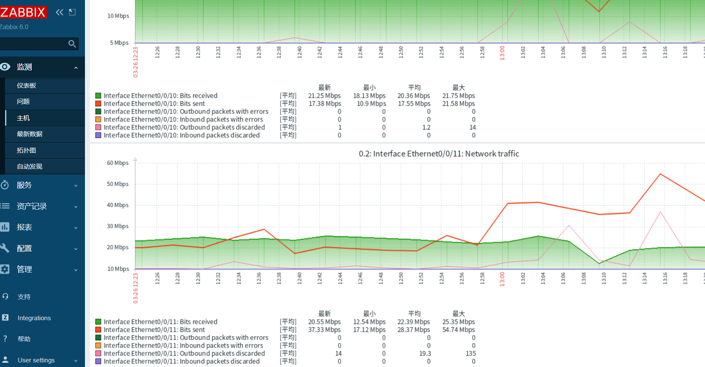

 


## 运行监控




访问地址 http://192.168.0.123:84/

默认账号：Admin
默认密码为：zabbix

### 修改语言

用户设置--配置--用户--语言

### 添加顺序

配置.主机组 -》配置.主机-》主机.监控项-》监测.最新数据

```shell
snmpwalk -c public -v 2c   localhost  sysDescr     
snmpwalk -c public -v 2c   localhost    sysName.0
snmpwalk -c public -v 2c  localhost system
```


### 测试命令

```cmd

zabbix_get -s 192.168.11.189 -p 10050 -k "system.hostname"
zabbix_get -s 192.168.11.189 -p 10050 -k "system.cpu.load"


```

如果没有此命令就需要手动安装

客户端无法连接 **Check access restrictions in Zabbix agent configuration**,

原因客户端配置文件/etc/zabbix/zabbix_agentd.conf中允许访问的列表不包含执行命令的服务器

```
Server=0.0.0.0/0

```


### 扩展zabbiz的安装源

1. 定制下载建议 

https://www.zabbix.com/download?zabbix=6.0&os_distribution=ubuntu&os_versi

 

##  snmp收集数据

### 华为snmp oid数据

arp表oid   (但是端口不准)  真实端口要从Oid:   1.3.6.1.2.1.2.2.1.2 获取

```
1.3.6.1.2.1.4.22.1
```


### 锐捷snmp oid数据

更新不及时 ？？？？

mac表oid   (但是端口不准)

```
1.3.6.1.2.1.17.4.3.1.1
```


### 容器部署zabbix

```
 vi docker-compose.yml 
```

### 最新版6.4

```yml
version: '3'
services:
  zabbix-server:
    image: zabbix/zabbix-server-mysql:alpine-6.4-latest
    ports:
      - 10051:10051
    environment:
      - DB_SERVER_HOST=mysql-server
      - MYSQL_USER=zabbix
      - MYSQL_PASSWORD=zabbix
      - MYSQL_DATABASE=zabbix
    depends_on:
      - mysql-server
    networks:
      - zabbix-network

  zabbix-web:
    image: zabbix/zabbix-web-nginx-mysql:alpine-6.4-latest
    ports:
      - 84:8080 
    environment:
      - DB_SERVER_HOST=mysql-server
      - MYSQL_USER=zabbix
      - MYSQL_PASSWORD=zabbix
      - MYSQL_DATABASE=zabbix
      - ZBX_SERVER_HOST=zabbix-server
    depends_on:
      - zabbix-server
    networks:
      - zabbix-network

  mysql-server:
    image: mysql:latest
    ports:
      - 3306:3306
    environment:
      - MYSQL_ROOT_PASSWORD=root
      - MYSQL_DATABASE=zabbix
      - MYSQL_USER=zabbix
      - MYSQL_PASSWORD=zabbix
    volumes:
      - mysql-data:/var/lib/mysql
    networks:
      - zabbix-network

networks:
  zabbix-network:

volumes:
  mysql-data:
```

### 稳定版


```yml
version: '3'
services:
  mysql:
    image: mysql:8.0
    container_name: mysql
    restart: always
    privileged: true
    environment:
      - MYSQL_ROOT_PASSWORD=myrootpass
      - MYSQL_DATABASE=zabbix
      - MYSQL_USER=zabbix
      - MYSQL_PASSWORD=mypass
      - TZ=Asia/Shanghai
      - LANG=en_US.UTF-8
    expose:
      - "3306"
    networks:
      zabbix-net:
    command: --character-set-server=utf8 --collation-server=utf8_bin
  zabbix-gateway:
    image: zabbix/zabbix-java-gateway:6.0-centos-latest
    container_name: zabbix-gateway
    volumes:
      - /etc/localtime:/etc/localtime
    restart: always
    privileged: true
    ports:
      - "10052:10052"
    networks:
      zabbix-net:
  zabbix-snmptraps:
    image: zabbix/zabbix-snmptraps:6.0-centos-latest
    container_name: zabbix-snmptraps
    restart: always
    privileged: true
    ports:
      - "1162:1162/udp"
    networks:
      zabbix-net:
  zabbix-server:
    image: zabbix/zabbix-server-mysql:6.0-centos-latest
    container_name: zabbix-server
    restart: always
    privileged: true
    environment:
      - ZBX_LISTENPORT=10051
      - DB_SERVER_HOST=mysql
      - DB_SERVER_PORT=3306
      - MYSQL_DATABASE=zabbix
      - MYSQL_USER=zabbix
      - MYSQL_PASSWORD=mypass
      - MYSQL_ROOT_PASSWORD=myrootpass
      - ZBX_CACHESIZE=1G
      - ZBX_HISTORYCACHESIZE=512M
      - ZBX_HISTORYINDEXCACHESIZE=16M
      - ZBX_TRENDCACHESIZE=256M
      - ZBX_VALUECACHESIZE=256M
      - ZBX_STARTPINGERS=64
      - ZBX_IPMIPOLLERS=1
      - ZBX_ENABLE_SNMP_TRAPS=true
      - ZBX_STARTTRAPPERS=1
      - ZBX_JAVAGATEWAY_ENABLE=true
      - ZBX_JAVAGATEWAY=zabbix-gateway
      - ZBX_STARTJAVAPOLLERS=1
    ports:
      - "10051:10051"
    networks:
      zabbix-net:
    links:
      - mysql
      - zabbix-gateway
  zabbix-web:
    image: zabbix/zabbix-web-nginx-mysql:6.0-centos-latest
    container_name: zabbix-web
    volumes:
      - /usr/share/fonts/truetype/simfang.ttf:/usr/share/zabbix/assets/fonts/DejaVuSans.ttf
      - /etc/localtime:/etc/localtime
    restart: always
    privileged: true
    environment:
      - ZBX_SERVER_NAME=Zabbix 6.0
      - ZBX_SERVER_HOST=zabbix-server
      - ZBX_SERVER_PORT=10051
      - DB_SERVER_HOST=mysql
      - DB_SERVER_PORT=3306
      - MYSQL_DATABASE=zabbix
      - MYSQL_USER=zabbix
      - MYSQL_PASSWORD=mypass
      - MYSQL_ROOT_PASSWORD=myrootpass
      - PHP_TZ=Asia/Shanghai
    ports:
      - "84:8080"
    networks:
      zabbix-net:
    links:
      - mysql
      - zabbix-server
networks:
  zabbix-net:
    driver: bridge
    ipam:
      config:
        - subnet: 10.10.10.0/24
          gateway: 10.10.10.1
```


```cmd


docker-compose -d up
docker compose  -f ./docker-compose6.0.yml  up -d
```


远程下载

```
docker pull  zabbix/zabbix-server-mysql:6.0-centos-latest
docker pull  zabbix/zabbix-web-nginx-mysql:6.0-centos-latest
docker pull zabbix/zabbix-snmptraps:6.0-centos-latest
docker pull zabbix/zabbix-java-gateway:6.0-centos-latest

docker save -o ~/zabbix-java-gateway.tar zabbix/zabbix-java-gateway:6.0-centos-latest
docker save -o ~/zabbix-snmptraps.tar  zabbix/zabbix-snmptraps:6.0-centos-latest
docker save -o ~/zabbix-web-nginx-mysql.tar  zabbix/zabbix-web-nginx-mysql
docker save -o ~/zabbix-server-mysql.tar zabbix/zabbix-server-mysql:6.0-centos-latest


```


