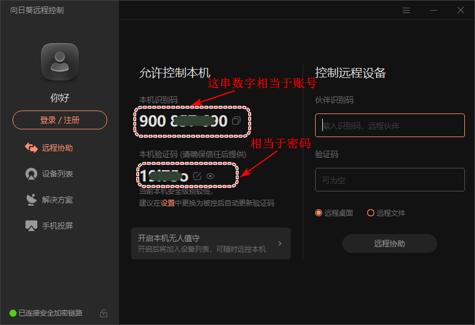
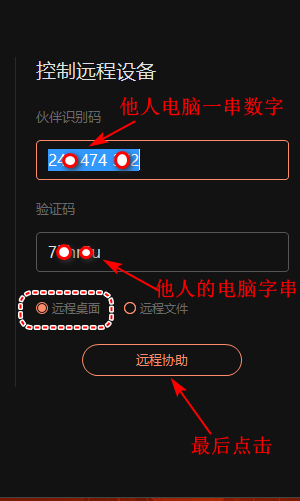
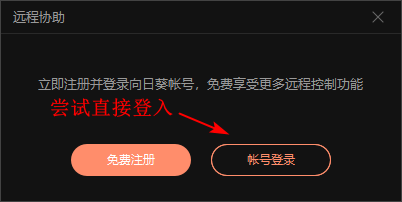
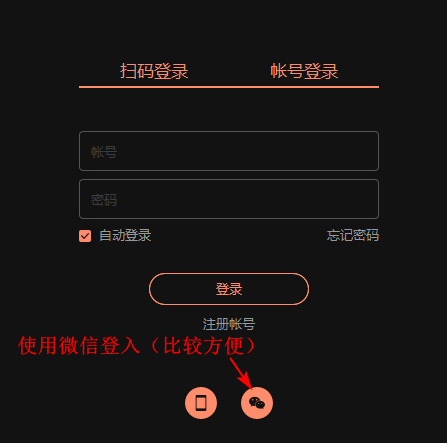
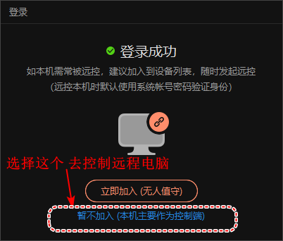
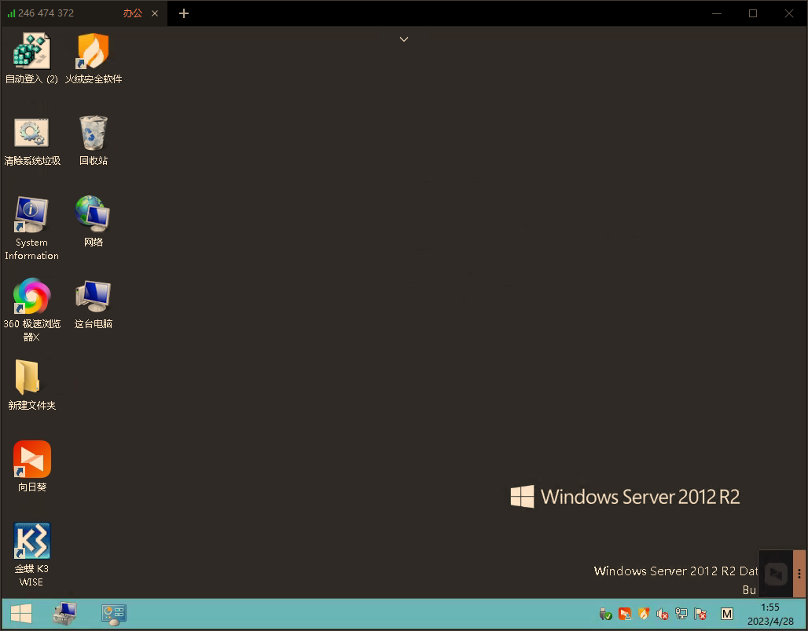

# 向日葵远程

## 通过使用k3系统

首先电脑中需要安装 “向日葵软件”

向日葵软件可以通过一串密码远程到其他电脑，也可以通过其他电脑控制本机。

### 软件启动界面

 这里有一串数字和一串文字，请保管好不要泄露知道这2串东西，它将能访问你的电脑。

### 连接到远程

连接到远程就需要知道一串数字和一串文字。并把它输入到右边的框内

#### 需要登入

这里可是使用微信扫码方式来完成登入

这里提示：询问你的电脑扮演的角色，选择作为控制端即可

这样就会看到一个电脑的桌面了

