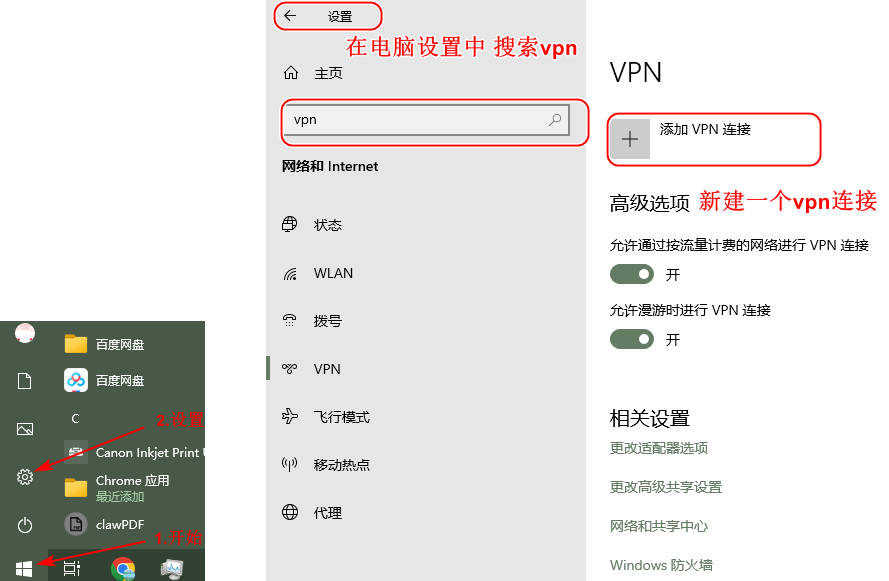
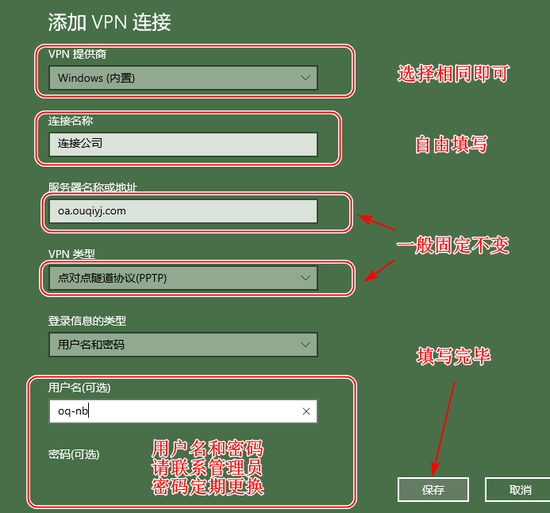
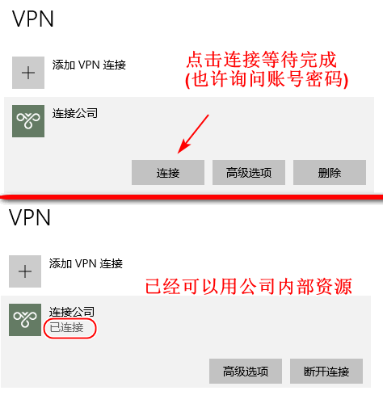

## 1.配置

以win10电脑为例

### 新建连接

## 2.连接

## 3.测试

打开一下地址测试

http://192.168.0.48/k3Cloud

http://192.168.11.111/cgi-bin/luci/

http://192.168.0.121:9090/

### 临时账号

| 用户名  | 密码     | 备注         |
| ------- | -------- | ------------ |
| oq-nb   | oq123456 | 宁波外贸使用 |
| wsf2019 | *****    | 临时使用     |
|         |          |              |

