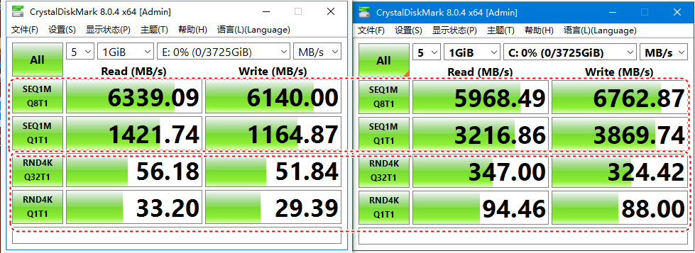

## 物理机虚拟机对比

| 机型   | 优点                                     | 缺点                           | 适用                     |
| ------ | ---------------------------------------- | ------------------------------ | ------------------------ |
| 物理机 | 使用物理硬件响应速度快              | 资源使用不充分 维护不灵活 | 数据库              |
| 虚拟机 | 迁移方便 硬件适应性强 性价比高 | 性能折损 io有瓶颈         | 应用系统 非核心业务 |

### 读写瓶颈测试

分别测试大文件连续读写和4k小文件读写,

左边为虚拟机，右边为物理机。在大文件读写时差别不大，但是小块文件读写时相差比较大。数据库类应用往往都是几条数据属于小文件读写。

#### 规划建议

做一下252虚拟机到物理机迁移测试(v2p)，如果能够直接迁移建议把252金蝶云迁移到R740xd服务器（曾经的107硬件 ）

