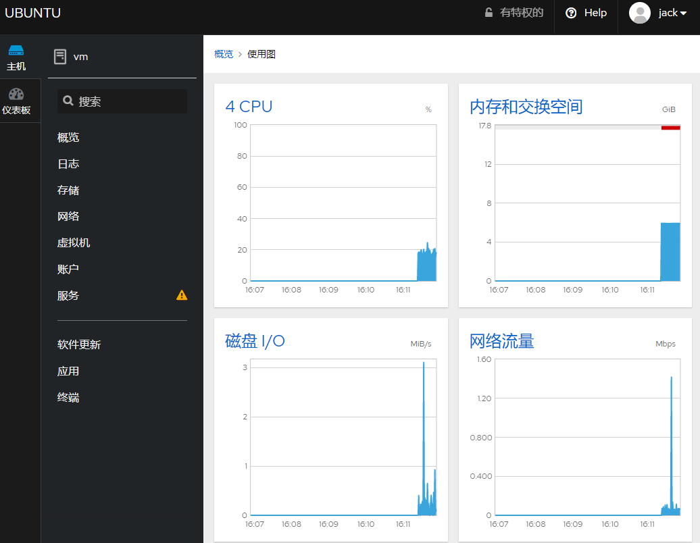

# 虚拟化

开源软件在企业中应用 open vswitch（二层）+ ospf(三层) + firewall-cmd(四层)+ kvm (5-7层) + cockpit/novnc(管理)

## kvm虚拟机

| 虚拟物理机  | ip            | 用途       |
| ----------- | ------------- | ---------- |
| Edge-R440   | 192.168.0.123 | OA系统     |
| Edge-R740xd | 192.168.0.48 | 金蝶云     |
| Edge-R740 | 192.168.0.45 | k3     |


### 虚拟化服务器管理

虚拟化 管理入口 https://192.168.0.123:9090/   

可以通过web界面查看虚拟化运行状态

创建虚拟机uefi

```shell
virt-install --virt-type kvm --name uefi  --noautoconsole --machine q35 --ram 1024    --boot loader=/usr/share/ovmf/OVMF.fd --disk none --graphics none --network none 

```
创建BIOS

```bash
virt-install --name basevm  --virt-type kvm  --noautoconsole --machine q35 --ram 1024   --disk none --graphics none --network none   --pxe
```


支持的架构

```
qemu-system-x86_64 -machine help
```


#### 桌面入口

remote-viewer spice://192.168.0.123:5902


### 物理服务器管理

通过web管理物理服务器资源使用情况




## 虚拟化迁移（P2V）


### 热迁移

热迁移需要系统vss磁盘快照

通过DISKGENIUS v5.4.6 x64 工具迁移到虚拟机

### 磁盘迁移

DISKGENIUS挂载vmdk文件 ，通过克隆分区来做镜像

* 菜单-磁盘-新建虚拟机磁盘
* 菜单-磁盘-打开虚拟机磁盘
* 磁盘-备份分区表
* 磁盘-恢复分区表
* 菜单-克隆分区

### 磁盘转换

```
qemu-img convert   -O qcow2 -p  /mnt/vm252.vmdk /opt/kvm252-c.qcow2
```


### 备份迁移

命令 clonezilla

### v2p迁移

DISKGENIUS挂在VMDK文件来 克隆分区


 

## 虚拟化网络


### 创建参数接口

```
ovs-vsctl add-br ovs1
ovs-vsctl set bridge ovs1 stp_enable=true


ovs-vsctl  add-port ovs1 eno2
ip link set ovs1 up
ifconfig eno2

ovs-vsctl  del-port ovs1  macvtap1
ovs-vsctl  del-port ovs1  95c5df14edb64_l
```


### 通物理设备 

虚拟交换机通物理交换机 trunks

```
    Bridge ovs1
        Port vnet0
            Interface vnet0
        Port ovs1
            Interface ovs1
                type: internal
        Port eno2
            trunks: [15, 16, 17, 18, 19, 20, 21, 22]
            Interface eno2
        Port vnet1
            Interface vnet1
    ovs_version: "2.13.8"


```


## 磁盘分布式

**CephFS** 3节点  支持(os mount ,app object , io block)


```
ceph -s
```


