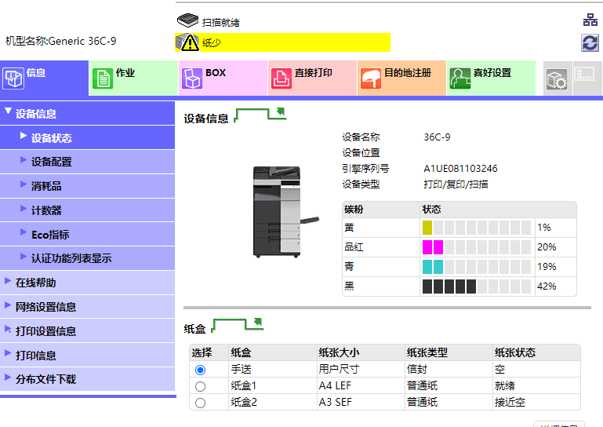
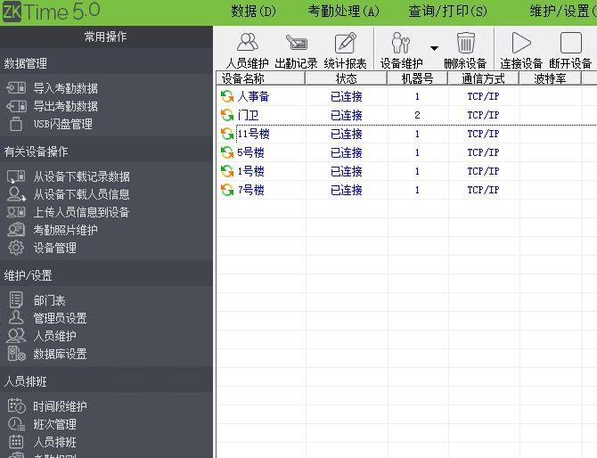
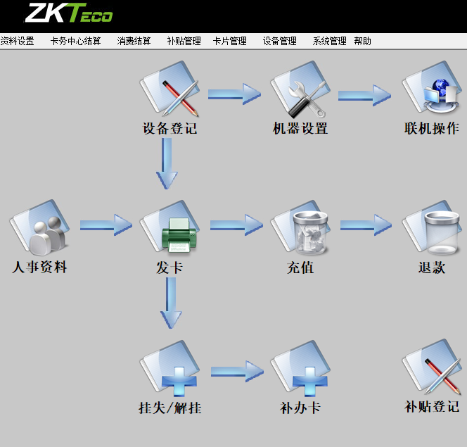

 

## 特殊设备

### 打卡机

 

| 名称           | ip             | 位置       | 备注                                                         |
| -------------- | -------------- | ---------- | ------------------------------------------------------------ |
| 打卡机         | 192.168.0.11   | 人事部     | iface702  (端口4370)  管理软件zktime 5.0                     |
| 打卡机         | 192.168.6.168  | 门卫       |                                                              |
| 打卡机         | 192.168.34.211 | 11号楼     |                                                              |
| 打卡机         | 192.168.34.202 | 5号楼      |                                                              |
| 打卡机         | 192.168.34.203 | 1号楼      |                                                              |
| 打卡机         | 192.168.34.205 | 7号楼      |                                                              |
| 打印复印一体机 | 192.168.20.200 | 二楼办公室 | http://192.168.20.200/wcd/abbr.xml 扫描文件存放 \\\\192.168.0.121\home |
| 食堂刷卡机     | 192.168.17.203 | 食堂       | ZKEpos消费管理系统                                           |

### 一体机设置

使用扫描功能需要配置图片上传服务地址比如FTP或smb

### 考勤机

考勤机只记录一部分人员信息，每个考勤设备记录数有限

### 刷卡机

每一台设备数据都有需要同步后才能正常使用

