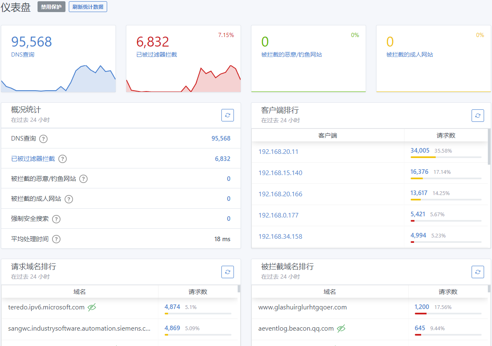
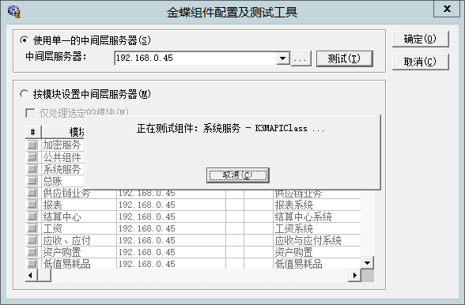
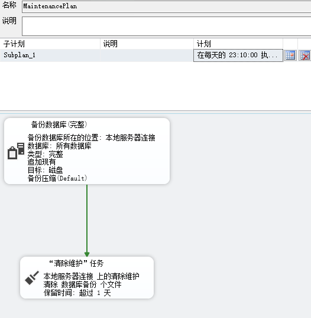

# 内部管理

### 访问网站管理




### 金蝶k3

连接端 192.168.0.45:4002 配置




### 数据库

#### sql server 备份计划设置

192.168.0.45:1433




### 共享盘

| 描述         | 地址                      | 管理人 |
| ------------ | ------------------------- | ------ |
| 销售生产文件 | \\192.168.0.45\打火机共享 |        |
| 备份文件     | \\192.168.0.107\全备份    |        |
|              |                           |        |


### 访问转发代理


### 企业邮箱

cnoqi.com


#### 0.45开放端口

开的远程RPC端口

```cmd
192.168.0.45

Discovered open port 4002/tcp on 192.168.0.45
Discovered open port 10269/tcp on 192.168.0.45
Discovered open port 80/tcp on 192.168.0.45
Discovered open port 4009/tcp on 192.168.0.45
Discovered open port 4022/tcp on 192.168.0.45
Discovered open port 5504/tcp on 192.168.0.45
Discovered open port 4010/tcp on 192.168.0.45
Discovered open port 16452/tcp on 192.168.0.45
Discovered open port 4035/tcp on 192.168.0.45
Discovered open port 445/tcp on 192.168.0.45
Discovered open port 593/tcp on 192.168.0.45
Discovered open port 4021/tcp on 192.168.0.45
Discovered open port 16453/tcp on 192.168.0.45
Discovered open port 5201/tcp on 192.168.0.45
Discovered open port 4032/tcp on 192.168.0.45
Discovered open port 3389/tcp on 192.168.0.45
Discovered open port 5159/tcp on 192.168.0.45
Discovered open port 16450/tcp on 192.168.0.45
Discovered open port 3388/tcp on 192.168.0.45
Discovered open port 2383/tcp on 192.168.0.45
Discovered open port 135/tcp on 192.168.0.45
Discovered open port 4050/tcp on 192.168.0.45
Discovered open port 4020/tcp on 192.168.0.45
Discovered open port 10268/tcp on 192.168.0.45
Discovered open port 4051/tcp on 192.168.0.45
Discovered open port 139/tcp on 192.168.0.45
Discovered open port 5985/tcp on 192.168.0.45
Discovered open port 47001/tcp on 192.168.0.45
Discovered open port 4004/tcp on 192.168.0.45
Discovered open port 4003/tcp on 192.168.0.45
Discovered open port 4005/tcp on 192.168.0.45
Discovered open port 2179/tcp on 192.168.0.45
Discovered open port 4014/tcp on 192.168.0.45
Discovered open port 4000/tcp on 192.168.0.45
Discovered open port 443/tcp on 192.168.0.45
Discovered open port 8090/tcp on 192.168.0.45
Discovered open port 17001/tcp on 192.168.0.45
Discovered open port 4001/tcp on 192.168.0.45
Discovered open port 3773/tcp on 192.168.0.45
Discovered open port 4025/tcp on 192.168.0.45
Discovered open port 4006/tcp on 192.168.0.45
Discovered open port 4015/tcp on 192.168.0.45
Discovered open port 4016/tcp on 192.168.0.45
Discovered open port 16451/tcp on 192.168.0.45
Discovered open port 3320/tcp on 192.168.0.45
Discovered open port 4008/tcp on 192.168.0.45
Discovered open port 4013/tcp on 192.168.0.45
Discovered open port 1433/tcp on 192.168.0.45
Discovered open port 4018/tcp on 192.168.0.45
Discovered open port 4007/tcp on 192.168.0.45
Discovered open port 5160/tcp on 192.168.0.45
Discovered open port 7887/tcp on 192.168.0.45
```


