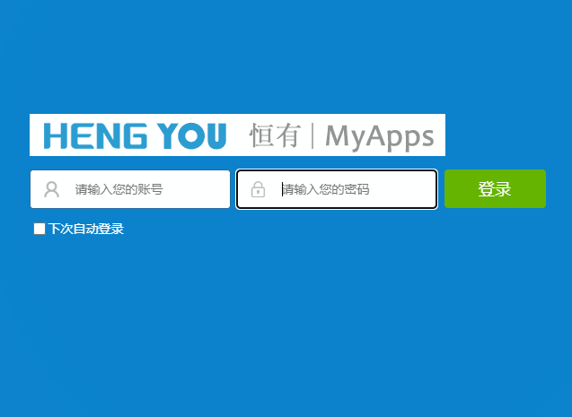
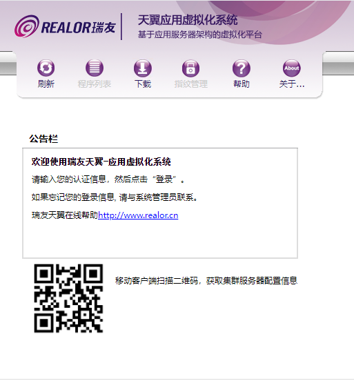
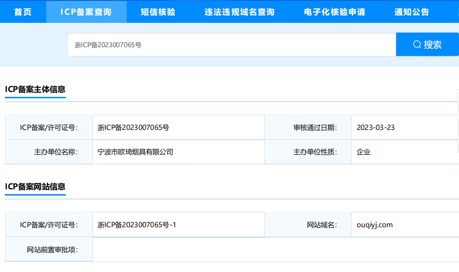
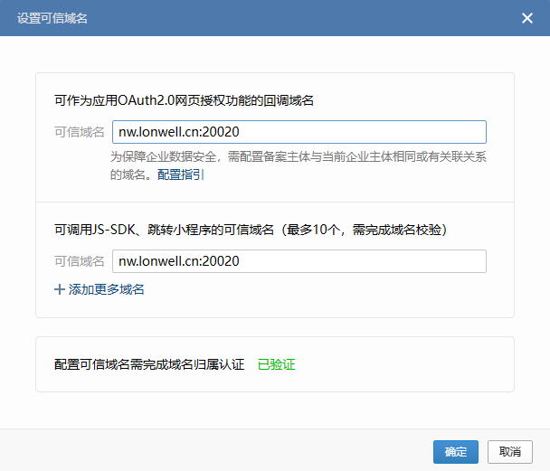

#  	外网管理


管理地址

| 名称       | 地址                                                         | 备注                                      |
| ---------- | ------------------------------------------------------------ | ----------------------------------------- |
| 公司公网ip | 112.16.172.14 （中国移动）                                   | OA部署在着ip上面 （OA内网部署）           |
| 公司网站   | [网站](https://www.ouqiyj.com/)  [英文站](www.ouqilighter.com) | 属于香港43.224.155.16/英文站104.21.56.218 |
| OA         | [oa登入](http://oa.ouqiyj.com:8081/ouqi/) / [oa管理后台](http://oa.ouqiyj.com:8081/ouqi/admin/) | 用了别人的域名`恒有` 但是指向公司的ip     |
| 虚拟化桌面 | http://oa.ouqiyj.com:8005/                                   | 驻外办公室                                |

邮件备份[mail backup](http://www.mail-qq.com/read/2091.html)

公司阿里巴巴国际站   https://cnoqi.en.alibaba.com/

### OA网页版



#### 虚拟化桌面



### 公司备案信息



### 微信验证

第三方应用跳转(OAuth)工作台 跳转到欧奇烟具   

ouqioa.nb-hengyou.com/112.16.172.14  

提示redirect_uri需使用应用可信域名 

https://open.work.weixin.qq.com/wwopen/uriconfirm?err_type=domain_err&uri=http%3A%2F%2Fouqioa.nb-hengyou.com%3A8081%2Fouqi%2Fportal%2Fphone%2Fmain.jsp%3Fapplication%3D11e8-b82b-b7056a2c-b266-7907d3bcd381%26action%3Dnull%26returnUrl%3D&retry_time=1676351344233&retry_count=1

跳转到

http://ouqioa.nb-hengyou.com:8081/ouqi/portal/phone/main.jsp?application=11e8-b82b-b7056a2c-b266-7907d3bcd381&action=null&returnUrl=

#### 回调模板

https://open.weixin.qq.com/connect/oauth2/authorize?appid=CORPID&redirect_uri=REDIRECT_URI&response_type=code&scope=snsapi_base&state=STATE&agentid=AGENTID#wechat_redirect

#### 设置方法




##### 企业微信登入入口

https://work.weixin.qq.com/wework_admin/loginpage_wx


###  icp 备案

工信部网站   https://beian.miit.gov.cn/#/Integrated/index


#### [所需资料](https://www.alibabacloud.com/help/zh/icp-filing/latest/icp-filing-regulations-for-zhejiang#concept-ycv-bgm-zdb)

| 需要材料                       | 份数 | 要求               |
| ------------------------------ | ---- | ------------------ |
| 营业执照                       | 1    | 原件电子版彩色照片 |
| 备案主体负责人必须为法定代表人 | 1    | 原件电子版彩色照片 |
| 网站LOGO                       | 1    |                    |
| 网站标题                       | 1    |                    |

#### 要求

| 要求                                           |      |      |
| ---------------------------------------------- | ---- | ---- |
| 域名有效期需大于或等于3个月                    |      |      |
| 域名持有者需与主办单位名称或法定代表人姓名一致 |      |      |
| 身份证有效期大于3个月                          |      |      |

OA公司自建 需要联系移动公司帮忙备案


### 外网开放端口

http://112.16.172.14:8081/ouqi/portal/share/security/login.jsp

http://112.16.172.14/     直接是路由器

```cmd
112.16.172.14  


Scanning 1 hosts [65535 ports/host]
Discovered open port 1723/tcp on 112.16.172.14
Discovered open port 8080/tcp on 112.16.172.14
Discovered open port 25872/tcp on 112.16.172.14
Discovered open port 5699/tcp on 112.16.172.14
Discovered open port 8081/tcp on 112.16.172.14
Discovered open port 8999/tcp on 112.16.172.14
Discovered open port 1900/tcp on 112.16.172.14
Discovered open port 5999/tcp on 112.16.172.14
Discovered open port 8890/tcp on 112.16.172.14
Discovered open port 23/tcp on 112.16.172.14
Discovered open port 7666/tcp on 112.16.172.14
Discovered open port 80/tcp on 112.16.172.14
Discovered open port 7999/tcp on 112.16.172.14
Discovered open port 9999/tcp on 112.16.172.14
Discovered open port 3389/tcp on 112.16.172.14
Discovered open port 15872/tcp on 112.16.172.14
Discovered open port 8000/tcp on 112.16.172.14
Discovered open port 8091/tcp on 112.16.172.14

```


