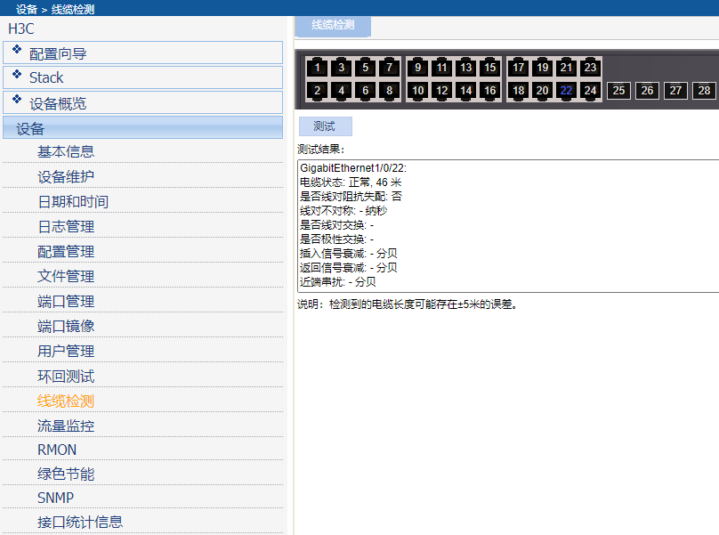

 


## 华三交换机   poe三层

S1850-28p-pwr/s5130-28s  （只读管理建议使用web）

[在线命令查看](https://www.h3c.com/cn/BizPortal/QueryCli/cn_index.aspx)




### 查看版本和运行时间

```
display version
```

### 改名

```
sysname  lou5
```

关闭 提示信息

```
undo info-center enable
```


普通模式下

### 重置配置

```cmd
reset saved-configuration
reboot
```

恢复出厂配置

```
restore factory-default
```

### 回环检查

```
loopback-detection enable
dis loopback-detection

```


### 配置IP地址

查看ip

```cmd
display ip interface

display ip interface vlan-interface brief
```

查看本机mac

```
display stp
dis int gi 1/0/1   每个接口都有mac
```

 


#### 设置ip

```
interface vlan-interface 1
ip address 192.168.11.202 255.255.255.0

```

#### 配置默认路由

```
ip route-static 0.0.0.0  0  192.168.11.1
```


### 设置常用服务

#### 发现协议lldp 

```cmd
lldp enable


display lldp neighbor-information   #显示附近的设备
```


#### telnet 开启

```
telnet server enable
```


#### 查看接口状况

```
display interface brief
```

### 修改接口备注

```

interface GigabitEthernet1/0/24
description string 
```


### 统计信息

```
display interface brief
```


#### 端口加入vlan

```
vlan 2
port GigabitEthernet 1/0/2

```


### trunk口


```
#
interface GigabitEthernet1/0/1
 port link-type hybrid
 port hybrid vlan 1 untagged
 port hybrid pvid vlan 11
 poe enable
#
interface GigabitEthernet1/0/2
 port link-type trunk
 port trunk permit vlan 1 to 1024
 port trunk pvid vlan 2
 poe enable
#
interface GigabitEthernet1/0/3
 description DuanKou1
 port link-type hybrid
 port hybrid vlan 1 untagged
 port hybrid pvid vlan 11
 poe enable
#
interface GigabitEthernet1/0/4
 port link-type trunk
 port trunk permit vlan 1 to 1024
 port trunk pvid vlan 2
 poe enable


```

