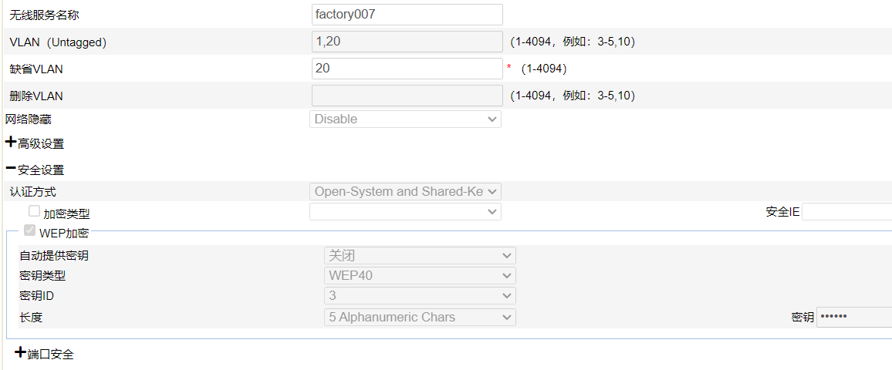

 


# 华三胖AP设置

 H3C WA2620i-AGN  胖瘦一体

[WA系列无线接入点设备配置指导](http://www.h3c.com/cn/Service/Document_Software/Document_Center/Wlan/WA/WA2600/)

[H3C WA2600系列无线接入点  配置调测 配置指导 H3C WA系列无线接入点 配置指导 ](https://www.h3c.com/cn/d_201707/1017275_30005_0.htm)

[web胖ap设置](https://www.h3c.com/cn/d_201502/854962_30005_0.htm)

无缝漫游 需要支持kvr协议

## 初始设置  

```
dis version
dis clock
```


### IP设置


```
clock datetime 11:11:11 2023/12/26
```


```
undo info-center enable

```

```


tftp  10.0.0.4  put startup.cfg startup.bak       
tftp  10.0.0.4  put wa2600a_fit.bin  wa2600a_fit.bak

 
tftp  10.0.0.4 get WA2600A-CMW520-R1308P05-FAT.bin  wa2600a_fat.bin             
bootrom update file wa2600a_fat.bin
boot-loader file wa2600a_fat.bin main
reboot

```


### 通过串口设置

```
system-view

interface vlan-interface 1

ip address 10.0.0.2 24


quit
telnet server enable
```

### 设置密码

```
user-interface vty 0 4

authentication-mode password
set authentication password simple admin

user privilege level 3

```

### ip查看

```
display ip interface brief
display ip routing-table
display arp 
display dhcp client 
```


## web管理 

```cmd
display web users
display ip https
ip https enable

```

```
local-user admin


password simple admin
authorization-attribute level 3
service-type web


```


## 无线设置

```

display interface wlan-radio
display interface wlan-bss 
display interface wlan-mesh 

interface wlan-radio

```

 ###  无线简单密码配置


