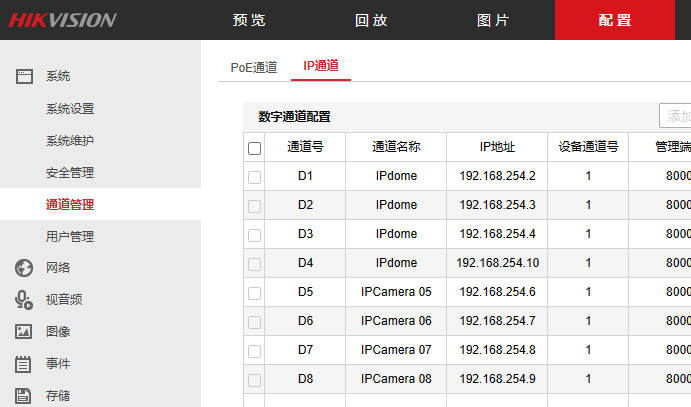

# 摄像头

[选型](https://www.hikvision.com/cn/products/product-selector/?category=%E6%9C%8D%E5%8A%A1%E5%99%A8%E4%BA%A7%E5%93%81&checkedSubSeries=null)

## 海康威视(主机)

| 名称           | 地址           | 管理账号 | 位置        | 备注                                                         |
| -------------- | -------------- | -------- | ----------- | ------------------------------------------------------------ |
| 门卫监控主机   | 192.168.6.247  | admin    | 门卫        | [预 览](http://192.168.6.247/doc/page/login.asp?_1676007437416) |
| 电商监控主机   | 192.168.34.244 | admin    | 电商办公室  |                                                              |
| 1-2楼外围监控  | 192.168.88.250 | admin    | 1号楼挂壁   | 含部分电商                                                   |
| 3-5号楼通道    | 192.168.88.251 | admin    |             | 无回放                                                       |
| 9，11号楼      | 192.168.88.253 | admin    | 10号楼      | DS-7816N-K2                                                  |
| 5，7号楼       | 192.168.88.254 | admin    | (7号楼挂壁) | 吸烟室                                                       |
| 各个办公室     | 192.168.17.249 | admin    | 行政办公室  | [预 览](http://192.168.17.249/doc/page/preview.asp)          |
| 室外过道       | 192.168.88.251 | admin    |             | [预 览](http://192.168.6.247/doc/page/preview.asp)           |
| 注塑车间       | 192.168.87.250 | admin    |             | [预 览](http://192.168.87.250/doc/page/preview.asp) DS-8632N-E8 |
| 充调，焊接     | 192.168.6.250  | admin    | 门卫        | DS-7932-R4                                                   |
| 充调           | 192.168.6.100  | admin    |             | [预 览](http://192.168.6.100/doc/page/preview.asp)           |
|                | 192.168.6.9    | admin    | 冲调车间    | [登录](http://192.168.6.9/doc/page/login.asp?_1677204535599) （不知道密码） |
| 机房           | 192.168.11.188 | admin    | 机房        | [预览](http://192.168.11.188/doc/page/preview.asp)           |

### 云平台监控

下载 Ezviz Studio 电脑版或手机版本


### 配置和管理通道




### 常见配置

#### 无法显示视频问题

主菜单->配置->网络->高级配置-平台接入， 取消勾选码流加密


#### 修改摄像头描述


主菜单->配置->图像->OSD设置 修改通道名称


#### 取消萤石云绑定

需要连接显示器 主菜单-》配置-》网络配置-》账号状态-》解绑


## 截取视频

如果没有对应的解码器需要重新编解码

```
ffmpeg -y -i C:\Users\Administrator\Web\DownloadFiles\2023-04-29\00010003228000000.mp4   -ss 00:50:00 -to 00:55:50 test_cut.mp4  
```

#### 不转码直接截取

```
-c:v copy -c:a copy  #//音视频都拷贝

-c:v copy -c:a aac  #//音频重新编码
```

```
ffmpeg -y -i C:\Users\Administrator\Web\DownloadFiles\2023-04-29\00010003228000000.mp4  -c:v copy -c:a aac  -ss 00:50:00 -to 00:55:50 test_cut2.mp4  
```


## 特殊监控

#### web远程管理 老监控


192.168.6.128  
192.168.6.127
需要安装
QuickTime 7.7.9


 

#### ip pc融合

192.168.20.3

#### ip vlan错位

192.168.6.17  7号楼

