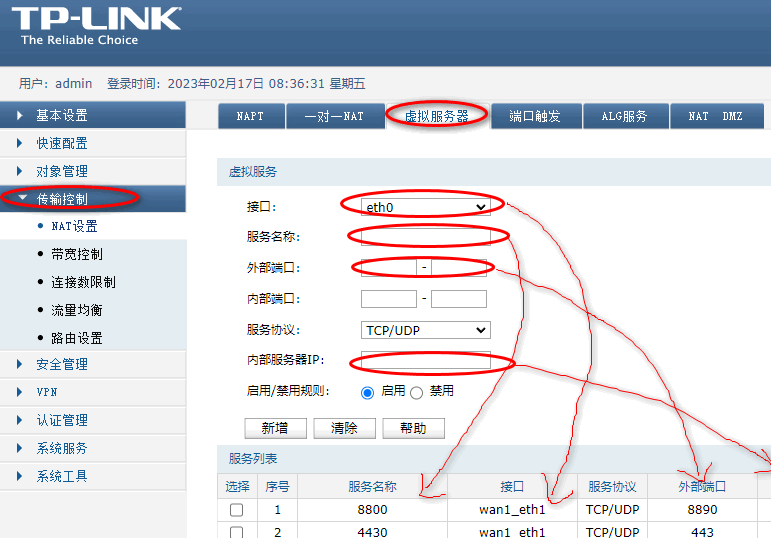

 

## 管理企业路由器

web->安全管理-arp防御

C类内部配置ip 192.168.5.1

A类地址 10.0.0.1

公网ip 112.16.172.14

系统工具-》浏览统计

记得保存配置（在web界面上）

### 端口映射

###  端口映射

| 选择 | 序号 | 服务名称 | 接口 | 服务协议 | 外部端口 | 内部端口 | 内部服务器IP | 状态 |
| ---- | ---- | -------- | ---- | -------- | -------- | -------- | ------------ |
|      | 1    | 瑞友8800      | wan1_eth1 | TCP/UDP | 8890  | 8890  | 192.168.0.99   | 已启用 |
|      | 2    | 4430          | wan1_eth1 | TCP/UDP | 443   | 443   | 192.168.0.99   | 已启用 |      |
|      | 3    | 瑞友5872      | wan1_eth1 | TCP/UDP | 5872  | 5872  | 192.168.0.99   | 已启用 |      |
|      | 4    | 考勤107       | wan1_eth1 | TCP/UDP | 5699  | 1433  | 192.168.0.107  | 已启用 |      |
|      | 5    | OA服务器web   | wan1_eth1 | TCP/UDP | 8081  | 8080  | 192.168.0.107  | 已启用 |      |
|      | 6    | OA服务器分销1 | wan1_eth1 | TCP/UDP | 6868  | 9898  | 192.168.0.107  | 已启用 |      |
|      | 7    | OA服务器分销2 | wan1_eth1 | TCP/UDP | 6869  | 9899  | 192.168.0.107  | 已启用 |      |
|      | 8    | 远程          | wan1_eth1 | TCP/UDP | 3389  | 3389  | 192.168.0.107  | 已禁用 |      |
|      | 9    | web2          | wan1_eth1 | TCP/UDP | 8089  | 8089  | 192.168.0.107  | 已启用 |      |
|      | 10   | JK1           | wan1_eth1 | TCP/UDP | 7666  | 80    | 192.168.17.249 | 已启用 |      |
|      | 11   | jk002         | wan1_eth1 | TCP/UDP | 8000  | 80    | 192.168.17.150 | 已启用 |      |
|      | 12   | 远程桌面      | wan1_eth1 | TCP/UDP | 8999  | 3389  | 192.168.0.252  | 已禁用 |      |
|      | 13   | 瑞友5873      | wan1_eth1 | TCP/UDP | 15872 | 15872 | 192.168.0.99   | 已启用 |      |
|      | 14   | 瑞友25872     | wan1_eth1 | TCP/UDP | 25872 | 15872 | 192.168.0.99   | 已启用 |      |
|      | 15   | mstsc         | wan1_eth1 | TCP/UDP | 13389 | 3389  | 192.168.0.121  | 已启用 |      |
|      | 16   | K3Cloud       | wan1_eth1 | TCP/UDP | 8091  | 8091  | 192.168.0.252  | 已启用 |      |
|      | 17   | 7000          | wan1_eth1 | TCP/UDP | 7000  | 7000  | 192.168.6.200  | 已启用 |      |
|      | 18   | 7100          | wan1_eth1 | TCP/UDP | 7100  | 7100  | 192.168.6.200  | 已启用 |      |
|      | 19   | 7200          | wan1_eth1 | TCP/UDP | 7200  | 7200  | 192.168.6.200  | 已启用 |      |
|      | 20   | webmir        | wan1_eth1 | TCP/UDP | 8090  | 80    | 192.168.6.200  | 已启用 |      |
|      | 21   | 45            | wan1_eth1 | TCP/UDP | 5999  | 3389  | 192.168.0.45   | 已禁用 |      |
|      | 22   | 99            | wan1_eth1 | TCP/UDP | 7999  | 3389  | 192.168.0.99   | 已禁用 |      |

##### ARP列表

| 选择 | 序号 | IP地址 | MAC地址 | 接口 | 状态 |
| ---- | ---- | ------ | ------- | ---- | ---- |
|      | 1    | 10.0.0.2       | 80-FB-06-C9-6D-B9 | eth0      |  已生效  |
|      | 2    | 112.16.172.1   | A0-F3-E4-98-20-D3 | wan1_eth1 | 未绑定                                                       |
|      | 3    | 112.16.172.28  | A0-F3-E4-98-20-D3 | wan1_eth1 | 未绑定                                                       |
|      | 4    | 112.16.172.118 | A0-F3-E4-98-20-D3 | wan1_eth1 | 未绑定                                                       |
|      | 5    | 192.168.5.21   | F4-6D-2F-19-83-F8 | dmz_eth1  | 未绑定                                                       |

##### arp 绑定表

| 序号 | IP地址        | MAC地址           | 出接口   | 备注             | 状态   |
| ---- | ------------- | ----------------- | -------- | ---------------- | ------ |
| 1    | 192.168.0.2   | 38-83-45-F3-A9-CD | eth0     | import           | 已启用 |
| 2    | 192.168.0.7   | 00-1D-0F-99-F5-AD | eth0     | import           | 已启用 |
| 3    | 192.168.0.12  | E0-05-C5-54-A7-75 | eth0     | import           | 已启用 |
| 4    | 192.168.0.14  | 14-E6-E4-87-F5-E1 | eth0     | import           | 已启用 |
| 5    | 192.168.0.17  | EC-88-8F-D6-AF-4F | eth0     | import           | 已启用 |
| 6    | 192.168.0.18  | 00-23-CD-70-E5-0B | eth0     | import           | 已启用 |
| 7    | 192.168.0.22  | 00-30-18-AD-06-B9 | eth0     | import           | 已启用 |
| 8    | 192.168.0.26  | 90-94-E4-AD-3D-83 | eth0     | import           | 已启用 |
| 9    | 192.168.0.85  | 00-E0-4C-36-04-AD | eth0     | import           | 已启用 |
| 10   | 192.168.0.39  | 00-30-67-1A-84-47 | eth0     | 厉国勇           | 已启用 |
| 11   | 192.168.0.92  | 54-04-A6-A0-24-16 | eth0     | 彭敏芳           | 已启用 |
| 12   | 192.168.0.121 | 00-24-8C-E8-AF-88 | eth0     | import           | 已启用 |
| 13   | 192.168.0.51  | 14-DA-E9-F0-07-E3 | eth0     | 陈挺             | 已启用 |
| 14   | 192.168.0.53  | 00-23-54-D6-45-18 | eth0     | 采购部           | 已启用 |
| 15   | 192.168.0.54  | 14-CF-92-E3-78-0B | eth0     | 陈红波           | 已启用 |
| 16   | 192.168.0.57  | BC-AE-C5-6F-ED-FB | eth0     | import           | 已启用 |
| 17   | 192.168.0.61  | BC-5F-F4-93-A6-6D | eth0     | import           | 已启用 |
| 18   | 192.168.0.62  | 00-1F-C6-03-1F-1A | eth0     | import           | 已启用 |
| 19   | 192.168.0.63  | 00-22-15-C4-C2-39 | eth0     | import           | 已启用 |
| 20   | 192.168.0.65  | 00-E0-4D-7E-5F-62 | eth0     | import           | 已启用 |
| 21   | 192.168.0.67  | 90-E6-BA-DF-8E-96 | eth0     | import           | 已启用 |
| 22   | 192.168.0.68  | E0-CB-4E-EA-4B-C8 | eth0     | import           | 已启用 |
| 23   | 192.168.0.69  | 90-2B-34-2A-5C-2D | eth0     | import           | 已启用 |
| 24   | 192.168.0.70  | 20-CF-30-80-B5-09 | eth0     | import           | 已启用 |
| 25   | 192.168.0.232 | E0-3F-49-A4-C6-CF | eth0     | import           | 已启用 |
| 26   | 192.168.0.76  | BC-AE-C5-AD-F5-DF | eth0     | import           | 已启用 |
| 27   | 192.168.0.79  | 00-24-8C-BB-04-61 | eth0     | import           | 已启用 |
| 28   | 192.168.0.84  | 90-2B-34-9E-55-3D | eth0     | import           | 已启用 |
| 29   | 192.168.0.86  | 48-5B-39-53-DF-6B | eth0     | import           | 已启用 |
| 30   | 192.168.0.89  | 00-30-18-AD-8B-B4 | eth0     | import           | 已启用 |
| 31   | 192.168.0.90  | 00-30-18-AC-F9-5C | eth0     | import           | 已启用 |
| 32   | 192.168.0.93  | 00-30-18-AD-8B-B6 | eth0     | import           | 已启用 |
| 33   | 192.168.0.94  | 00-30-18-AC-F8-6A | eth0     | import           | 已启用 |
| 34   | 192.168.0.95  | 00-30-18-AC-F7-FA | eth0     | import           | 已启用 |
| 35   | 192.168.0.96  | 74-D4-35-6C-8A-6B | eth0     | import           | 已启用 |
| 36   | 192.168.0.99  | 90-E6-BA-94-D3-93 | eth0     | import           | 已启用 |
| 37   | 192.168.0.102 | 00-1F-D0-C3-CE-83 | eth0     | import           | 已启用 |
| 38   | 192.168.0.104 | 00-24-1D-07-20-0C | eth0     | import           | 已启用 |
| 39   | 192.168.0.105 | 00-24-1D-07-EF-ED | eth0     | import           | 已启用 |
| 40   | 192.168.0.106 | 74-EA-3A-6B-D4-4A | eth0     | import           | 已启用 |
| 41   | 192.168.0.107 | 00-1A-64-B2-60-D0 | eth0     | import           | 已启用 |
| 42   | 192.168.0.110 | 00-22-4D-4B-9B-96 | eth0     | import           | 已启用 |
| 43   | 192.168.0.112 | 14-CF-92-E3-63-AE | eth0     | import           | 已启用 |
| 44   | 192.168.0.113 | BC-AE-C5-AD-0C-84 | eth0     | import           | 已启用 |
| 45   | 192.168.0.114 | 90-E6-BA-9A-A3-87 | eth0     | import           | 已启用 |
| 46   | 192.168.0.115 | 90-E6-BA-9A-A3-FA | eth0     | import           | 已启用 |
| 47   | 192.168.0.116 | 00-E0-4C-36-24-32 | eth0     | import           | 已启用 |
| 48   | 192.168.0.120 | 14-DA-E9-43-F1-09 | eth0     | import           | 已启用 |
| 49   | 192.168.0.122 | 54-04-A6-A0-23-3F | eth0     | import           | 已启用 |
| 50   | 192.168.0.123 | 00-26-18-C9-7A-5C | eth0     | import           | 已启用 |
| 51   | 192.168.0.56  | 5C-63-BF-88-CE-7B | eth0     | 翁瑞挺           | 已启用 |
| 52   | 192.168.0.126 | 90-2B-34-E2-EF-BF | eth0     | import           | 已启用 |
| 53   | 192.168.0.128 | C8-60-00-DE-3C-78 | eth0     | import           | 已启用 |
| 54   | 192.168.0.130 | C8-3A-35-3C-FA-08 | eth0     | import           | 已启用 |
| 55   | 192.168.0.131 | B8-AC-6F-5B-31-02 | eth0     | import           | 已启用 |
| 56   | 192.168.0.139 | 94-DE-80-4F-73-50 | eth0     | import           | 已启用 |
| 57   | 192.168.0.140 | 00-1F-16-29-D2-36 | eth0     | import           | 已启用 |
| 58   | 192.168.0.144 | 40-16-7E-23-51-CA | eth0     | import           | 已启用 |
| 59   | 192.168.0.154 | 00-E0-4D-2D-10-E5 | eth0     | import           | 已启用 |
| 60   | 192.168.0.156 | F4-6D-04-3D-DD-50 | eth0     | import           | 已启用 |
| 61   | 192.168.0.162 | 6C-F0-49-AF-0D-0E | eth0     | import           | 已启用 |
| 62   | 192.168.0.163 | 00-19-21-35-91-38 | eth0     | import           | 已启用 |
| 63   | 192.168.0.164 | 00-E0-4D-49-72-72 | eth0     | import           | 已启用 |
| 64   | 192.168.0.169 | 00-1F-C6-03-1F-09 | eth0     | import           | 已启用 |
| 65   | 192.168.0.170 | 00-1E-8C-B1-62-BE | eth0     | import           | 已启用 |
| 66   | 192.168.0.171 | 00-E0-4C-02-47-F5 | eth0     | import           | 已启用 |
| 67   | 192.168.0.172 | BC-5F-F4-93-F6-1A | eth0     | import           | 已启用 |
| 68   | 192.168.0.173 | 00-E0-4C-16-61-31 | eth0     | import           | 已启用 |
| 69   | 192.168.0.175 | BC-5F-F4-93-F6-26 | eth0     | import           | 已启用 |
| 70   | 192.168.0.179 | BC-5F-F4-93-F6-2B | eth0     | import           | 已启用 |
| 71   | 192.168.0.180 | 08-60-6E-C2-55-D3 | eth0     | import           | 已启用 |
| 72   | 192.168.0.181 | 08-60-6E-C2-57-5E | eth0     | import           | 已启用 |
| 73   | 192.168.0.182 | 08-60-6E-C2-57-3B | eth0     | import           | 已启用 |
| 74   | 192.168.0.185 | BC-5F-F4-95-11-27 | eth0     | import           | 已启用 |
| 75   | 192.168.0.192 | 94-DE-80-A7-9D-4B | eth0     | import           | 已启用 |
| 76   | 192.168.0.193 | 00-E0-66-97-66-DC | eth0     | import           | 已启用 |
| 77   | 192.168.0.194 | 74-D4-35-21-C6-25 | eth0     | import           | 已启用 |
| 78   | 192.168.0.251 | 00-12-12-10-51-E0 | eth0     | import           | 已启用 |
| 79   | 192.168.0.158 | 00-1F-C6-4E-B0-B0 | eth0     | 历青             | 已启用 |
| 80   | 192.168.0.41  | AC-16-2D-0F-B8-0B | eth0     | 1楼测私房南      | 已启用 |
| 81   | 192.168.0.32  | 5C-FF-35-04-8C-7F | eth0     | 吸塑车间笔记本   | 已启用 |
| 82   | 192.168.0.31  | 00-E0-66-0B-54-FD | eth0     | 吸塑厂台机       | 已启用 |
| 83   | 192.168.0.35  | D4-C9-EF-80-57-2D | eth0     | 伊莱克斯         | 已启用 |
| 84   | 192.168.0.34  | 00-26-22-B5-29-81 | eth0     | 新飞oem          | 已启用 |
| 85   | 192.168.0.33  | A8-15-4D-D1-19-C1 | eth0     | 原采购部出租路由 | 已启用 |
| 86   | 192.168.0.36  | 14-CF-92-E3-78-8B | eth0     | 老板娘           | 已启用 |
| 87   | 192.168.0.37  | C8-2A-14-35-39-2E | eth0     | 包建宏           | 已启用 |
| 88   | 192.168.0.52  | 00-1F-D0-C3-84-03 | eth0     | 虞自力           | 已启用 |
| 89   | 192.168.0.81  | 00-E0-4C-EE-80-3B | eth0     | gy3              | 已启用 |
| 90   | 192.168.0.97  | 00-1D-92-21-83-18 | eth0     | 工艺             | 已启用 |
| 91   | 192.168.0.98  | 00-E0-4D-1C-F9-65 | eth0     | 设备科           | 已启用 |
| 92   | 192.168.0.133 | 10-BF-48-7A-F0-01 | eth0     | finance1         | 已启用 |
| 93   | 192.168.0.143 | 00-16-96-05-A6-6C | eth0     | 柴晓霞           | 已启用 |
| 94   | 192.168.0.38  | 00-13-8F-EA-CE-DF | eth0     | 司机             | 已启用 |
| 95   | 192.168.0.55  | 3C-97-0E-8D-36-A9 | eth0     | 李红英           | 已启用 |
| 96   | 192.168.0.124 | D8-5D-4C-70-B6-4F | eth0     | 陈萍             | 已启用 |
| 97   | 192.168.0.91  | 00-24-8C-E8-AF-82 | eth0     | 陈备庆           | 已启用 |
| 98   | 192.168.0.119 | 00-01-2E-37-7C-C5 | eth0     | 陈双露           | 已启用 |
| 99   | 192.168.0.77  | 00-30-18-AC-F8-F1 | eth0     | 童旭文           | 已启用 |
| 100  | 192.168.0.141 | 00-15-58-EA-05-51 | eth0     | 叶戎亚           | 已启用 |
| 101  | 192.168.0.40  | 28-2C-B2-CA-D5-ED | eth0     | 艾丽格           | 已启用 |
| 102  | 192.168.0.4   | 00-14-78-63-E8-A5 | eth0     | 4148             | 已启用 |
| 103  | 192.168.0.117 | F4-6D-04-93-DB-ED | eth0     | ---              | 已启用 |
| 104  | 192.168.0.101 | 00-1F-D0-C3-CE-A2 | eth0     | ---              | 已启用 |
| 105  | 192.168.0.195 | 74-27-EA-E8-FE-F9 | eth0     | 财务开票         | 已启用 |
| 106  | 192.168.0.153 | 00-16-96-07-C0-EB | eth0     | 财务             | 已启用 |
| 107  | 192.168.0.21  | D8-42-AC-8B-F4-62 | eth0     | 售后无线         | 已启用 |
| 108  | 192.168.0.88  | 00-1D-7D-46-F5-04 | eth0     | ---              | 已启用 |
| 109  | 192.168.0.129 | D8-50-E6-51-63-D3 | eth0     | ---              | 已启用 |
| 110  | 192.168.0.60  | 00-26-18-4A-8F-9F | eth0     | ---              | 已启用 |
| 111  | 192.168.0.196 | 00-E0-4C-7D-00-11 | eth0     | ---              | 已启用 |
| 112  | 192.168.0.138 | C0-3F-D5-07-32-84 | eth0     | ---              | 已启用 |
| 113  | 192.168.0.161 | 44-33-4C-4F-69-04 | eth0     | ---              | 已启用 |
| 114  | 192.168.0.236 | D8-15-0D-E4-EF-C7 | eth0     | ---              | 已启用 |
| 115  | 192.168.0.74  | 74-D4-35-6C-A0-3B | eth0     | ---              | 已启用 |
| 116  | 192.168.0.231 | BC-AE-C5-13-BA-DD | eth0     | oem              | 已启用 |
| 117  | 192.168.0.3   | E0-05-C5-C3-D7-4F | eth0     | 4148             | 已启用 |
| 118  | 192.168.0.11  | 00-21-27-B0-B4-4B | eth0     | ---              | 已启用 |
| 119  | 192.168.0.45  | 40-F2-E9-D2-66-C8 | eth0     | k3               | 已启用 |
| 120  | 192.168.0.100 | 00-E0-4C-EE-84-2D | eth0     | ---              | 已启用 |
| 121  | 192.168.0.241 | 8C-E7-48-0F-E0-12 | eth0     | 241              | 已启用 |
| 122  | 192.168.0.242 | 00-40-48-3A-C2-94 | eth0     | 242              | 已启用 |
| 123  | 192.168.0.243 | 00-40-48-37-EC-E8 | eth0     | 243              | 已启用 |
| 124  | 192.168.0.244 | 00-0C-41-4E-01-62 | eth0     | 244              | 已启用 |
| 125  | 192.168.0.245 | 8C-E7-48-6A-54-EE | eth0     | 245              | 已启用 |
| 126  | 192.168.0.246 | 8C-E7-48-6A-52-90 | eth0     | 246              | 已启用 |
| 127  | 192.168.0.247 | 8C-E7-48-6A-54-05 | eth0     | 247              | 已启用 |
| 128  | 192.168.0.248 | 8C-E7-48-6A-54-FD | eth0     | 248              | 已启用 |
| 129  | 192.168.0.249 | 00-40-48-3E-AF-2E | eth0     | 249              | 已启用 |
| 130  | 192.168.0.252 | 8C-E7-48-6E-BF-80 | eth0     | ---              | 已启用 |
| 131  | 192.168.0.64  | 00-1F-C6-4E-AF-6F | eth0     | ---              | 已启用 |
| 132  | 192.168.0.10  | EC-17-2F-9D-64-9B | eth0     | 5110             | 已启用 |
| 133  | 192.168.5.20  | D0-76-E7-ED-46-67 | eth0     | 3LOU             | 已启用 |
| 134  | 10.0.0.2      | 80-FB-06-C9-6D-B9 | eth0     | import           | 已启用 |
| 135  | 192.168.5.20  | D0-76-E7-ED-46-68 | dmz_eth1 | import           | 已启用 |

### 访问策略-

#### url规则列表

| 序号 | 名称 | 受控地址 | URL地址/关键字 | 过滤方式 | 设置 |
| ---- | ---- | -------- | -------------- | -------- | ---- |
| 1    | taobao   | 阿里旺旺阻止            | taobao         | 关键字  |      |
| 2    | 天猫     | 阿里旺旺阻止            | tmall          | 关键字  |      |
| 3    | 京东     | 阿里旺旺阻止            | 360buy         | 关键字  |      |
| 4    | 当当     | 阿里旺旺阻止            | dangdang       | 关键字  |      |
| 5    | 拍拍     | 阿里旺旺阻止            | paipai         | 关键字  |      |
| 6    | 乐淘     | 阿里旺旺阻止            | retao          | 关键字  |      |
| 7    | 苏宁     | 阿里旺旺阻止            | suning         | 关键字  |      |
| 8    | 国美     | 阿里旺旺阻止            | gome           | 关键字  |      |
| 9    | 易迅     | 阿里旺旺阻止            | 51buy          | 关键字  |      |
| 10   | 阿里巴巴 | 阿里旺旺阻止            | alibaba        | 关键字  |      |
| 11   | 财付通   | 阿里旺旺阻止            | tenpay         | 关键字  |      |
| 12   | 银联支付 | 阿里旺旺阻止            | chinapay       | 关键字  |      |
| 13   | 快钱     | 阿里旺旺阻止            | 99bill         | 关键字  |      |
| 14   | YOUKU    | 金融游戏视频音乐代理P2P | YOUKU          | 关键字  |      |
| 15   | iqiyi    | 金融游戏视频音乐代理P2P | iqiyi          | 关键字  |      |
| 16   | letv     | 金融游戏视频音乐代理P2P | letv           | 关键字  |      |
| 17   | game     | 金融游戏视频音乐代理P2P | game           | 关键字  |      |
| 18   | qq视频   | 金融游戏视频音乐代理P2P | v.qq.com       | 完整URL |      |
| 19   | kankan   | 金融游戏视频音乐代理P2P | vod.kankan.com | 完整URL |      |
| 20   | 暴风音影 | 金融游戏视频音乐代理P2P | baofeng        | 关键字  |      |
| 21   | 风行网   | 金融游戏视频音乐代理P2P | funshion       | 关键字  |      |
| 22   | 芒果TV   | 金融游戏视频音乐代理P2P | imgo           | 关键字  |      |
| 23   | 芒果TV1  | 金融游戏视频音乐代理P2P | hunantv        | 关键字  |      |
| 24   | 土豆     | 金融游戏视频音乐代理P2P | tudou.com      | 关键字  |      |

#### 内网访问规则

| 序号 | 名称 | 策略类型 | 服务类型 | 生效区段 | 源地址范围 | 目的地址范围 | 生效时间 | 设置 |
| ---- | ---- | -------- | -------- | -------- | ---------- | ------------ | -------- | ---- |
| 1    | 1    | 允许 | 传奇 | dmz  | IPGROUP_ANY | IPGROUP_ANY | Any  |      |

#### MAC过滤

| 序号 | 名称 | MAC地址 | 设置 |
| ---- | ---- | ------- | ---- |
| 1    | 10号楼上-188          | bc-5f-f4-93-f6-40 |      |
| 2    | 11号楼上 187          | bc-5f-f4-93-f7-5e |      |
| 3    | 11号楼下 186          | bc-5f-f4-93-f6-2a |      |
| 4    | 1号楼下 167           | bc-5f-f4-93-f6-12 |      |
| 5    | 4号楼上 172           | bc-5f-f4-93-f6-1a |      |
| 6    | 4号楼下-1 179         | bc-5f-f4-93-f6-2b |      |
| 7    | 4号楼下2 159          | 00-e0-4d-0e-07-4f |      |
| 8    | 4号楼下3 160          | 00-e0-4d-0e-24-7e |      |
| 9    | 5号楼-1 166           | 00-27-19-93-7b-84 |      |
| 10   | 5号楼-计件-1 183      | 48-5b-39-e9-f9-d4 |      |
| 11   | 5号楼-计件-2 184      | c8-60-00-de-3c-7b |      |
| 12   | 5号楼上一 152         | bc-5f-f4-93-f6-33 |      |
| 13   | 9号楼下 189           | bc-5f-f4-93-f6-1e |      |
| 14   | 注塑车间168           | 00-1f-c6-4e-ad-43 |      |
| 15   | 裘波萍 171            | 00-e0-4c-02-47-f5 |      |
| 16   | 沈瑞国路由器          | 78-a1-06-6a-85-69 |      |
| 17   | 1楼测试房             | ac-16-2d-0f-b8-0b |      |
| 18   | 5号楼上100            | 00-e0-4c-ee-84-2d |      |
| 19   | hj21-火机4号楼上-165  | 00-e0-4d-7e-5f-62 |      |
| 20   | hj22-火机四号楼上-175 | bc-5f-f4-93-f6-26 |      |
| 21   | hj19-火机11号楼上-067 | 90-e6-ba-df-8e-96 |      |
| 22   | 个人电脑              | bc-85-56-de-2e-1d |      |
| 23   | 笔记本                | 00-40-d0-9d-f2-fb |      |
| 24   | E0-3F-49-A4-C6-CF     | e0-3f-49-a4-c6-cf |      |
| 25   | 45服务器              | 2c-ea-7f-eb-b1-18 |      |
| 26   | 11                    | 54-e1-ad-b4-10-ce |      |