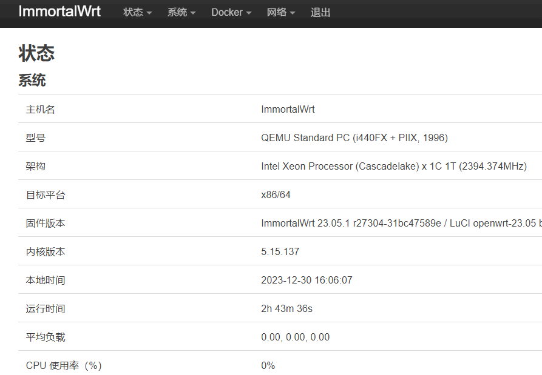
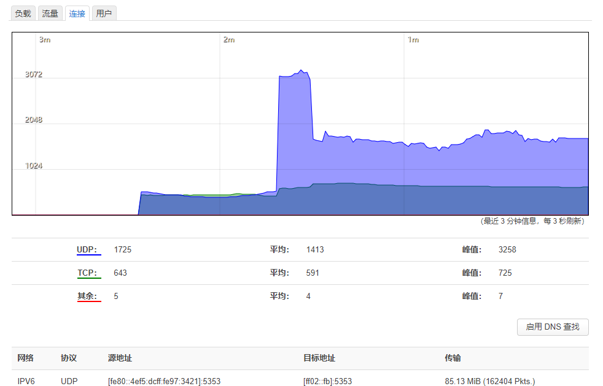
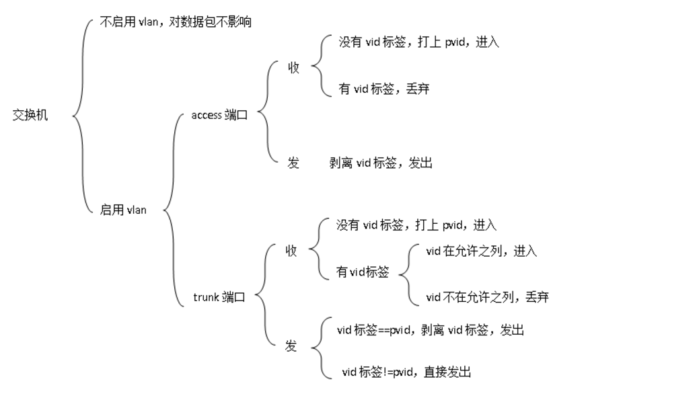
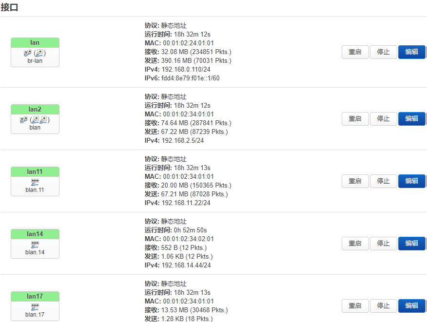
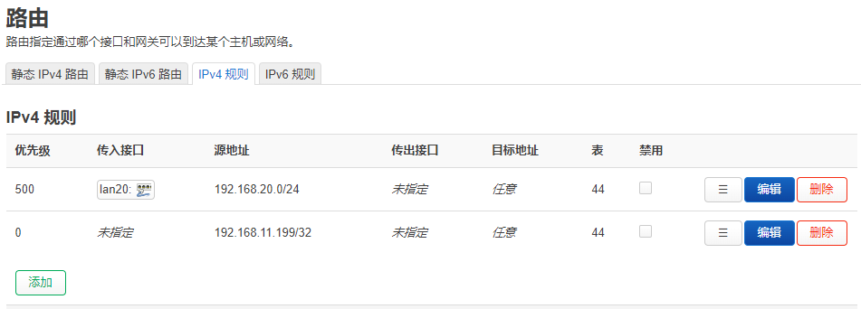
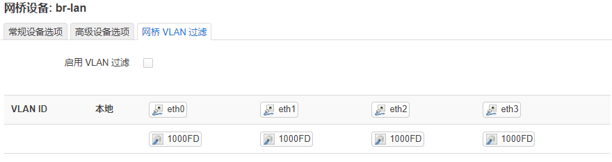
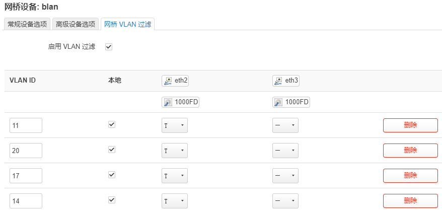
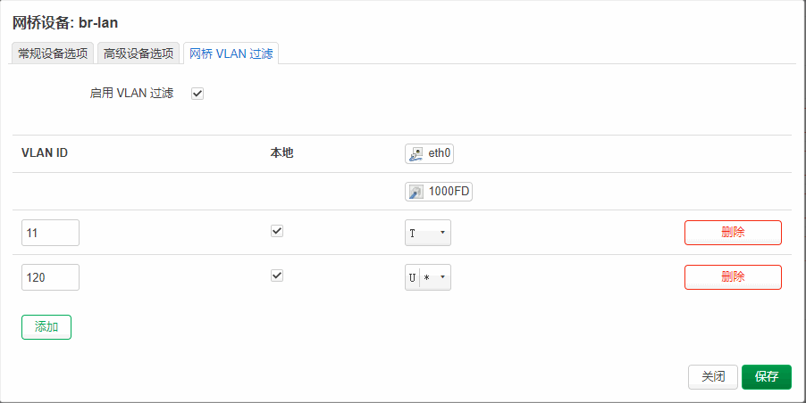
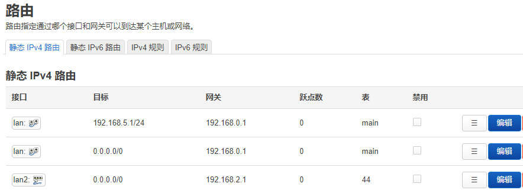

 


## 软路由

软路由wrt接管大部分无线接入直接通往防火墙,加入ospf实现高级交换机功能。部分行为管理上网管控通过docker功能实现  ( openWrt-23  原版效率高)

 


通过虚拟服务器+虚拟交换机






 

### 接口

设备管理二层，接口管理三层  ，三层重点在于防火墙，二层重点在与vlan。wan口不具备任何路由功能（防火墙规则为丢弃）


#### uci查看配置

```
uci show network
```

 

### 路由表

路由表 是一个数字从0-65535， 表+规则完成不同情况走不同的路由

状体->路由--》IPv4 邻居：可以看到arp表

###  通过规则路由

```
ip rule show
ip route show table main
```


#### 静态 IPv4 路由

| 接口 | 目标      | 网关        | 跃点数 | 表   |
| ---- | --------- | ----------- | ------ | ---- |
| lan2 | 0.0.0.0/0 | 192.168.2.1 | 0      | 44   |

#### ipv4规则


| 优先级 | 传入接口 | 源地址            | 传出接口 | 目标地址 | 表   |
| ------ | -------- | ----------------- | -------- | -------- | ---- |
| 自动   | br-lan   | 192.168.99.0/24   | 未指定   | 任意     | 44   |
| 自动   | 未指定   | 192.168.99.199/32 | 未指定   | 任意     | 44   |

注意：当源地址为网段需要指定传入接口

#### 验证路由

```
tracert -d  112.16.172.14
```

结果

走电信路线

```
tracert -d  112.16.172.14

通过最多 30 个跃点跟踪到 112.16.172.14 的路由

  1     1 ms     1 ms     1 ms  192.168.20.12
  2     3 ms     1 ms     1 ms  192.168.2.1
  3     4 ms     3 ms     3 ms  192.168.1.1
  4     5 ms     4 ms     4 ms  125.115.232.1
  5    44 ms    16 ms     9 ms  115.233.65.145
```

走移动路线

```
tracert -d  112.16.172.14

通过最多 30 个跃点跟踪到 112.16.172.14 的路由

  1     3 ms     3 ms     3 ms  192.168.11.1
  2    <1 毫秒   <1 毫秒   <1 毫秒 112.16.172.14
```

## 流量控制eqos

可以通过ip限制 某电脑上网速度

## vlan设置

协议 802.1q    access/trunk/Hybrid

Hybrid 最灵活

access 最稳定

连接到trunk口  通用



### 启用vlan

vlan是交换机内部概念

vlan id 11 创建了blan.11接口一个，保存但是不应用。


### 使用vlan

 




##### 交换机端口 配置

```
interface Ethernet0/0/3
 port link-type trunk
 port trunk allow-pass vlan 2 to 111
```


#### 基于vlan的路由

规则




## vlan过滤

通过过滤只处理一部分vlan可以减少cpu  。 设备-》配置-》网桥vlan过滤：启用



 

### VLAN类型

(已打标签 )T 类型  trunk   //指定vlan能进入

(未打标签)U类型  access /Hybrid   //+主vlan 就给包打标后进入

允许带有11，20，17vlan标记包进入



让没有vlan的包打上120的tage  



 

#### 路由表



## 路由协议frr-ospf

路由回路的自动同步

frr-ospfd / quagga-ospfd 比较老


* 一个ip网段广播，只有一个主路由。
* 数据包不能经过ospf设备
* 正常链路全FULL状态


```cmd
opkg install frr-zebra frr-staticd frr-watchfrr frr-ospfd frr-vtysh
```

配置文件 vi /etc/frr/daemons 修改部分

```
ospfd=yes
vtysh_enable=yes
```

##### 路由id

```
主优先级.次优先级.网段.ip地址
200.200.20.5
1.200.0.121 
```

##### 通信ip

```
10.vlan.网段.ip地址
10.34.34.1
```


### 命令vtysh

建议只在多网口上启动ospf服务

类似于交换机 ?提供帮助 

#### 查看链路

```
vtysh  -c ' show ip ospf nei'
```


#### 查看路由

以学到的路由为准，状态更新不即时

```
vtysh  -c ' show ip ospf route'
vtysh  -c 'show ip route ospf'
```

#### 查看细节db

```
vtysh  -c ' show ip ospf int'

vtysh  -c ' show ip ospf database router'
vtysh  -c ' show ip ospf database network'

```

#### 查看配置文件

```
vtysh  -c ' show running-config ospfd'
```

```
vtysh  -c ' do write file'
```


#### 主备规则

本地路由优先，ospf路线要么全部使用，要么全部不使用。

#### 查看

命令行 vtysh

```cmd
show int brief
show interface brief

show run
show ip route

```

#### 查看ospf细节

#### 查看相邻

```
show ip ospf    
show ip ospf neighbor #邻居 
show ip ospf route
show ip ospf int
```

OSPF邻居状态详解


#### 查看路由

```
show ip ospf route
```


### 配置ospf

```
configure  terminal
router ospf
ospf router-id 200.200.22.101
network 192.168.17.0/24 area 123  #同有网段
default-information originate #下发默认路由
do write file
```

#### 优先级

先进入某接口

```
ip ospf priority 0
```


#### 重启

触发重新选举  （也会借鉴其他路由器的选举结果）可以解决显示状态不对的问题

```
clear ip ospf process
```


#### 删除命令

```
no network 192.168.20.0/24 area 0

```

#### 清空配置

```
c t
no router ospf 
```

清空重配解决大部分不合理问题

#### 状态

State = 与对端的状态/对端的角色   

状态都必须full状态才正常  ，ExStart状态为理论主路由被占用

| 状态                 | 步骤        | 备注               |
| -------------------- | ----------- | ------------------ |
| **· Down状态；**     | 离线        |                    |
| **· Attempt状态；**  | 单向联络    |                    |
| **· Init状态；**     | 收到hello   |                    |
| **· 2-way状态；**    | 得到对方rid | vm主机不能ospf服务 |
| **· Exstart状态；**  | 选举        | vm主机不能ospf服务 |
| **· Exchange状态；** | 开始交换    |                    |
| **· Loading状态；**  | 交互路由表  |                    |
| **· Full状态。**     | 完成交换    |                    |


####  角色

DR指定路由，BDR备选路由，DROther其他路由

显示的远端路由器扮演的角色


### 监控数据包

通过抓包查看通信内容

```
tcpdump -vvv proto ospf
```


## 抓包网络分析


### 抓arp

```
tcpdump -vvv  arp -i vlan.34  -e 
```

 -e 增加以太网帧头部信息  -v 输出更详细

```
tcpdump -vvv  ether host  f0:00:00:3a:be:c5
```


### 通过IP和协议

ICMP一路抓包查看和路由回路

```
tcpdump  net 192.168.20.199  and proto 1 -v
```

## sflow网络分析

softflowd 实现数据流收集  +Graylog分析

```
softflowd -v 10 -i enp3s0 -t maxlife=1 -n 127.0.0.1:2055 -P udp -D
```


## 防火墙

4层

```
iptables -t nat -nvL --line-number
```


```
firewall-cmd --list-all-zone
```

```
firewall-cmd --zone=public --add-interface=ovs1 
firewall-cmd --get-zone-of-interface=ovs1  

```

