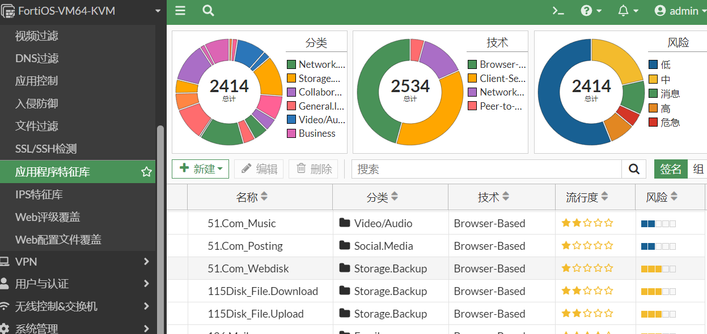

 


# 防火墙

[一本通FortiOS 7](https://handbook.fortinet.com.cn/产品简介.html)




## 命令行管理

第一个物理口 mgmt (通常用于管理) 

show 看配置  get 看状态

### 查看命令

```
show full-configuration
show full-configuration system interface mgmt 
```


```
get hardware status
get system status
show system global
get system inter
show system inter
```

```
get hardware cpu          
get hardware memory      
get system performance status   

get system interface physical
get hardware nic

```

```
get system arp 
get system arp 
get system fortiguard-service status
get system stp list
```


### 配置命令

#### 配置ip

```
config system interface
    edit "mgmt"
        set vdom "root"
        set mode static
        set ip 192.168.129.111 255.255.255.0
        set allowaccess ping https ssh snmp http
        set role lan
        set type physical
    next
end

show system interface mgmt
```
#### 配置路由

```
config router static
    edit 1
        set gateway 192.168.122.1
        set device "mgmt"
    next
end


show router static
```
#### 系统路由表

```
get router info routing-table all
```


#### dns配置

```

config system dns
    set primary 8.8.8.8
    set secondary 96.45.46.46
    set protocol cleartext dot
    set server-hostname "globalsdns.fortinet.net"
end
show system dns
```


#### 测试命令

```
execute ping 8.8.8.8 
traceroute 8.8.8.8
execute reboot 
```


### 虚拟vlan

```
config system switch-interface
    edit "sw1"
        set vdom "root"
        set member "port2" "port3"
        set type switch
        set intra-switch-policy implicit
        set mac-ttl 300
        set span disable
    next
end
```


```
config system virtual-switch
    edit "VLAN10"
        set physical-switch "sw0"
        set vlan 10
        config port
            edit "port1"
            next
            edit "port2"
            next
        end
    next
   end
```


## 虚拟机配置

BIOS模式，网口必须是virtio类型

## 登入密码

终端默认登入密码

```
默认用户名为 admin ，默认密码为空。
```

