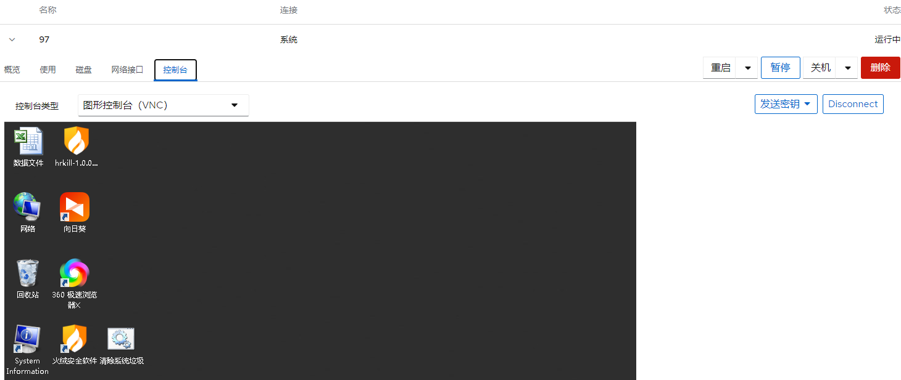
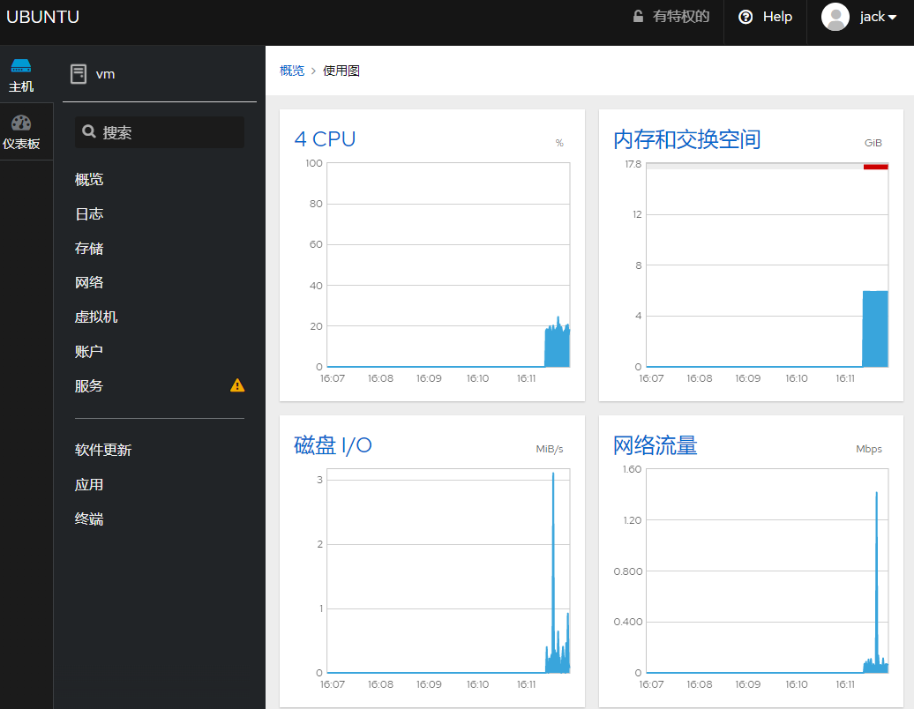

 

## 服务器规划

### 硬件虚拟化规划

 

| 名称      | ip            | 位置                | 备注                       |
| --------- | ------------- | ------------------- | -------------------------- |
| vm        | 192.168.0.121 | 机房2机柜 台式机    | linux kvm系统 云桌面       |
| vm2       | 192.168.0.122 | 机房2机柜 台式机    | linux kvm系统 测试和云桌面 |
| Edge-R440 | 192.168.0.123 | 机房2机柜 1U        | 用于 OA                    |
| R740xd    | 192.168.0.124 | 机房2机柜 4U        | 用于 金蝶云                |
|           |               |                     |                            |
|           |               |                     |                            |
| win-99    | 192.168.0.99  | kvm 192.168.0.121内 | 驻外办公远程k3             |
| win-98    | 192.168.0.98  | kvm 192.168.0.122内 | 驻外办公远程k3             |
| win-97    | 192.168.0.97  | kvm 192.168.0.121内 | 驻外办公远程k3             |

## 虚拟化服务器管理

虚拟化 管理入口 https://192.168.0.124:9090/   

可以通过web界面查看虚拟化运行状态

## 物理服务器管理

通过web管理物理服务器资源使用情况

