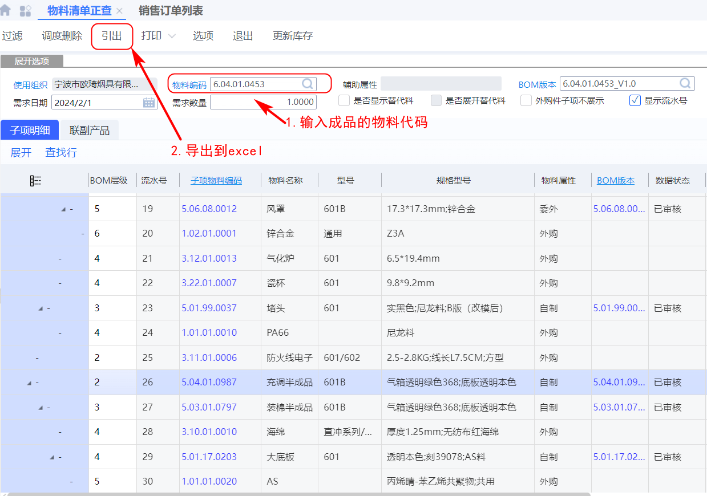

### 显示设置

## 审批工作

## bom查看

通过物料清单正查来查看完整bom

### 工作流模拟

### 工作流程图

## 业务员分组

## erp常用菜单

销售管理--基础资料--客户列表

销售管理--价格管理--销售价目列表

基础管理--基础资料--公共资料--业务员列表

基础管理--基础资料--主数据--物料列表

基础管理--基础资料--主数据--物料列表

基础管理--基础资料---公共资料--物料单位换算列表

供应链--库存管理--库存查询--即时库存

生产制造--工程数据管理--物料清单--物料清单列表

仓库管理--杂收杂发--其他入口单

供应链--销售管理--价格管理--销售调价方案

供应链--销售管理--可销控制--【客户-物料】

----

供应链--采购管理

采购管理--货源与价格管理

采购管理--采购管理系统参数--价格管理

财务会计--应付款管理--应付单列表

财务会计--出纳管理--日常处理--付款申请单

立账类型 ：【 暂估应付，财务应付】（？立账类型 不等于 暂估应付）

# amdin常用菜单

基础管理--基础资料--主数据--员工列表

基础管理--基础资料--主数据--物料

基础管理--基础资料--单价类型-单价类型列表

