# 总账报表

## 流程逻辑

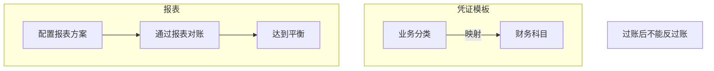


## 基础配置


### 凭证模板

### 模板分录


### 科目


## 凭证模板


## 凭证生成

财务会计--智能会计平台--账务处理--凭证生成

很多菜单内都由【凭证生成】只有【智能会计平台】内可以生成各种凭证

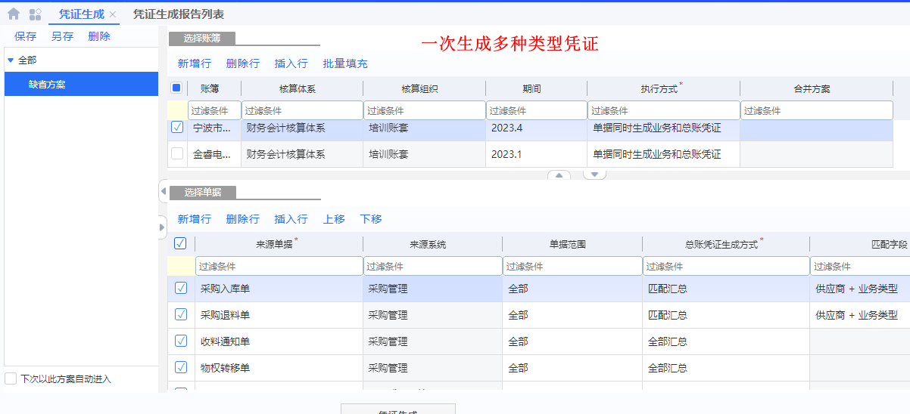

#### 业务单据到业务凭证

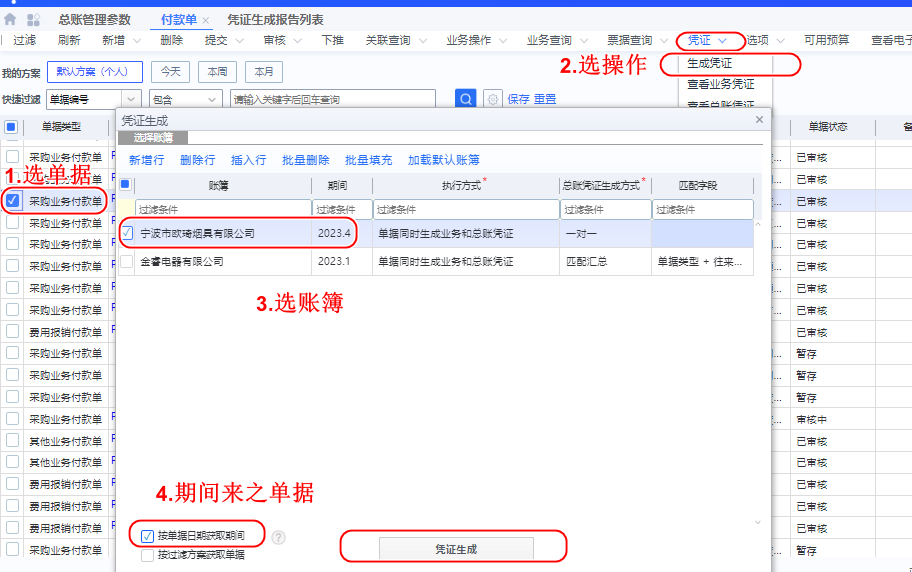


#### 凭证生成错误

```
凭证生成失败，请检查凭证模版074设置：
1、凭证模板设置的凭证日期是否在账簿所选期间对应的日期范围，
2、凭证模板设置的来源组织在会计核算体系下的核算组织是否和账簿的核算组织一致，
3、若单据上的会计核算体系不为空，是否和账簿的会计核算体系一致。


```

#### 总账管理参数

可以做未来的配置

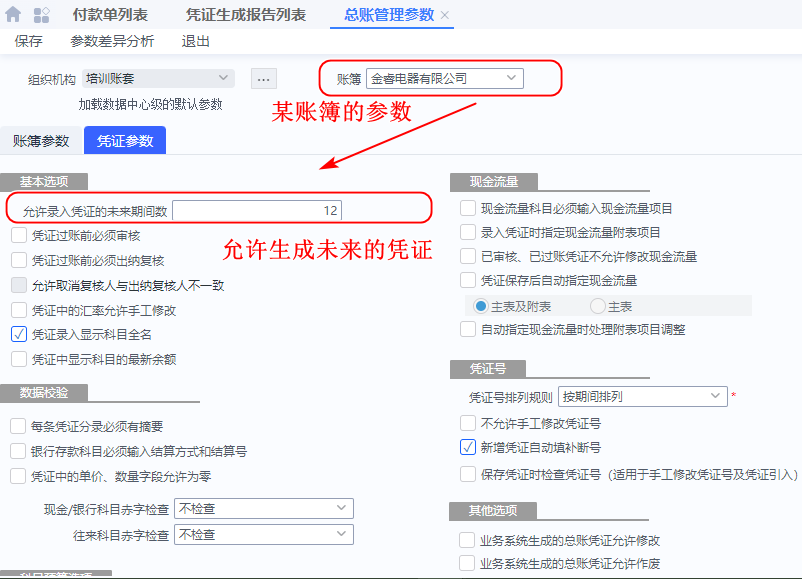


#### 批量生成单据


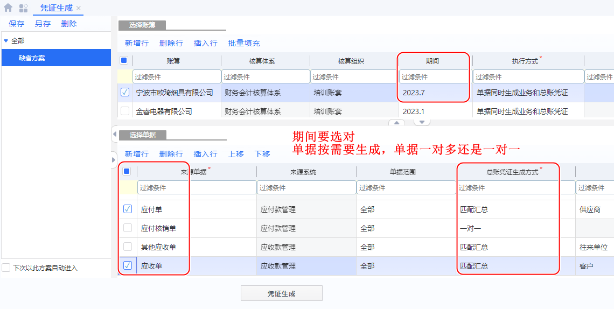

###### 生成错误

```
模版编码030第1行业务分类下第16行分录科目的核算维度取不到
    (可能原因：
    1.核算维度未指定；
    2.基础资料未分配；
    3.基础资料或辅助资料被删除或被禁用；
    4.单据上对应字段值为空。）
```

- 根据提示：第1行业务分类--第16行分录科目

```
银行==付款单明细.我方银行账号.开户银行
银行账号==付款单明细.我方银行账号
```

---------


###### 生成异常

```
模版编码030第1行业务分类下第6行分录取不到对应的科目，
    详情可点击菜单【凭证生成异常检查指引】。
```

- 第1行业务分类--第6行分录 : 科目不存在

  -------

  

```
模版编码030第1行业务分类下第16行分录取不到对应的科目，
	详情可点击菜单【凭证生成异常检查指引】。
```

- 承兑票据--背书

```
科目取值--新增行
结算方式 等于 '应收票据背书'
```

--------


```
模版编码007第1行业务分类下第1行分录科目的核算维度与凭证模版
设置不一致，请检查科目或凭证模版设置
```


### 凭证查询


### 凭证过账

### 凭证整理

### 自动转账(凭证)

### 期末调汇


##  业务报表对账方案


##  业务报表对账

【财务会计】--【只能会计平台】--【对账管理】--【业务报表对账】

未审核的单据也参与对账，让未过账的单据参与对账


## 业务单据对账方案


### 核查明细账（2级）


## 其他查询

### 科目余额表

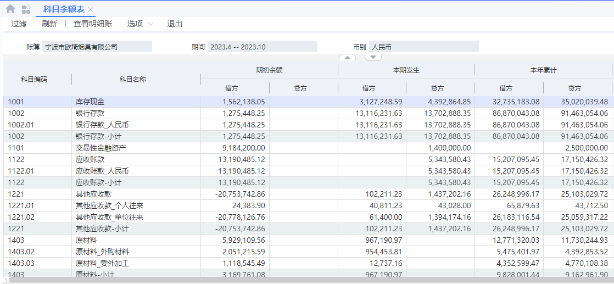

### 核算维度余额表

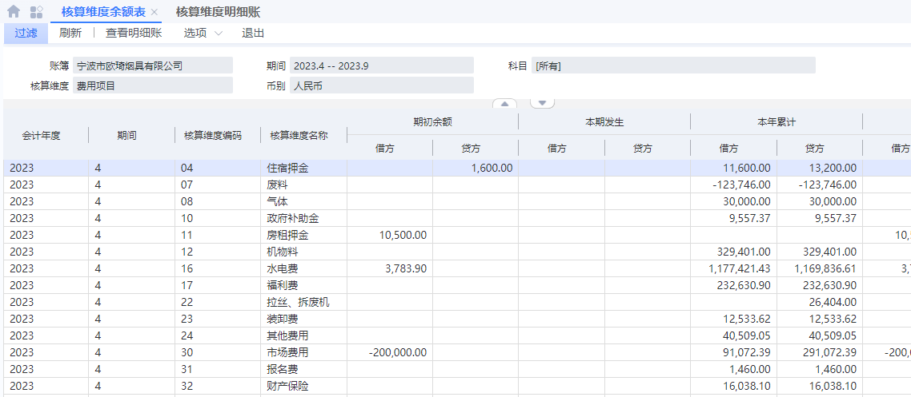

### 总分类账

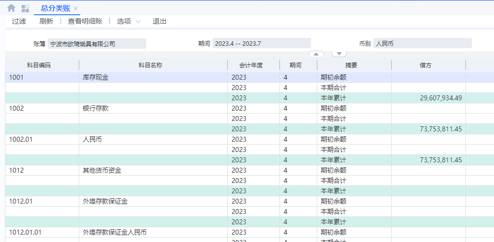


## 相关设置

### 会计政策

基础管理--基础资料--财务会计--会计政策


存货核算按费用项目明细核算

### 总账初始化(结束)


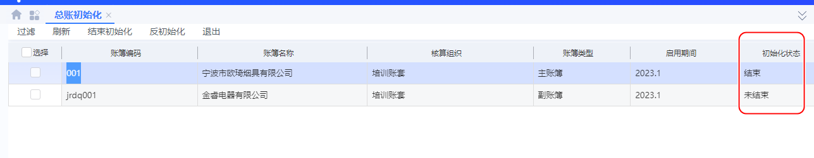


### 账簿

账簿可以有多个，来符合业务对应多套财务准则


【财务会计】--【总账】--【基本资料】--【账簿】

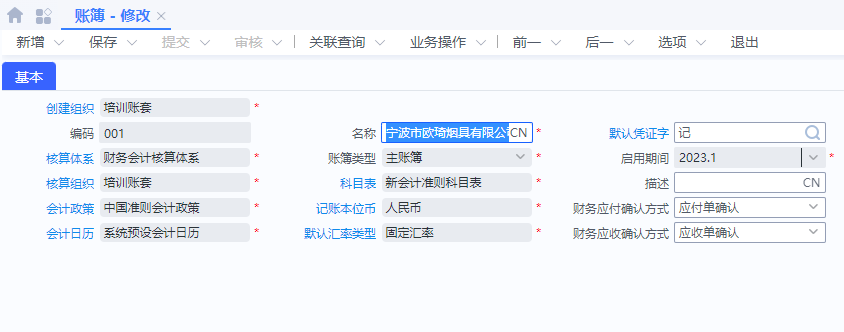


### 科目初始数据录入

比如期初余额

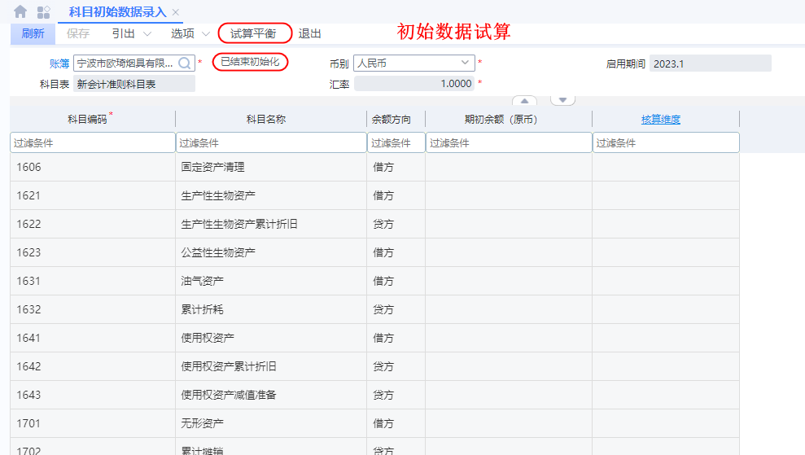

## 


