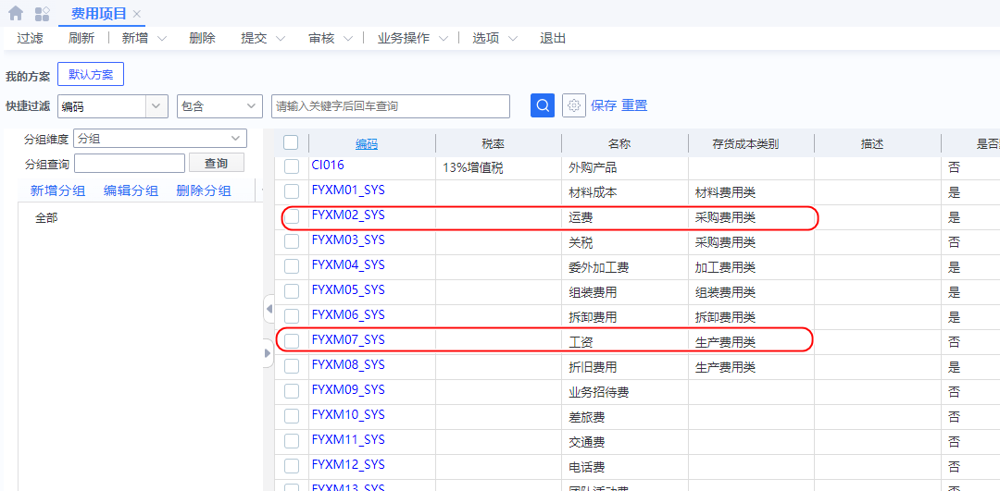
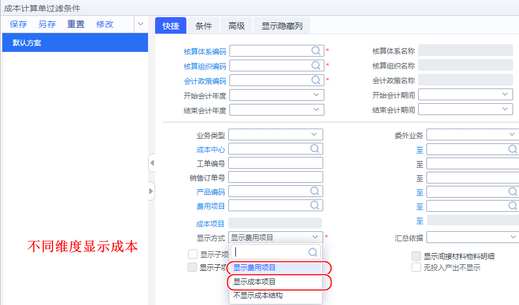

<pre>图文加载中...请稍后....</pre>
<script onload="document.querySelector('main > pre').remove();"  type="text/javascript" src="https://cdnjs.cloudflare.com/ajax/libs/mermaid/9.4.3/mermaid.min.js"></script>


# 成本核算

分步发成本法，标准成本法，作业成本法，计划成本法  实际成本法

 

设计成本，生成成本

[TOC]

### 流程概念

从成本中心开始（将料工费计算到产品）


## 成本中心


### 参数设置

#### 共耗设置


#### 成本为0处理


## 费用分配


### 成本项目


### 成本项目匹配


### 定额因子


### 作业活动

只有辅助生产部门需要设置，比如供电，供水

这里先忽略


## 启用和初始化

### 基础

#### 会计政策

【基础管理】--【基础资料】--【财务会计】--【会计政策】


#### 启用核算范围

【成本管理】--【存货核算】--【基础资料】

这个先要启用才能到存货核算系统


### 启用存货核算系统（1）

【成本管理】--【存货核算】--【初始化】--【启用存货核算系统】


所有相关库存数据要【已审核】

#### 通过启用出存货核算


#### 存货核算初始化(结束)

【成本管理】--【存货核算】--【初始化】--【存货核算初始】


```
组织(100[培训账套])核算体系(KJHSTX01_SYS[财务会计核算体系])会计政策(KJZC01_SYS[中国准则会计政策])
仓库核对初始核算数据中物料数量与初始库存中物料数量不一致，
请使用初始核算数据维护功能进行处理
```

#### 初始核算数据录入

【成本管理】--【存货核算】--【初始化】--【初始核算数据录入】


必须填入价格 

关联【库存数量价格】到【出库成本单价】

#### 存货核算初始化结束

【成本管理】--【存货核算】--【初始化】--【存货核算初始化】


### 启用产品成本核算（2）

【成本管理】--【产品成本核算】--【初始化】--【启用产品成本核算】


先要完成 存货初始化

#### 通过启用产品成本


#### (处理)期初在产品成本

【期初在产品】来自于基于【期初生产订单】 ，根据开工日期确定是否为期初


#### 引出引入在产品成本


##### 引入为空问题

订单计划开工日期和执行下单日期要小于启用月份。需要手动执行下达	

如果无法下达	【存货核算期末关账】反关账一下（反关账要符合 2反2启）


##### 引入错误

成本项目

```
编码为【CBXM00003_SYS】的成本项目不存在或未在成本项目匹配方案中设置！
```


#### 完成引入


#### 产品成本核算初始化（结束）

 【成本管理】--【产品成本核算】--【初始化】--【产品成本核算初始化】


加入没有引入【期初在产品成本】就会提示

```
组织(100[培训账套])核算体系(KJHSTX01_SYS[财务会计核算体系])
会计政策(KJZC01_SYS[中国准则会计政策])存在订单未完成成本系统初始化，
请通过菜单【期初在产品成本录入-选项-引出-下载期初在产订单数据】
下载期初订单，并维护在产品数量和金额，
然后通过菜单【选项-引入-外部引入】把期初订单引入到成本系统。
下面是具体的未完成初始化的订单（仅显示前100行订单）。
```


## 费用分配标准设置

### 费用项目（系统自带）




制造费用分配及取值科目：分配标准公式=标准工时*完工入库数量；

### 费用公式

【成本管理】--【产品成本核算】--【基础资料】--【费用分配标准】


### 费用分配标准


### 费用分配标准设置

【成本管理】--【产品成本核算】--【分配标准设置】--【费用分配标准设置】


## 产品分配标准设置


【成本管理】--【产品成本核算]--【分配标准设置】--【在产品分配标准设置】


## 费用引入方案

【成本管理】--【产品成本核算】--[费用归集】--【费用引入方案】


 

## 成本计算


【成本管理】--【产品成本核算】--【产品成本核算】--【成本计算】


### 执行结果


#### 原因明细


去 【产品分配标准设置】为其他车间设置分配标准

#### 委外成本不做计算


### 完成成本计算


### 处理警告

#### 入库成本维护

【成本管理】--【存货核算】--【存货核算】--【入库成本维护】

选择成本批量维护，1.要产品成本核算【反初始】 2.产品成本核算【反启用】


选用一种价格填充方式


```
组织(100[培训账套])核算体系(KJHSTX01_SYS[财务会计核算体系])
会计政策(KJZC01_SYS[中国准则会计政策])工单编号【MO000007】，行号【3】未完成成本系统初始化。
```

过程需要返工，所以2启2结之前提前检查。


### 完成成本计算


查看相关明细


## 成本计算单（以不同角度展示）

【成本管理】--【产品成本核算】--【报表分析】--【成本计算单】




### 列表


### 横向


## 成本性能诊断报告


<script>
console.log('显示图表') 
mermaid.init({ noteMargin: 10 }, '.language-mermaid');
</script>
 