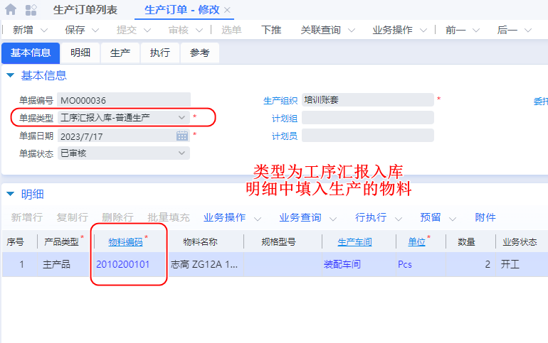

# 生产管理

## 直接生产流程

### 生产订单

【生产制造】--【生产管理】--【生产订单】

### 生产领料

通过【生产订单】下推

### 生产补料

通过【生产订单】下推

### 生产订单变更

通过【生产订单】下推

### 用料清单变更

通过【用料清单】下推

### 返工业务流程

【生产制造】--【生产管理】--【生产订单】

单据类型==直接入库-返工生产

#### 查看返工物料清单

通过【业务查询】--【用料清单查询】 添加新物料来返工

###  不良品管理

通过【用料清单】下推

#### 来料不良

#### 余料退料

同上

### 生产入库

通过【生产订单】下推

### 生产结案

通过【 生产订单列表】【行执行】操作

### 生产订单用料明细++

# 工序报工入库

### 前提配置

#### 管理工序控制码

#### 创建作业

【生产制造】--【车间管理】--【工艺建模】--【作业列表】

#### 创建工艺

### 工序汇报入库

【生产制造】--【车间管理】--【工艺建模】--【工序控制码列表】

#### 汇报入库单

##### 选用工艺

##### 开工

#### 生成工序计划

#### 工序计划

【生成制造】--【车间管理】--【车间作业计划】--【工序计划列表】

#### 逐级完成汇报

通过【列表选中】下推

#### 汇报入库

通过最后一个工序【汇报单】下推

### 工序汇报委外

####  汇报后转移（主组织-供应商）

加工完毕后转入

#### 委外提前设置

#### 工艺委外费用

#### 工序单流程

## 单据类型设置

【基础管理】--【基础资料】--【单据类型】

### 工序计划

### 工序汇报入库单

