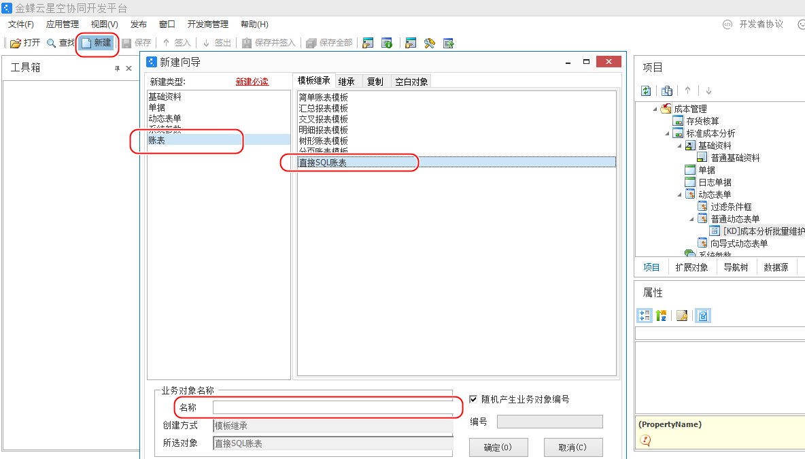
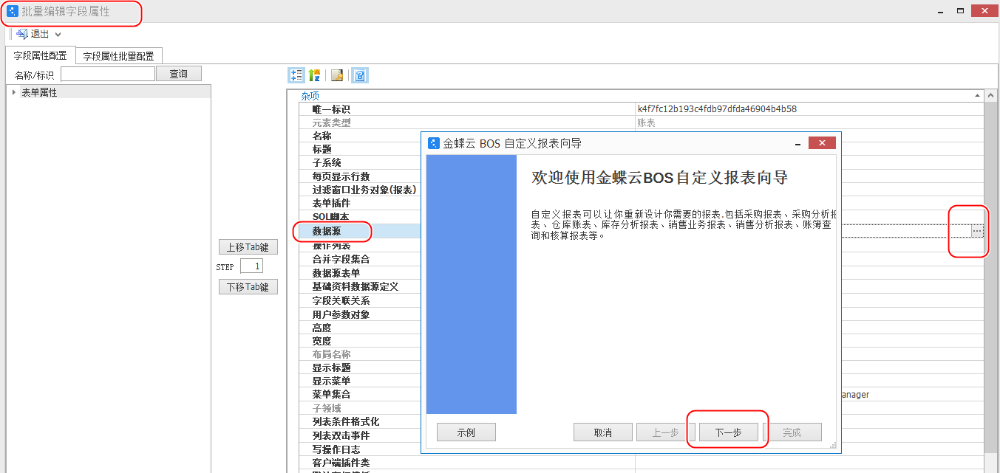
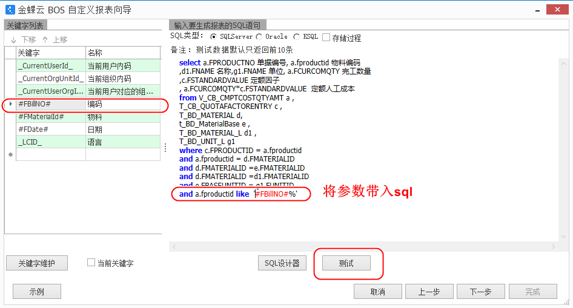
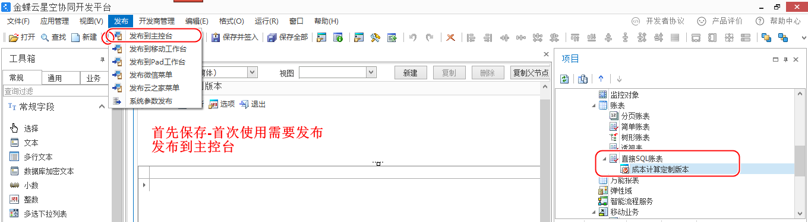
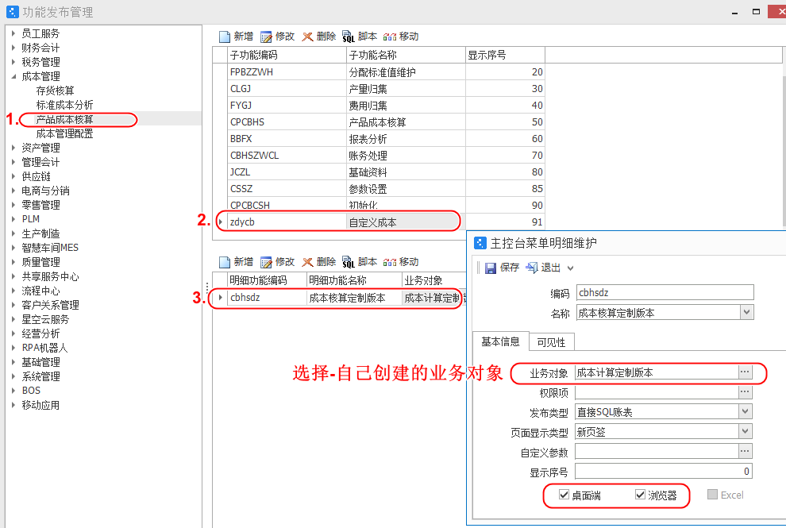
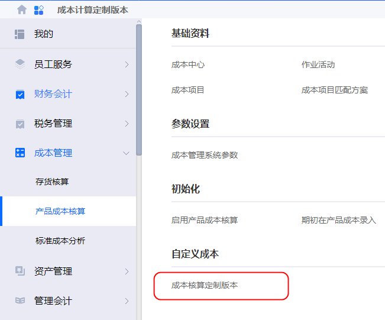

# 报表

成本报表

 通过《金蝶云星空集成开发平台》创建新的报表

## 概念

`签入` 相当于修改到系统文件。通过签入签出加锁

## 步骤1 创建





## 步骤2 数据源



### 编辑sql

带入参数



### sql语句

```sql
select a.FPRODUCTNO 单据编号, a.fproductid 物料编码 
,d1.FNAME 名称,g1.FNAME 单位, a.FCURCOMQTY 完工数量
,c.FSTANDARDVALUE 定额因子
, a.FCURCOMQTY*c.FSTANDARDVALUE  定额人工成本
from V_CB_CMPTCOSTQTYAMT a ,
T_CB_QUOTAFACTORENTRY c ,
T_BD_MATERIAL d,
t_BD_MaterialBase e ,
T_BD_MATERIAL_L d1 ,
T_BD_UNIT_L g1
where c.FPRODUCTID = a.fproductid 
and a.fproductid = d.FMATERIALID
and d.FMATERIALID =e.FMATERIALID 
and d.FMATERIALID =d1.FMATERIALID 
and e.FBASEUNITID = g1.FUNITID
and a.fproductid like  '#FBillNO#%'
```


## 步骤3 保存发布





### 发布位子




## 前台使用

### 要重新登入





