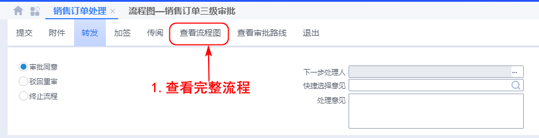

# 审批业务参考

## 1.进入金蝶云

公司内部请使用：[http://192.168.0.48/K3Cloud](http://192.168.0.48/K3Cloud) ，如果有客户端可以直接打开客户端。

### 登入

要审批首先先要进入系统才可以操作

## 2.查看审批

进入系统可以看到左上角有两个图标，点击房子图案来到首页

点击代办任务的标题进入审批处理

## 3.处理审批

审批可以看到单据的相关信息，最后做出判断是否同意还是驳回要求修改等。

## 4.查看审批进度

### 进入流程图

再审批处理中点击 `查看流程图`进入流程图查看

### 查看完成流程

