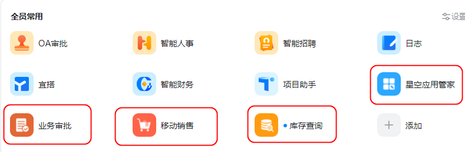
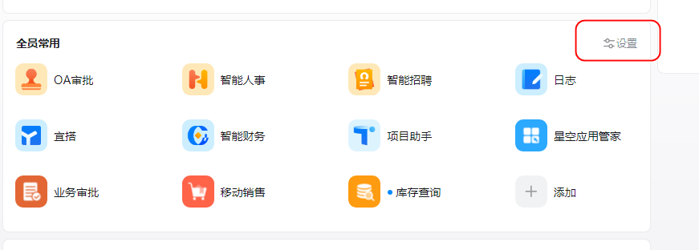

[参考](https://vip.kingdee.com/knowledge/specialDetail/375590350204988928?category=375594125196439552&id=23892&productLineId=1)

## 钉钉+云星空

### 使用限制

#### 步骤1

#### 步骤2

#### 步骤3

### pc端设置

## 首次配置

### 连接私有云

设置1

### 设置2

设置 3 

### 设置4

## 用使用配置

### 进入应用

### 使用量查看

模块管理

### 移动版 金蝶云

## 开始销售

### 首次进入

### 确认员工和账号权限

### 后台配置

【基础管理】--【移动设置】--【**轻应用字段显示设置**】--【移动销售显示设置】

### 单据配置

### 需要显示的字段

### 前端操作

## 新版销售

### 设置移动端api版本

【基础管理】--【公共设置】--【参数设置】

设置为最新版

### v5版本界面

### 商品列表

### 选物料

销售 点火枪成品（6.03.01.0402）

 

### 下单

#### 结果

？？？？ 计划跟踪号未填

### 订单明细

## 订单列表

### 入口

### 订单列表明细

### 销售订单显示设置

### 添加显示

## 发货通知

通过 销售订单下推

### 发货通知

### 发货通知单列表

### 移动端显示设置

#### 配置发货通知单字段信息 ？？？

### 发货通知单配置入口

#### 通知单 明细设置

### 移动端发货通知单效果

## 并行流程设计

### 结果

### 流程

### 投票模式

