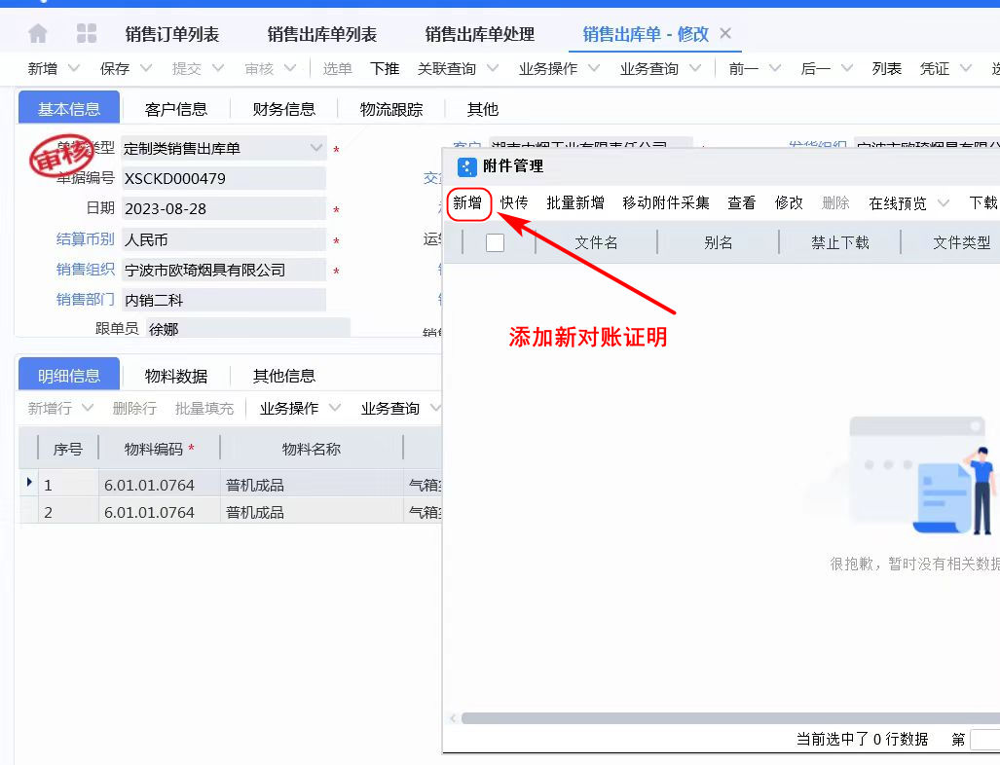
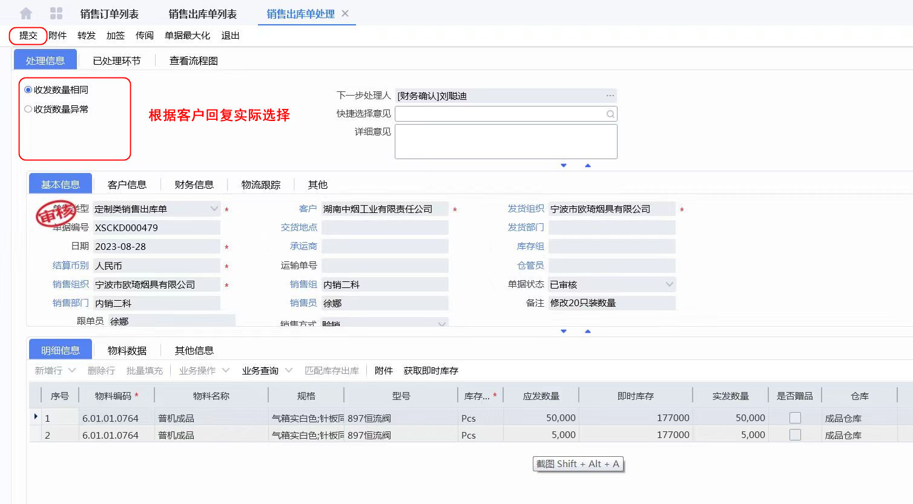
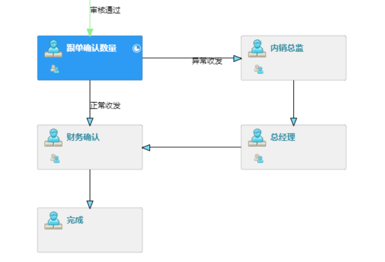

# 销售出库对账

### 操作流程

* 联系客户核对收货数量
* 修改对应单据添加对账附件
* 完成对账流程

### 01.进入对应应单据

收到客户的收货确认来到对应的单据，打开已经审核的单据进行修改在附件中新增对账的图片或文件。

### 02.来到对应代办任务

销售出库单有对应的代办任务，需要和客户确认后进行数量确认并录入系统。

在这里的附件只能查看添加新附件或证据图片需要在列表里点击此单据修改

### 0.3 查看完整流程

发货数量确认分为【发货与客户收货相同、发货与客户收货不同】最后由财务接收对账资料调整应收等

