# 销售工作流

### 特殊操作

加签、会签 

```
销售订单定制流程
【定制类销售使用，工厂定制订单使用，工厂渠道订单使用，】
```


## 订单种类

| 销售订单流程        | 别名（单据类型）       | 层级 | 持有人                 | 消息通知人        |
| ------------------- | ---------------------- | ---- | ---------------------- | ----------------- |
| 1、宁外定制订单审批 | 定制类销售订单         | 2    | 财务，生产，总经理     | bom专员，生产主管 |
| 2、工厂定制订单审批 | 渠道非标               | 3    | 内销总监，财务，总经理 | bom专员，生产主管 |
| 3、工厂渠道订单审批 | 渠道标准               | 2    | 内销总监，总经理       | bom专员，生产主管 |
| 4、预测订单审批     | 无客户；生产--预测冲销 | 2    | 内销总监，生产         | bom专员，生产主管 |


## 1、宁外定制订单审批

 

### 简版流程 通知到计划主管

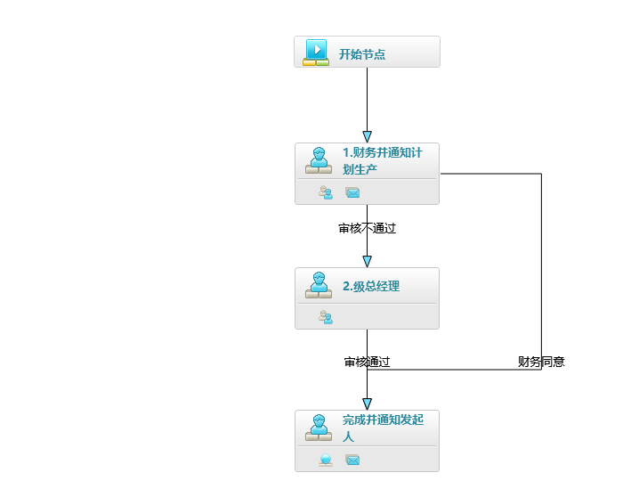

| 节点                   | 作业                       | 节点名称           |
| ---------------------- | -------------------------- | ------------------ |
| 财务核价、通知到生产部 | 价格是否合理、生产是否可行 | 财务并通知计划生产 |
| 总经理                 | 最终决定                   | 总经理决定         |

### 通知信息

```
---- 核价
您有{入口单据名称} {销售订单号} 的订单需要核价

---- 审批
您有{入口单据名称} {单据类型} 的订单需要审批


---- 计划

销售订单{销售订单号}类型{单据类型}需要关注

----最后通知
订单{销售订单号}流程完结	

```

### 财务设置细节

#### 财务YN判断

把1级中的财务`驳回重审`操作，转换成`正向` 不管同意还是驳回都会往下走。

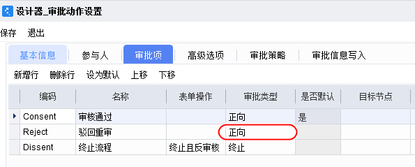

#### 连接线N

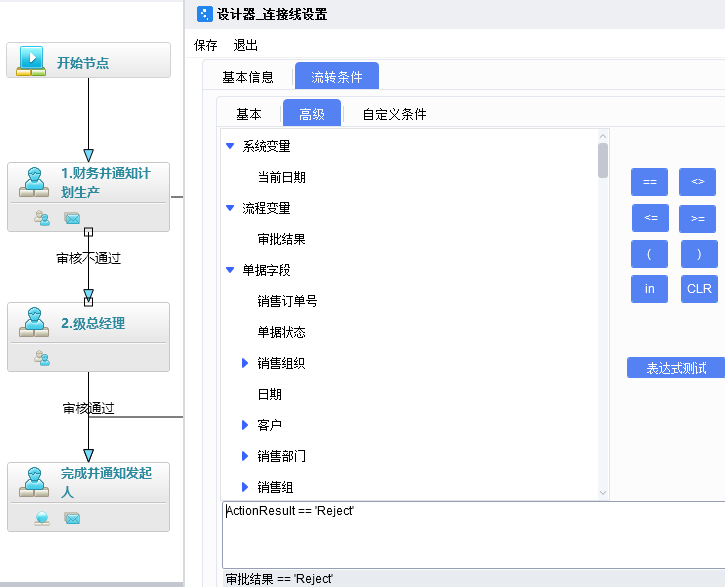

#### 连接线Y

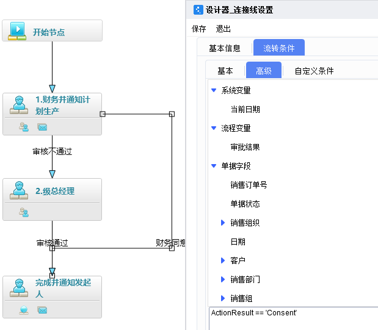

### 总经理节点细节

驳回重审要操作表单，修改表单状态【重新审核】

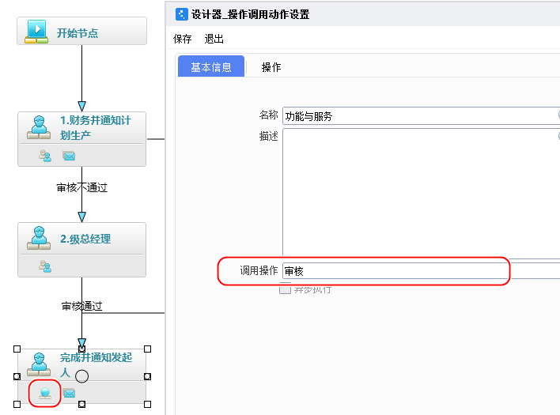

### 完成节点设置细节


#### 同时发送消息

通知发起人

[发起人，bom专员(王飞)，生产主管(杨丽勇)] 

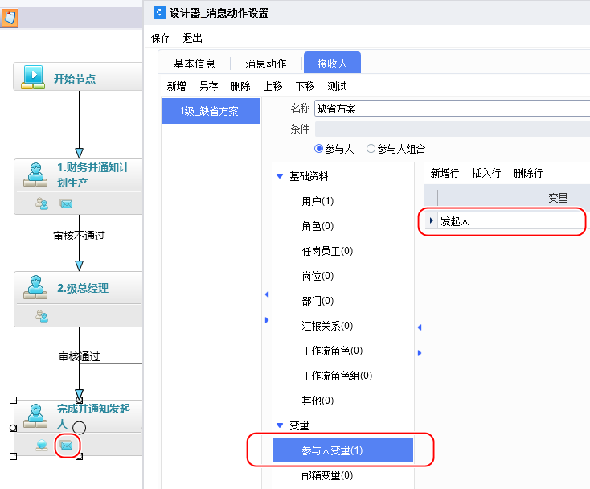


## 2、工厂定制订单审批


| 节点           | 作业         | 节点名称   |
| -------------- | ------------ | ---------- |
| 内销部门经理() | 是否符合市场 |            |
| 财务核价       | 售价是否合理 | 财务核价   |
| 总经理         | 最终决定     | 总经理定价 |


### 通知信息

```

----- 最后通知
有销售订单下达{销售订单号}
```


### 流程截图


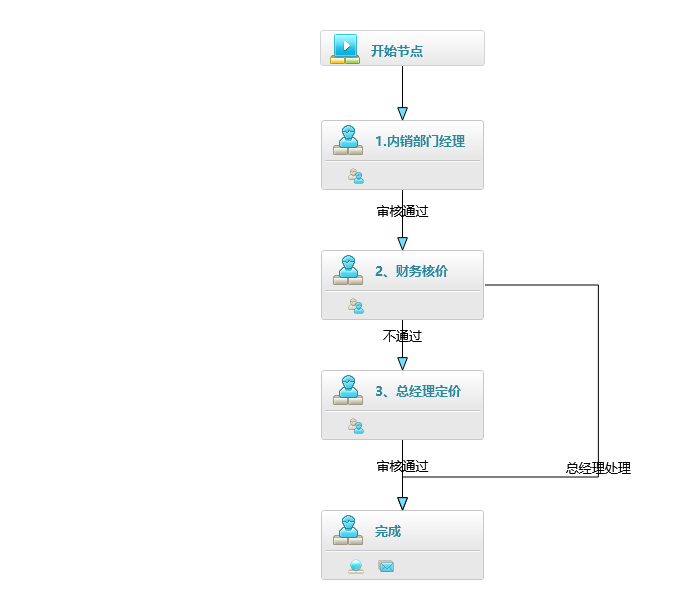

#### 通用设置细节

{Consent:'审核通过',Reject:'驳回重审',Dissent:'终止流程'}

也可以自定添加，关键是审批类型【正向，驳回，终止】


### 财务设置细节

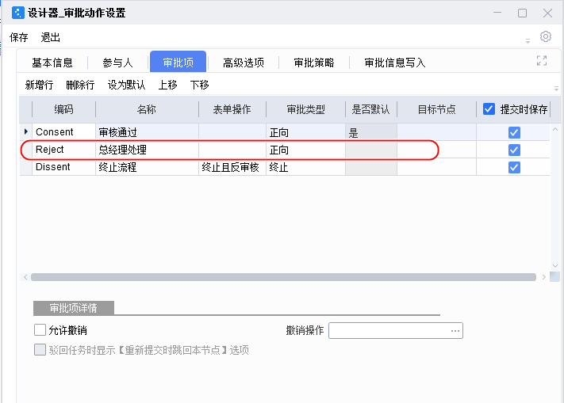

### 总经理设置细节

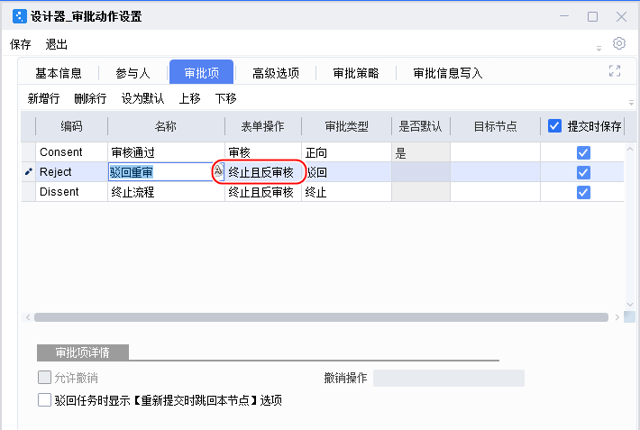


### 配置工作流

#### 设计发布

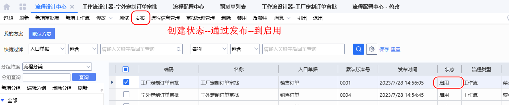

#### 配置使用

名称： 工厂定制订单使用

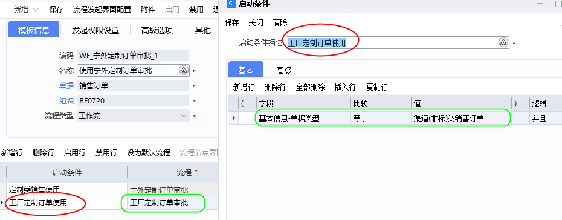


## 3、工厂渠道订单审批

| 节点           | 作业         | 节点名称     |
| -------------- | ------------ | ------------ |
| 内销部门经理() | 是否符合市场 | 内销经理定夺 |
| 总经理         | 售价是否合理 | 总经理定夺   |

  ### 流程图

工厂渠道订单使用


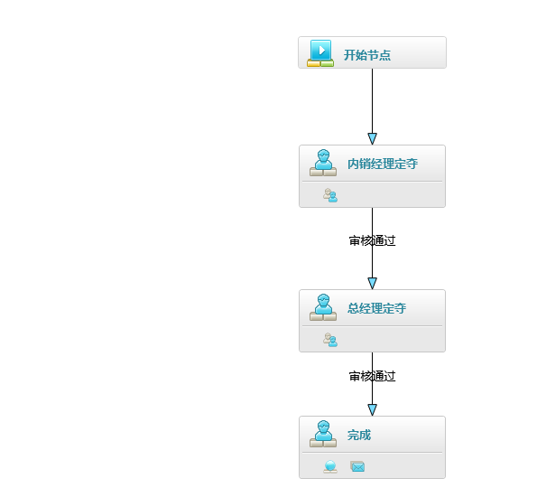

### 配置

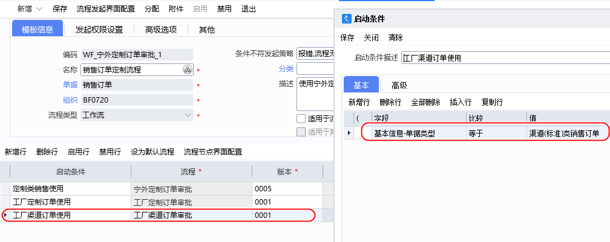

## 4、预测订单审批


| 节点           | 作业                            | 节点名称     |
| -------------- | ------------------------------- | ------------ |
| 内销部门经理() | 是否符合市场需求                | 内销经理定夺 |
| 计划主管       | 生产安排是否可行                | 生产部定夺   |
| 完结           | 通知 ：下单人，生产主管，总经理 |              |

### 通知信息

```

---- 内销部门经理
{入口单据名称}编号{单据编号}需要进行处理
----计划主管
{入口单据名称}编号{单据编号}需要进行评估
---- 完结
预测{入口单据名称}{单据编号}完结

```


### 流程图

预测订单使用

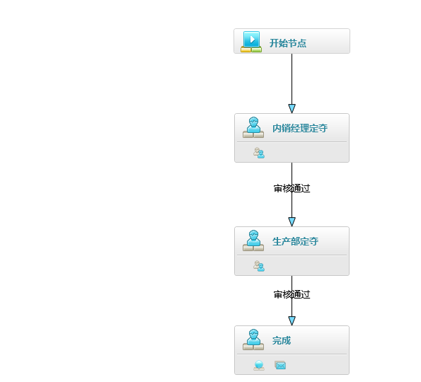

### 配置

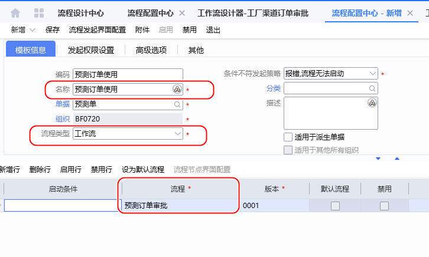

#### 启用配置

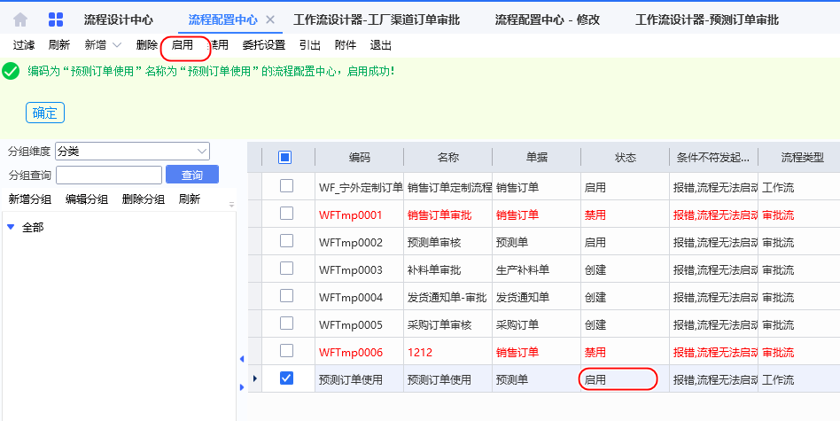