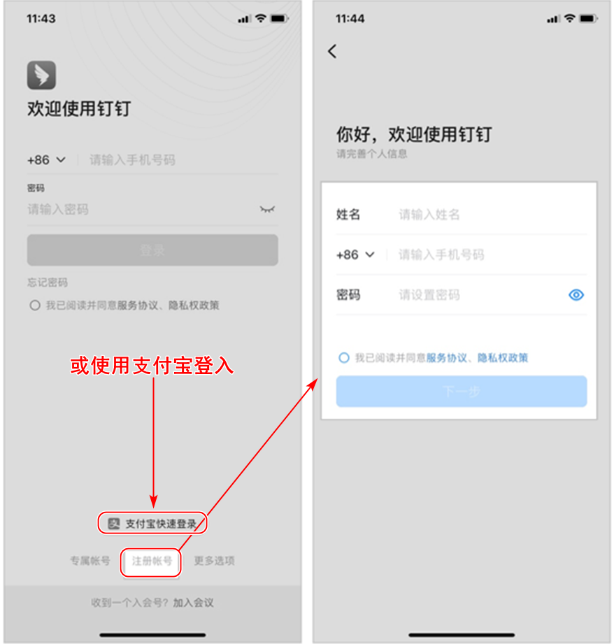
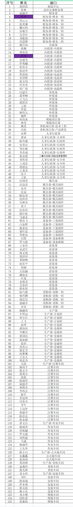

## 1、首先下载钉钉

### 扫码二维码下载

### 点击下载

点击[钉钉下载](https://page.dingtalk.com/wow/z/dingtalk/simple/ddhomedownload#/)到下载界面完成下载

## 2、注册钉钉

 

使用手机号码或支付登入二选一即可

## 2、加入公司

使用钉钉来扫码加入公司

## 首批注册人

## 帮助文档

https://www.yuque.com/yida/support/hufzoo

## 轻应用

https://qing.ik3cloud.com/install/

