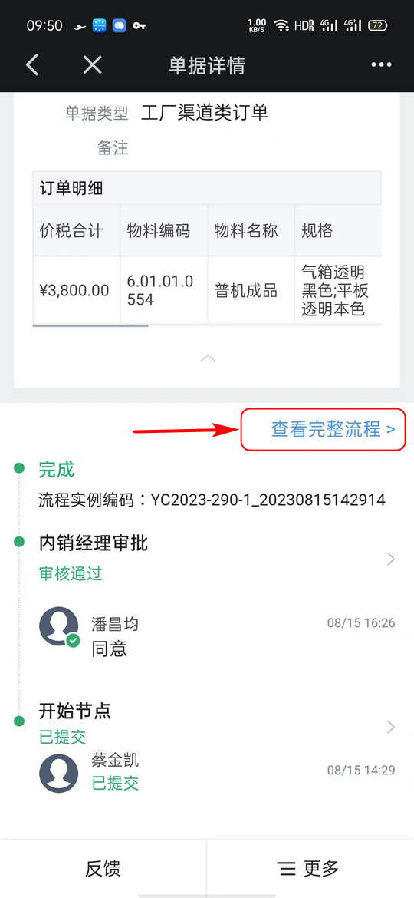

# 移动设备上完成审批

 

## 1.打开钉钉APP

### 首次使用

第一次使用参考[如何使用钉钉](./使用钉钉.html)

### 选择公司

没有选择正确的公司无法使用公司内的应用

 

## 2.进入工作台

 
### 进入工作台界面

 

## 3.登入云心空

这里输入的账号密码和电脑端云星空一样

## 4.查看代办

## 5.审批

 

## 6.查看完整流程

当前流程

完整的业务流程

