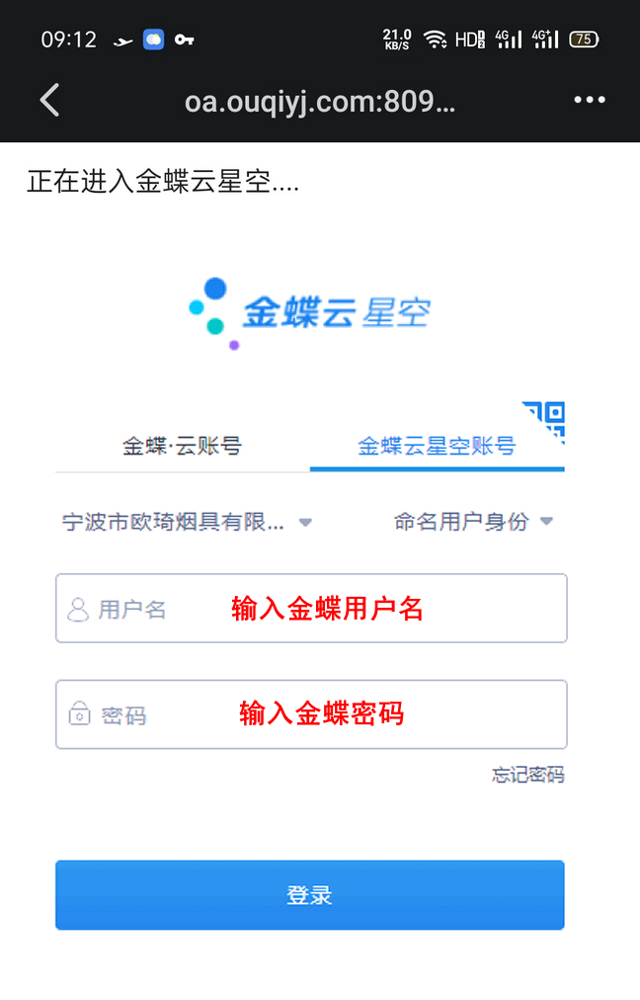

# 移动销售

 

## 1.打开钉钉APP

### 首次使用

第一次使用参考[如何使用钉钉](./使用钉钉.html)

### 选择公司

没有选择正确的公司无法使用公司内的应用

 

## 2.进入工作台

 
### 进入工作台界面

## 3.登入云心空

首次进入这里输入的账号密码和电脑端云星空一样

# 发货通知单

进入销售首页

## 1找到对应的单据

## 2.创建通知单

 

## 3.确认发货单

填入相关信息

