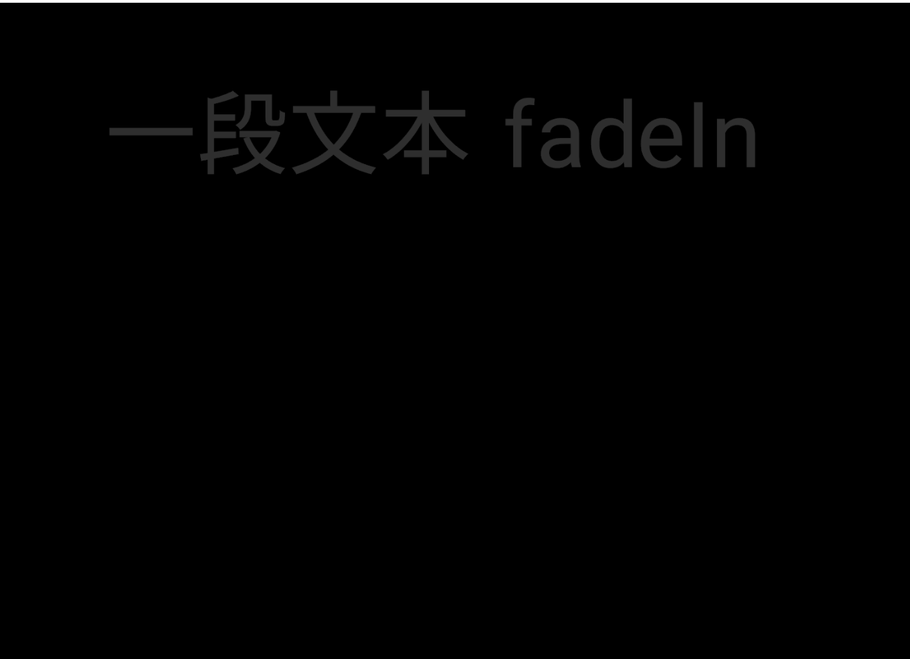

# 动画库

movy.js是基于three.js和gsap的易于使用的动画引擎,宗旨就是简单、简单、还是简单。减少学习负担是最大善意。所有的共功能都被包含在movy.ts文件中

在使用前需要引入

```js
import * as mo from "movy";
```

很多功能可以直接用，比如 **run( )**虽然他什么也不干。

```js
import * as mo from "movy";
mo.run();
```

把内容保存成demox.js就可以在命令行

```
movy  demox.js
```


启动它并看到效果

## 入门试手

很多功能都来自于Scene场景对象

### 添加文本

```js
mo.addText("一段文本")
```

### 动起来

```js
//涂擦效果
mo.addText("一段文本").wipeIn( ); 
```

### 改字体

字体丰富度是个短板

```js
//"en" | "condensed" | "code" | "math" | "arcade" | "zh" | "gdh" 只有这么几个

mo.addText("一段文本",{ font:"zh"} );		
```


### 添加缓动效果

来控制一下时间和动画进度(缓动)

```js
//擦除效果
let ea = {
  duration:2,
  ease: "bounce.out"
}
mo.addText("一段文本",{ font:"zh"} ).wipeIn( ea );  //进度效果

```

有了更加精细的控制感觉还满意吗？

具体有那些可参看[ease文档](https://greensock.com/docs/v3/Eases)来自gsap，缓动效果可参考[easings](https://easings.net/zh-cn)在线演示

------

不满意还可以试试这个，分为2段（in/out）入和出过度

```js
ea = {
  duration:2,
  ease: "bounce.inOut"
}
```

#### 扩展缓动

通过加载缓动包来支持一些特有的效果

```js
import { SlowMo } from "gsap/EasePack";
gsap.registerPlugin(SlowMo);
//-----------
 ease: "slow(0.1, 2, false)"  //更加个性化的效果
```


### 来点颜色

```js
//擦除效果
let ea = {
  duration:2,
  ease: "bounce.out"
}
let at = {
    color:"red"
}
mo.addText("一段文本",at).wipeIn(ea ); 

```

需要更多颜色可以使用**\#272727**模式来自定

#### 背景颜色

默认背景是黑色不喜欢可以自己换一个

```js
mo.addRect({color: "#ffffff" });
```

出现如下效果


说好的背景呢？怎么来了一块白色方块。所以要修改一下把它放到后面并且拉大一点

```js
mo.addRect({z:-1,scale:20,color: "#ffffff" });
```

这下应该满意了吧。但是只有这一种效果吗？当然不是上效果。

### 显示效果

为了方便我们把文字存成对象方便展示多种效果。

```js
let text =mo.addText("一段文本",at)
text.wipeIn(ea );
text.spinning(ea );
text.implode2D(ea );
```


| 名称      | 用途 | 备注                                         |
| --------- | ---- | -------------------------------------------- |
| fadeIn    | 入场 | 淡入                                         |
| wipeIn    | 入场 | 拉幕效果                                     |
| flyIn     | 入场 | 飞入效果<br />(前奏有点长)<br />(不支持图片) |
| rotateIn  | 入场 | 旋转效果                                     |
| grow      | 入场 | 放大效果                                     |
| explode2D | 入场 | 爆炸效果(特别)                               |
| implode2D | 退场 | 缩小效果 （对应grow）                        |
| fadeOut   | 退场 | 淡出（对应fadeIn）                           |
| spinning  | 中场 | 交换                                         |
| reveal    | 中场 | 浮出                                         |
| shake2D   | 中场 | 抖动                                         |

```js
import * as mo from "movy";
//一次展示多种效果
let m  = 1.5
mo.addText("一段文本 fadeIn",{y:m*2})
    .fadeIn( { duration:2}).changeOpacity(0) ;
mo.addText("一段文本 wipeIn",{y:m*1})
    .wipeIn(  { duration:2}).changeOpacity(0) ;;
mo.addText("一段文本 flyIn",{y:m*0})
    .flyIn(  { duration:2}).changeOpacity(0) ;;
//----
mo.addText("一段文本 rotateIn",{y:-m*1})
    .rotateIn( { duration:2} ).changeOpacity(0) ;;
mo.addText("一段文本 grow ",{y:-m*2})
    .grow( { duration:2} ).changeOpacity(0) ;;
mo.addText("一段文本 explode2D" ,{y:-m*3})
    .explode2D(  { duration:2}).changeOpacity(0) ;;
mo.addText("一段文本 explode2D" ,{y:m*3})
    .reveal().shake2D().spinning();

```



#### 变化效果

#### 改变颜色

```js
text.changeColor("#3CB371", {
  t: ">",
  duration: 2,
})			
```

#### 改变对象透明度

```js
text.changeOpacity(0.5)  //变成半透明
```

#### 设置物件大小

```js
text.scaleTo(1.5)

text.scaleTo(1.5,{duration: 3,ease: "bounce.out"}) //都支持加入过度效果
```

##### 让文本重新显示

```js
text.show()  
```

#### 更改文本

```js
setText/updateText
```


虽然动画有了但是顶多算个显示效果。


## 开始动画

这是真正的动起来的动画之前都可以归类于显示效果

### 移动物件

```js
text.moveTo({x:2,y:2,duration: 5})
```

### 物件旋转

```js
text.rotateTo (10,240,0,{duration :3}) //旋转是相对的	
```

## 动画时间管理

### 暂停动画

```js
mo.pause(2); //暂停2秒	
```

### 动画排列

动画特效中有一个t参数来控制时间

[

{t:1.2} //指定时间

,{t:“+”} //同步执行动画

,{t:">"} //顺序执行动画

,{t:“+>”} //与上一个动画同时

,{t:“<”}  //动画持续间隔???  

]

### 镜头动画

通过移动摄像机来营造运动的动画效果

```js
mo.cameraMoveTo({ x: 3 , duration: 5 }); //横向移动摄像机
//还可以加入zoom:2来放大 zoom:-1倒过来显示 zoom:0 小到消失
```

### 加入特效

现成的特效

```js
mo.addGlitch()  //漏电故障效果 全局	
```

如果有能力可以自己自作特效

## 组合物件

在实际制作中需要将物体与物体保持相对位置不变时就需要用到打包成组。


#### 添加组

```js
const wordGroup = mo.addGroup( );

let img = wordGroup.addImage('abc.png')
.wipeIn  ()  ;
//----
let text = wordGroup.addText("abc" )
text.reveal( );

wordGroup.moveTo
```


## 高级共功能

### 安装json-loader

#### 添加json支持


```
npm install --dependencies
```


```
npm install --save-dev json-loader
```
需要用到那些包 movy\package.json  文件加入   
```
"dependencies": { "json-loader": "^0.5.5",}
```


### 使用js代码 加载json内容

C:\Users\Administrator\AppData\Roaming\npm\node_modules\movy

 package.json/package-lock.json 配置后 自动识别

代码中添加

```js
const srcCfg = require('./src.json');
console.log(11111 ,srcCfg)
```

### 加载polyfill

错误

```
webpack ＜ 5 used to include polyfills for node.js core modules by default.
```
webpack.config.js 添加
```js
const NodePolyfillPlugin = require('node-polyfill-webpack-plugin')


plugins.push(  new NodePolyfillPlugin());


```

### 安装 file-loader

```
npm install --save-dev file-loader
```

