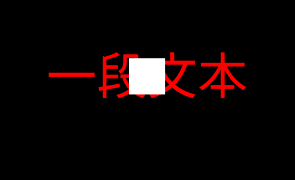

# 动画库

movy.js是基于three.js和gsap的易于使用的动画引擎,宗旨就是简单、简单、还是简单。减少学习负担是最大善意。所有的共功能都被包含在movy.ts文件中

在使用前需要引入

```js
import * as mo from "movy";
```

很多功能可以直接用，比如 **run( )**虽然他什么也不干。

```js
import * as mo from "movy";
mo.run();
```

把内容保存成demox.js就可以在命令行movy  demox.js启动它并看到效果

## 入门试手

### 添加文本

```js
mo.addText("一段文本")
```

### 动起来

```js
//涂擦效果
mo.addText("一段文本").wipeIn( ); 
```

#### 添加效果

来控制一下时间和动画进度(缓动)

```js
//擦除效果
let ea = {
  duration:2,
  ease: "bounce.out"
}
mo.addText("一段文本").wipeIn(ea ); 

```

有了更加精细的控制感觉还满意吗？

具体有那些可参看[ease文档](https://greensock.com/docs/v3/Eases)来自gsap，缓动效果可参考[easings](https://easings.net/zh-cn)在线演示

------

不满意还可以试试这个，分为2段（in/out）入和出过度

```js
ea = {
  duration:2,
  ease: "bounce.inOut"
}
```


### 来点颜色

```js
//擦除效果
let ea = {
  duration:2,
  ease: "bounce.out"
}
let at = {
    color:"red"
}
mo.addText("一段文本",at).wipeIn(ea ); 

```

需要更多颜色可以使用**\#272727**模式来自定

#### 背景颜色

默认背景是黑色不喜欢可以自己换一个

```js
mo.addRect({color: "#ffffff" });
```

出现如下效果



说好的背景呢？怎么来了一块白色方块。所以要修改一下把它放到后面并且拉大一点

```js
mo.addRect({z:-1,scale:20,color: "#ffffff" });
```

这下应该满意了吧。但是只有这一种效果吗？当然不是上效果。

### 显示效果

为了方便我们把文字存成对象方便展示多种效果。

```js
let text =mo.addText("一段文本",at)
text.wipeIn(ea );
text.spinning(ea );
text.implode2D(ea );
```


| 入场                                                         | 中段                       | 退场              |
| ------------------------------------------------------------ | -------------------------- | ----------------- |
| wipeIn , flyIn ,  rotateIn ,  rotateIn ,grow , fadeIn，explode2D | spinning , reveal ,shake2D | fadeOut implode2D |


#### 变化效果

改变颜色

```js
text.changeColor("#3CB371", {
  t: ">",
  duration: 2,
})			
```

虽然动画有了但是顶多算个显示效果。


## 开始动画


### 加入特效

现成的特效

```js
mo.addGlitch()  //漏电故障效果 全局	
```

如果有能力可以自己自作特效